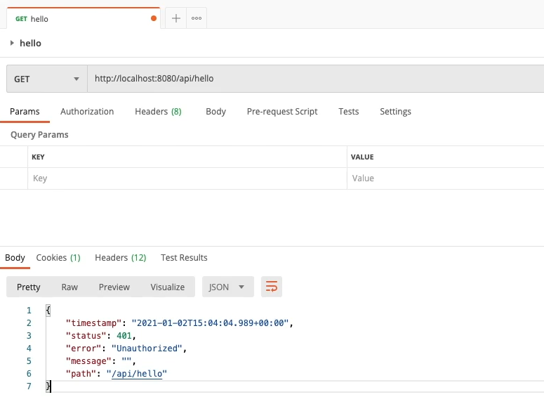

# Spring Boot JWT Tutorial

## JWT

### 특징

- RFC 7519 웹 표준으로 지정
- Json 객체를 사용해서 토큰 자체에 정보들을 저장하고 있는 Web Token

### 구성

- Header
    - 시크니쳐를 해싱하기 위한 알고리즘 정보 포함
- Payload
    - 서버와 클라이언트가 주고받는, 시스템에서 실제로 사용됧 정보에 대한 내용 포함
- Signature
    - 토큰의 유효성 검사를 위한 문자열 포함
        - 이 문자열을 통해 서버에서는 이 토큰이 유효한 토큰인지 검증

### 장단점

- 장점
    - 헤비하지않고 아주 간편하고 쉽게 적용 가능
    - 중앙의 인증서버, 데이터 스토어에 대한 의존성 없음, 시스템 수평 확장 유리
    - Base64 URL safe encoding을 사용하기 때문에 URL, Cookie, Header 모두 사용 가능
- 단점
    - Payload의 정보가 많아지면 네트워크 사용량 증가, 데이터 설계 고려 필요
    - 토큰이 서버에 저장되지 않고 클라이언트에 저장 = 서버에서 각 클라이언트의 토큰을 조작할 수 없음

### project setting

- 일반적인 controller 만들어서 테스트한 결과, 'Unauthorized'가 나온걸 확인하였다

  

### 1. Security 섫정, Data 설정

### 2. JWT 코드, Security 설정 추가

### 3. DTO, Repository, 로그인

### 4. 회원가입, 권한검증

---
강의 : [Spring Boot JWT Tutorial](https://www.inflearn.com/course/%EC%8A%A4%ED%94%84%EB%A7%81%EB%B6%80%ED%8A%B8-jwt/dashboard)