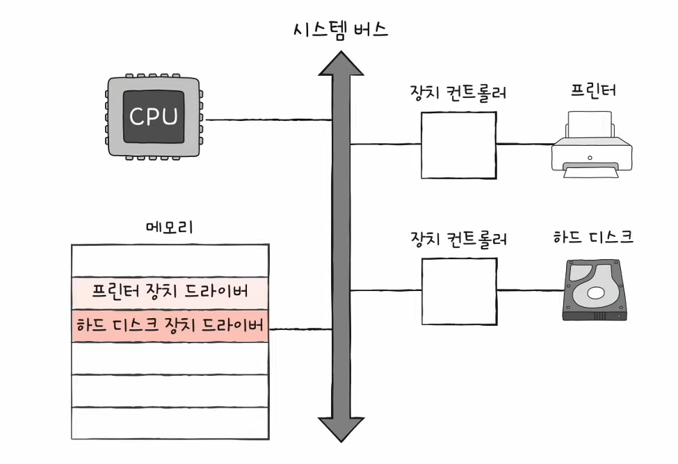
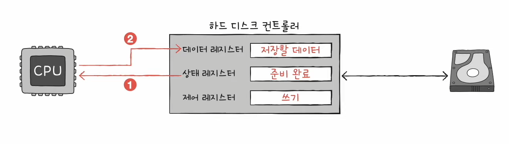
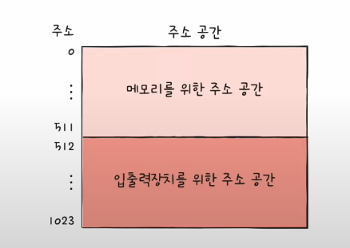

# 10강. CPU의 내부 구성 - 레지스터

- Q. 레지스터란 무엇일까?

## 레지스터

- CPU 내부의 작은 임시 저장 장치
- 프로그램 속 명령어 & 데이터가 실행 전후로 제리스터에 저장
    - 그러므로 실행되는 순서 관찰 가능해서 프로그래머 입장에서는 중요!
- CPU내부에는 다양한 레지스터가 있고 각기 다른 역할을 가진다
    - CPU 종류마다 제리스터 종류는 다르다 (이름도 다를 때 있음)

## 매우 중요한 레지스터들 (공통적으로 CPU들이 가지고 있는 것)

### 1. 프로그램 카운터

- 메모리에서 가져올 명령어의 주소 저장 (메모리에서 읽어 들일 명령어의 주소)
- Instruction Pointer(명령어 포인터)라고 부르는 CPU도 있음

### 2. 명령어 제리스터

- 해석할 명령어를 저장 (방금 메모리에서 읽어들인 명령어를 제어장치가 해석하고 저장)

### 3. 메모리 주소 레지스터

- 메모리의 주소
- CPU가 읽어들이고자 하는 주소를 버스로 보낼 때 거치는 레지스터

### 4. 메모리 버퍼 레지스터

- 메모리와 주고받을 값 (데이터와 명령어)
- CPU가 정보를 데이터버스로 주고받을 때 거치는 레지스터

### 여기까지 전체 흐름 정리

- (1) '프로그램 카운터'는 1000번지를 가져올거니까 1000을 가지고 있는다
- (2) 그다음 CPU가 읽어들이려면 '메모리 주소 레지스터'를 거쳐서 버스로 보내야하니까 이때 여기에 값이 1000이 들어간다
- (3) 그다음 이제 1000번지에 있는 메모리인 1101이 '메모리 버퍼 레지스터'에 담긴다
- (4) 이순간! '프로그램 카운터'의 값은 +1 증가하여 1001번지가 된다
    - 왜냐하면 '프로그램 카운터' 자체가 그 다음 차례의 명령어 주소를 저장하니까
- (5) 그리고 방금 메모리에서 읽어들인 명령어인 1101은 '명령어 레지스터'에 저장된다

- 중요포인트는 '프로그램 카운터'가 증가한다는 것!
    - 이 뜻은 프로그램이 순차적으로 실행되는 원리가 된다
    - 그런데 프로그램 카운터가 마냥 1씩 증가만 되는건 아니다
    - 순차적인 실행 흐름이 끊기는 경우도 있음!
        - 특정 메모리 주소로 실행 흐름을 이동하는 명령어 실행 시
        - (E.G JUMP, CONDITIONAL JUMP, CALL, RET)
        - 인터럽트 발생 시
        - 등등..

### 5. 플래그 레지스터

- 연산결과 또는 CPU 상태에 대한 부가적인 정보

### 6. 범용 제지스터

- 다양하고 일반적인 상황에서 자유롭게 사용

### 7. 스택 포인터

- 주소지정 때 사용
- '스택 주소 지정 방식' 때 사용!
    - 스택과 스택 포인터를 이용한 주소 지정 방식
    - 스택 포인터 : 스택의 꼭대기를 가리키는 레지스터 (스택이 어디까지 차있는지에 대한 표시)

 
- 스택포인터에 4번지라고 되어있으면 스택이 4번지까지 찬거임
- 스택은 메모리 안에 스택영역이라고 있음

### 8. 베이스 레지스터

- 주소지정 때 사용
- '변위 주소 지정 방식' 때 사용!
    - 오퍼랜드 필드의 값(변위)과 특정 레지스터의 값을 더하여 유효 주소 얻기

- 오퍼랜드 필드의 값을 '변위'로 삼고, 특정 레지스터 안에 들어있는 값을 더해서 유효주소를 얻어내는 방식

#### 변위주소 지정의 두 가지 방식

- (1) 상대 주소 지정 방식
    - 오퍼랜드 필드의 값과 '프로그램 카운터'의 값을 더해서 유효주소를 얻는다
    - '프로그램 카운터'가 다음에 올 명령어 주소 말하는거
    - 

- (2) 베이스 레지스터 주소 지정 방식
    - 오퍼랜드 필드의 값과 '베이스 레지스터'의 값을 더해서 유효주소를 얻는다
    - 기준주소로부터 얼만큼 떨어져있는지를 보는 것
    - 