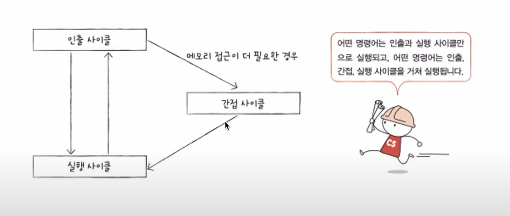
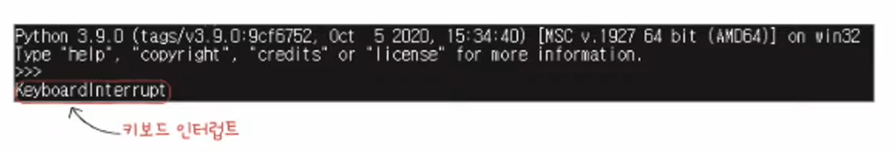
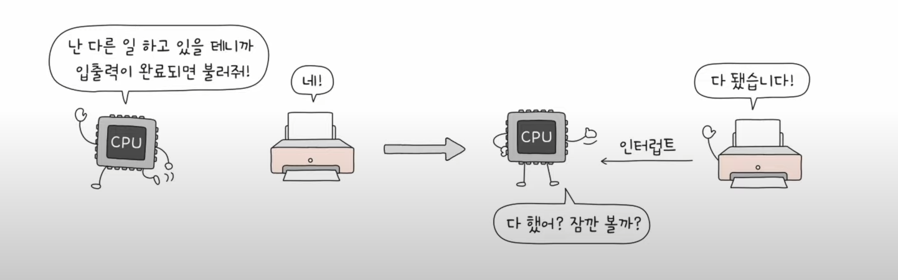
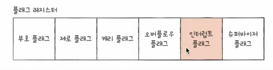
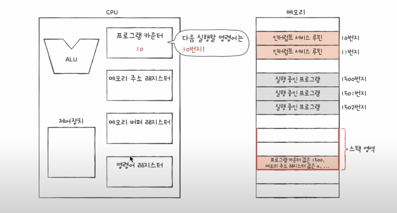
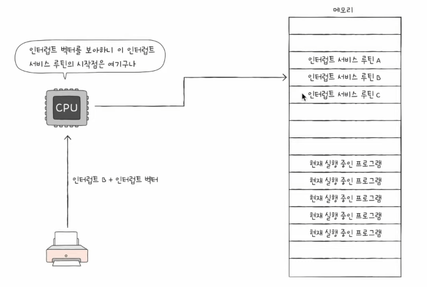
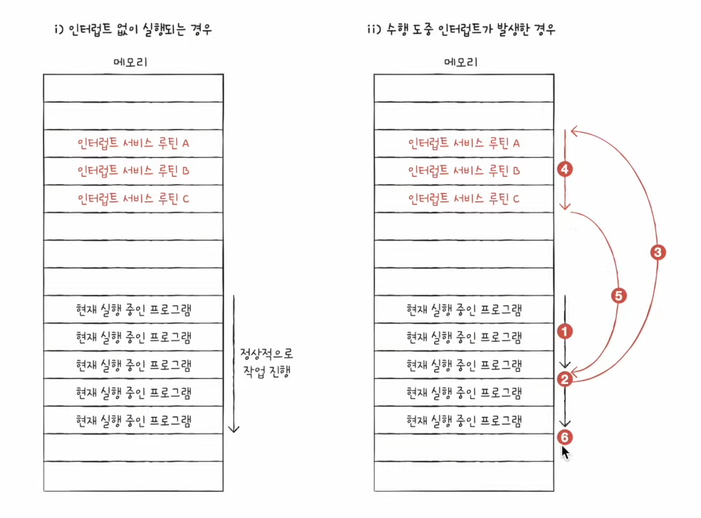
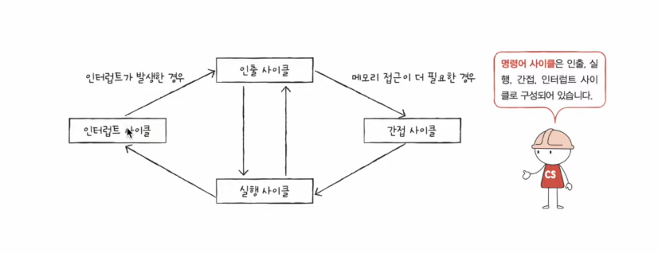

# 11강. 명령어 사이클과 인터럽트 ⭐

- Q. CPU가 명령어를 처리하는데 어떤 흐름이 있을까?

## 명령어 사이클

- CPU가 프로그램 속 명령어들을 일정하게 정해진 흐름(주기)대로 반복되며 실행하는데, 그 주기가 바로 '명령어 사이클'
    - 인출사이클 : 인출(메모리로부터 CPU로 가지고 오는 것)하는 주기
    - 실행사이클 : 가지고 왔으면 이제 실행해야지, 실행하는 주기

- 즉, CPU는 일반적으로 인출-실행-인출-실행-... 을 반복하게 된다

- 그런데 CPU로 명령어를 가지고 와도 바로 실행이 불가능한 경우도 있다
    - => 추가적으로 메모리에 접근하는 경우 (예:간접 주소 지정 방식 등)
    - 이런 경우에는 '간접사이클'이 추가될 수도 있다

- 보통의 CPU는 이런 경우로만 처리가 된다
- 그렇지만 이러한 흐름이 깨지는 경우도 있는데 이게 바로 '인터럽트'

## 인터럽트

- interrupt : 방해하다, 중단시키다
- CPU가 꼭 주목해야할 떄, CPU가 얼른 처리해야 할 다른 작업이 생길 때 발생
    - (예: 이거 급한거니까 지금하던거 멈추고 이거부터 해줘)
       
      

## 인터럽트 종류

### (1) 동기 인터럽트 (예외)

- CPU가 예기치 못한 상황을 접했을 때 발생
    - (예: 디버깅 할 때, 원하는 데이터 없음, 실행 불가능한 명령어 있음)
- 종류 : 폴트, 트랩, 중단, 소프트웨어 인터럽트 (운영체제 부분할때 더 자세히 나옴)

### (2) 비동기 인터럽트 (하드웨어 인터럽트)

- 주로 입출력장치에 의해 발생
- 알림과 같은 역할 (세탁기 완료 알림, 전자렌지 조리 알림)
- 즉, 입출력 작업 도중에도 효율적으로 명령어 처리 하기 위해 하드웨어 인터럽트 사용!
    - 입출력 장치는 CPU에 비해 느린데, 만약에 인터럽트가 없다면 주기적으로 확인해야한다
    - 인터럽트가 있으므로 입출력작업 동안 CPU가 다른 일 할 수 있는겨!
        - (예:주기적으로 호출하면서 프린트가 완료되었는지 안되었는지 여부 확인)

## 인터런트 처리 순서

- 대부분의 인터럽트 처리 순서

### (1) 입출력장치는 CPU에 인터럽트 요청 신호를 보내기

- 인터럽트 요청 신호 : (입출력장치가) 지금 끼어들어도 되나요?

### (2) CPU는 실행사이클이 끝나고 명령어를 인출하기 전 항상 인터럽트 여부를 확인

### (3) CPU는 인터럽트 요청을 확인하고 인터럽트 플래그를 통해 현재 인터럽트를 받아들일 수 있는지 확인

- 플래그 레지스터에 있는 인터럽트 플래그
    - 인터럽트 요청 신호 받아들일지 무시할지 결정하는 비트-
- 이런식으로 0과 1 표시되겠지
- 만약 인터런트 받아들일 수 없는 상황이라면 인터럽트 요청신호가 와도 인터럽트는 발생하지 않는다
- 그렇지만 모든 인터런트를 인터런트 플래그로 막을 수 있는 건 아니다 : Non-Maskable Interrupt, NMI
    - 인터럽트 마스크(interrupt mask)에 영향을 받지 않는 가장 우선 순위가 높은 인터럽트
    - (CPU고장,, 정전,, 등등)

### (4) 인터럽트 받아들일 수 있으면 CPU는 지금까지의 작업을 백업

- 지금까지 한 작업들을 스택에 백업하기

### (5) CPU는 '인터럽트 벡터'를 참조하여 '인터럽트 서비스 루틴' 실행

- 인터럽트 서비스 루틴 : 인터럽트가 발생했을 때 해당 인터럽트를 어떻게 처리하기 위한 매뉴얼같은 '프로그램'!
    - ex: 키보드가 인터럽트 요청보내면 이렇게 해야함~
    - ex: 마우스가 인터럽트 요청보내면 이렇게 해야함~
- 인터런트 서비스 루틴도 프로그램이니까 메모리에 저장한다
    - 각기 다른 주소에 각기 다른 루틴(매뉴얼)이 적혀있겠지

- 인터럽트 벡터
    - 각각의 인터럽트를 구분하기 위한 정보
    - 인터럽트를 보내는 주체에 따라서 '인터럽트 서비스 루틴'의 '시작 주소'가 달라지는데 그걸 구분해야하잖아
    - 그걸 구분하는 정보가 바로 '인터렙트 벡터'

### (6) 인터럽트 서비스 루틴 실행이 끝나면 (4)에서 백업한 작업 복구해서 하던 실행 재개

- 인터럽트 요청이 처리된 후에 중단된 프로세스의 상태를 복원하고 다시 실행한다
- 이때 백업 메모리에 있는 스택을 가져오는 것은 '중단된 프로세스의 상태를 복원하는 일부분'
- 따라서 백업 메모리에 있는 스택에 있던 정보는, 중단된 프로세스의 상태를 복원하는 과정에서 사용되고 백업 메모리에 있는 정보는 사라지지 않음!

- 이런식으로 인터럽트 순서가 진행된다

- CPU는 이런 정형화된 사이클에 맞춰서 명령어를 처리하는거야~ 그게 바로 '명령어 사이클'!
