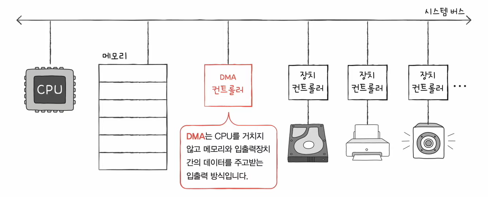
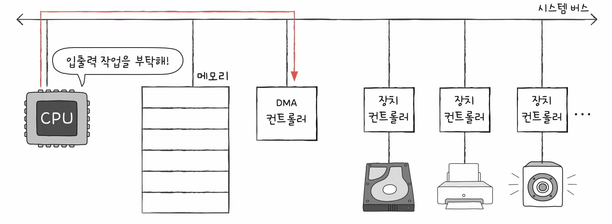

# 12강. 빠른 CPU를 위한 설계 기법

- Q. 클럭 / 코어 & 멀티 코어 / 스레드 & 멀티 스레드는 모게요?

## CPU의 속도를 빠르게 만들어보자!

1. 컴퓨터 부품들은 '클럭 신호'에 맞춰 일사불란하게 움직인다 <- (10강 참고)
2. CPU는 '명령어 사이클'이라는 정해진 흐름에 맞춰 명령어들을 실행한다

> Q. 그럼 클럭신호가 빠르게 반복하면 CPU를 비롯한 전체적인 컴퓨터 부품들은 그만큼 빠르게 움직이나? !!!
>
> A. 보통 그렇다!

## 클럭 속도

- 클럭속도 : 헤르츠(Hz) 단위로 측정
- 헤르츠 : 1초에 클럭이 반복되는 횟수
    - 클럭이 '똑-딱-' 1초에 한번 반복하면 1헤르츠
    - 클럭이 1초에 100번 반복되면 100헤르츠
- 클럭속도가 매번 일정하지는 않을 수도 있음

### 예시사진

- 4.9 기가헤르츠 : 1초에 최대 49억번 반복한다는 소리

> Q. 그럼 클럭 신호를 마냥 높이면 CPU가 무지막지하게 빨라지나?
>
> A. 꼭 그런건 아니래. 왜냐면 필요 이상으로 클럭 높이면 발열이 심해지기 때문!

=> 그럼 클럭속도를 높이는거말고 CPU속도 높이는 방법 뭐 있게?

- 코어 수를 늘리는 방법 ("듀얼 코어", "멀티 코어"...)
- 스레드 수를 늘리는 방법 ("멀티 스레드"...)

## 코어 (Core)

- 현대적인 관점에서 'CPU'라는 용어를 재해석 해야 함
- CPU 원래 뜻 : '명령어를 실행하는 부품' - 전통적으로, 원칙적으로 하.나.만. 존재
- 그렇지만 오늘날 CPU에는 '명령어를 실행하는 부품'이 그림처럼 여러개 존재한다
- 그리고 그 '명령어를 실행하는 부품'을 '코어'라는 용어로 사용

> Q. 그럼 코어를 2개, 3개, 100개 늘리면 연산 속도도 비례해서 빨라지나??
>
> A. 그렇진 않음.. 조별과제 생각해봐.. 도시락 1개 만드는데 요리사 100명과 요리사 10명의 차이

## 스레드 (Thread)

- 스레드 : 실행 흐름의 단위

### (1) 하드웨어적 스레드

 

- 하나의 코어가 동시에 처리하는 명령어 단위
- 이런걸 바로 '멀티스레드 프로세서', '멀티스레드 CPU'라고 한다
- 예 : 하이퍼스레딩 : 인텔의 멀티스레드 기술

### (2) 소프트웨어적 스레드

 

- 하나의 프로그램에서 독립적으로 실행되는 단위
- 예 : 워드프로그램 (화면에도 보여주고, 맞춤법도 검사하고, 수시로 저장하는걸 동시에 한다)

- 그런데 여기서 헷갈리지 말아야하는 것은!
    - 1코어 1스레드 CPU도 여러 소프트웨어적 스레드를 만들 수 있다는 것이다

### 하드웨어 스레드를 더 파악해보자-!

- 멀티스레드 프로세서를 설계할 떄 가장 큰 핵심은 '레지스터'
- 아래 그림에서는 하나의 명령어를 실행하기 위해 꼭 필요한 레지스터들을 편의상 '레지스터 세트'라고 표기
- 이때, 그림처럼 하나의 코어가 여러개의 레지스터 세트를 가지고 있다면 멀티스레드 프로세스를 처리할 수 있다!
    - 예를들어, 레지스터 세트가 두 개라면 스택포인트도 두 개니까 두 개의 스택을 관리할 수 있는 것!

- 하드웨어 스레드를 논리프로세서라고도 부름

