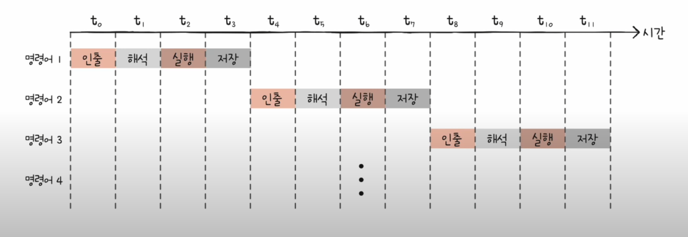

# 13강. 명령어 병렬 처리 기법

- Q. 시간낭비없이 메모리에 있는 명령어들을 처리할 방법이 없을까?

## 명령어 파이프라인

- (1) 명령어 인출(Instruction Fetch) - 가져오기
- (2) 명령어 해석(Instruction Decode) - 해석하기
- (3) 명령어 실행(Execute Instruction) - 실행하기
- (4) 결과 저장(Write Back) - 저장하기

- 같은 단계가 겹치지 않으면 CPU는 각 단게를 '동시에' 실행할 수 있다

## 명령어 파이프라이닝

- 동시에 여러개의 명령어를 겹쳐 실행하는 기법
- 당연히 아래그림처럼 하나하나 실행한다면 시간이 아주 오래 걸릴 것!

## 파이프라인 위험 (PipeLine Hazard)

- 명령어 파이프라인이 성능 향상에 실패하는 경우, 위처럼 병렬로 잘 실행되지 않는 경우

### (1) 데이터 위험 (Data Hazard)

- 명령어간의 의존성때문에 생겨나는 위험
- 모든 명령어들을 동시에 처리할 수는 없다
    - 이전 명령어가 처리되어야지만 그 후에 비로소 실행할 수 있는 경우가 있음
- 앞에서 실행된 명령어의 결과가 다음 명령어에 사용되어 발생하는 문제

### (2) 제어 위험 (Control Hazard)

- 프로그램 카운터의 갑작스러운 변화
- 분기명령어에 의해 발생
    - jump, call, interuct 등의 명령어
- 해결방안 중 하나는 분기예측(branch prediction)

### (3) 구조적 위험 (Structural Hazard)

- 서로 다른 명령어가 같은 CPU 부품 (ALU, 레지스터)를 쓰려고 할 때

- 파이프라인 위험 : [참고 페이지](https://needjarvis.tistory.com/675)

## 슈퍼스칼라

 

- CPU 내부에 여러개의 명령어 파이프라인을 포함한 구조
    - 오늘날의 멀티스레드 프로세서
    - 여러 컨베이어벨트가 있다고 생각하면 됨
- 이론적으로는 파이프라인 개수에 비례해서 처리 속도가 증가
    - 그렇지만 그만큼 파이프라인 위험도도 같이 증가
    - 즉, 파이프라인 개수에 비례해서 처리 속도가 증가하지는 않음

## 비순차적 명령어 처리

- (out-of-order execution, 줄여서 OoOE, dynamic execution)
- 합법적인 새치기
- 파이프라인의 중단을 방지하기 위해 명령어를 순차적으로 처리하지 않는 명령어 병렬 처리 기법
- 고성능 마이크로프로세서가 특정한 종류의 지연으로 인해 낭비될 수 있는 명령 사이클을 이용하는 패러다임

- 가령 아래의 상황

- 여기서 의존성이 없는 명령어의 순서를 바꾼다면??
    - 단, 전체결과에 영향이 없어야 함!
    - 의존성이 없는 애들만 순서 바꾸기 가능!

- 변경 후의 모습

