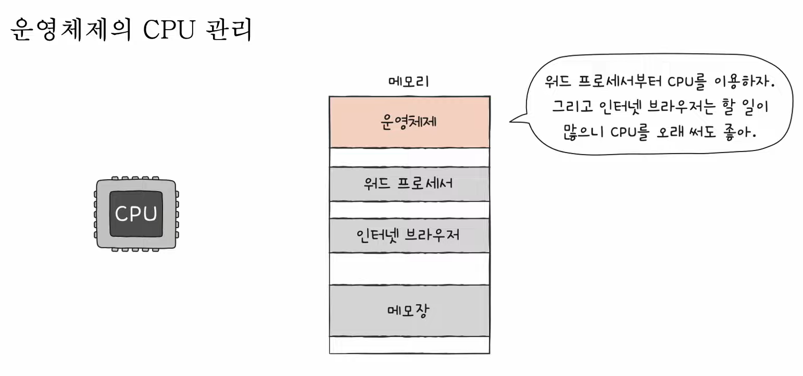
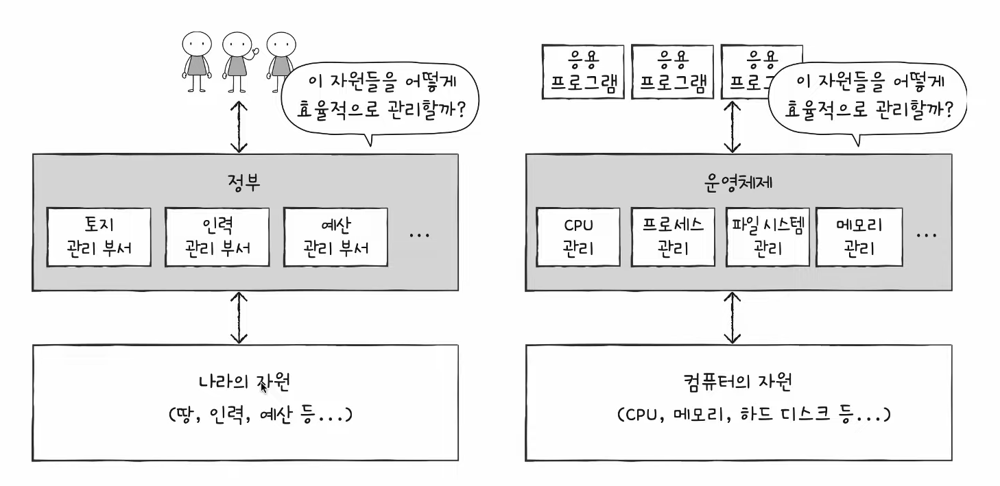

# 14강. 명령어 집합 구조, CISC와 RISC

- Q. 명령어가 어떻게 생겨야 명령어 파이프라이닝에 더 유리할까?

> Q. CPU는 명령어를 실행하잖아, 근데 이 세상 CPU가 모두 똑같이 생긴 명령어를 실행하나?
>
> A. 아니! 명령어 생김새, 연산, 주소지정방식등은 CPU마다 모두 다르대!

## 명령어 집합 (구조) - ISA

- CPU가 이해할 수 있는 명령어들의 모음

- 명령어 집합이 다르기 때문에, 같은 소스 코드를 컴파일 할지라도 나오게되는 어셈블리어(기계어)가 다를 수 있다
    - 그림처럼 ARM 명령어 집합을 따르는 애들은 x86을 따르는 명령어들을 이해 못하고, x86 따르는 애들을 ARM 따르는 명령어들을 이해 못한다

- 즉, 명령어 집합은 CPU의 언어라고 볼 수 있다
- 명령어가 달라지면 그냥 명령어만 달라지는게 아니고, 명령어 해석 방식, 레지스터의 종류와 개수, 파이프라이닝의 용이성 등 영향받는 많은 것들이 달라진다

- 그래서 어떻게 보면 하나의 '약속'이라고 볼 수 도 있지

## 명령어 집합 종류

- 가장 큰 종류 두 가지가 있음
- CISC (씨스크) & RISC (리스크)

## (1) CISC

- complex instruction set computer
- x86, x86-64
- 복잡한 명령어 집합을 활용하는 컴퓨터 (CPU)
    - 복잡하고 다양한 명령어 활용
    - 명령어의 형태와 크기가 다양한 '가변길이 명령어'를 활용
    - 다양하고 강력한 명령어 활용
    - 상대적으로 적은 수의 명령어로도 프로그램 실행 가능

- 장단점
    - 장점
        - 메모리 아낄 수 있음 (그래서 과거엔 인기 많음)
    - 단점
        - 명령어 파이프라이닝 불리한 치명적 단점!
            - 파이프라이닝 잘되려면 명령어 실행시간들이 정형화 되야하는데 이건 너무 들쑥날쑥해서 파이프라이닝 힘들지
        - 명령어가 워낙 복잡하고 다양한 기능을 제공해서 명령어의 크기와 실행되기까지의 시간이 일정하지 않음
        - 복잡한 명령어 떄문에 명령어 하나를 실행하는 데에 여러 클럭 주기 필요
        - 대다수의 복잡한 명령어는 사용 빈도가 낮다 - 어차피 자주쓰는것만 계속 쓰지..

## (2) RISC

- reduced instruction set computer
- 명령어의 종류가 적고, 짧고 규격화된 명령어 사용
- 고정길이 명령어, 단순한 명령어
- RISC는 짧고 규격화된 명령어라서 명령어 파이프라이닝에 유리하다!
- 메모리 접근 최소화 (load, store), 제리스터를 더 많이 활용한다
- 다만 명령어 종류가 CISC보다 적기에 더 많은 명령어로 프로그램을 동작시킨다!
- CISC보다 요새는 더 많이 쓰인다!

## 한눈에 보는 정리

- 그래서 현재 현업에서는 어떻게하느냐!
    - CISC는 장점이 있잖아. 그렇지만 파이프라이닝 불리한게 너무 치명적이니까 현업에서는 CISC를 마이크로 명령어라고 해서 내부적으로 잘개 쪼개서 실제로 수행할때는 RISC처럼 사용한다!
  

