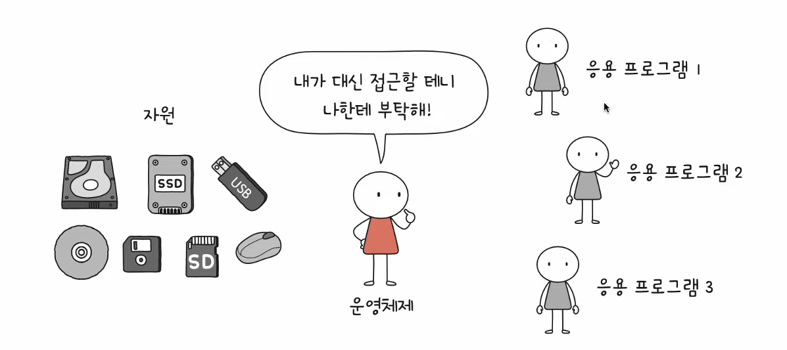
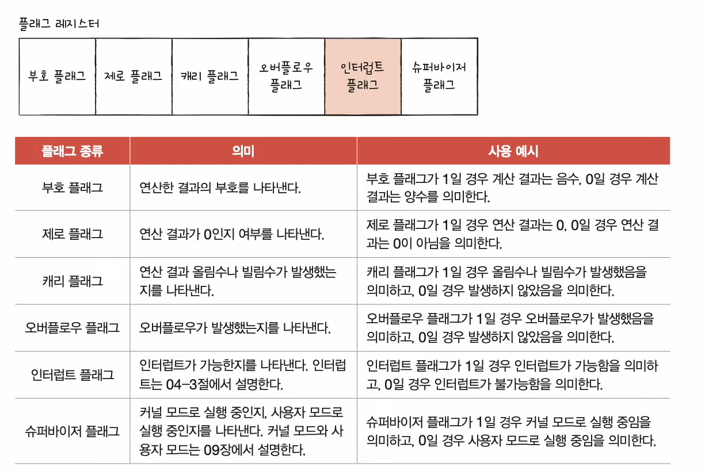

# 15강. RAM의 특성과 종류

> 컴퓨터의 주된 부품 중 주기억장치(메인메모리) 종류에는 RAM과 ROM이 있는데, '메모리'는 보통 RAM을 지칭한다

Q. RAM이 크면 정확히 뭐가 좋을까? RAM 종류에는 모가 있을까?

## RAM 특징 알아보자

- RAM : 전원꺼지면 날아간다 (휘발성)
- 보조기억장치 종류: SSD, USB, 하드디스크, 시디룸 등

## RAM의 성능에 관하여

> Q. RAM이 크면 뭐가 좋아? RAM 용량은 컴퓨터 용량에 어떤 영향을 미쳐?

- 만약 RAM이 너무너무 작다면 CPU가 메모리를 요청했을 때 RAM이 가지고 있는게 너무 작아서 계속 보조기억장치에다가 요청해야한다면 동시에 여러개의 프로그램을 실행하기 힘들 것이다
- 그렇지만 큰 메모리, 즉 RAM이 클수록 많은 프로그램들을 동시에 실행하기에 유리할 것이다

- 쉽게 이해할 수 있는 이미지

## RAM 종류 ✨

### (1) DRAM

- dynamic RAM (동적의 램)
- 저장된 데이터가 동적으로 사라지는 RAM
- 데이터 소멸을 막기 위해 주기적으로 재활성화(refresh) 해야한다
- 보통 메모리에서 사용하는게 바로 이 DRAM이다
    - 이유 : 상대적으로 소비전력도 낮고 저렴하고 집적도가 높아서(빽빽하고 오밀조밀하게 설계가능) 대용량으로 설계하기 용이하다

### (2) SRAM

- static RAM (정적의 램)
- 저장된 데이터가 정적인 (사라지지 않는) RAM
- DRAM 보다 일반적으로 더 빠르다
- 일반적으로 '캐시메모리'에서 사용된다
    - 이유 : 상대적으로 소비전력 높고 비싸고 집적도가 낮아서 대용량 설계는 필요없지만 빨라야하는 장치에 사용한다

### < 둘의 차이 이해하기 >

### (3) SDRAM

- synchronous DRAM (동기화된 램)
    - 특별한 (발전된 형태의) DRAM
    - 클럭신호와 동기화된 DRAM

### (4) DDR SDRAM

- Double Data Rate SDRAM
- 특별한 (발전된 형태의) SDDRAM
- 최근 가장 대중적으로 사용하는 RAM
- 대역폭을 넓혀 속도를 빠르게 만든 SDRAM
    - 대역폭 : 데이터를 주고받는 길의 너비
- DDR SDRAM은 주고받을 데이터도 많아질 수 있고, 더 빨라질 수 있다
- 거기에다가 2배 더 넓은 DDR2 SDRAM !

#### DDR SDRAM

- 이 친구를 계속 확장시킬 수 있음
    - DDR3 SDRAM VS DDR2 SDRAM - (일반적인 SDRAM보다 DDR3 SDRAM은 8배)
    - DDR4 SDRAM VS DDR3 SDRAM - (일반적인 SDRAM보다 DDR4 SDRAM은 16배)
- 2배로 넓어진다
- 현재 가장 대중적인 것은 'DDR4 SDRAM' 이다
