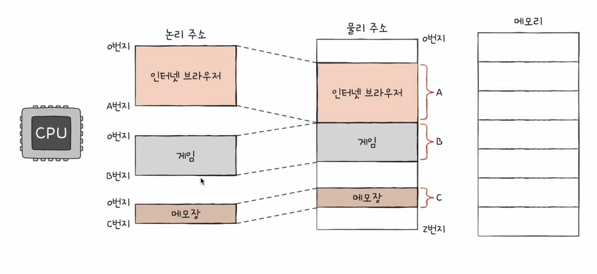
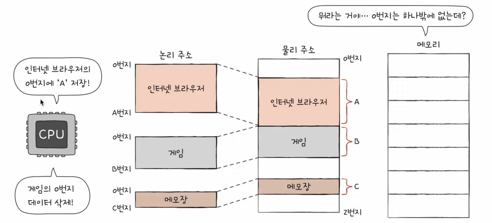
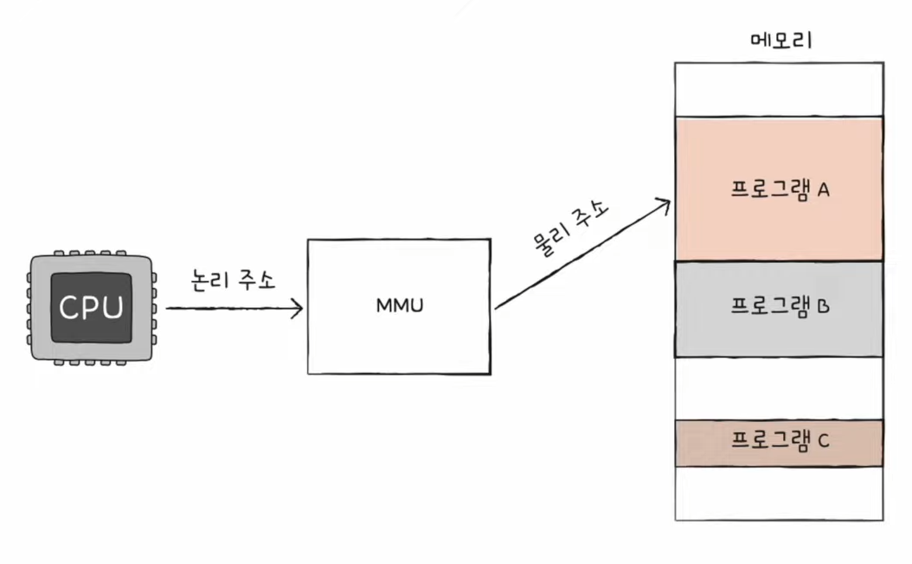
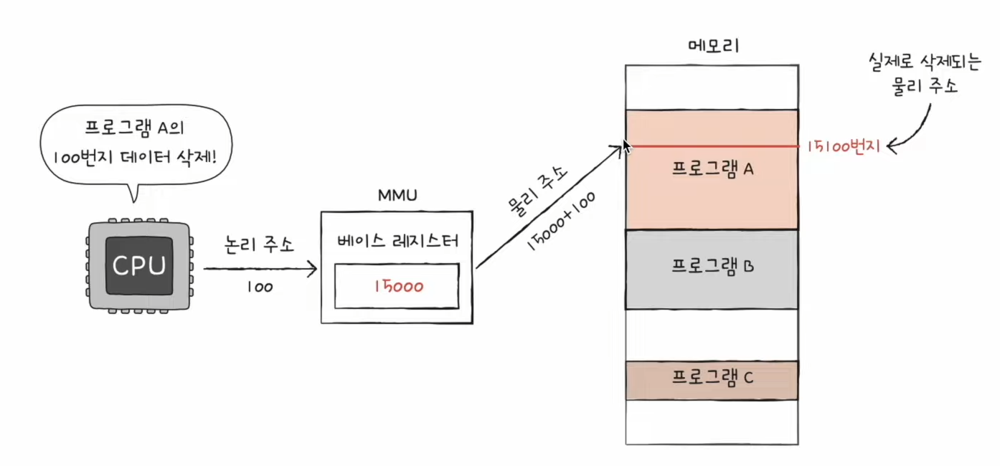
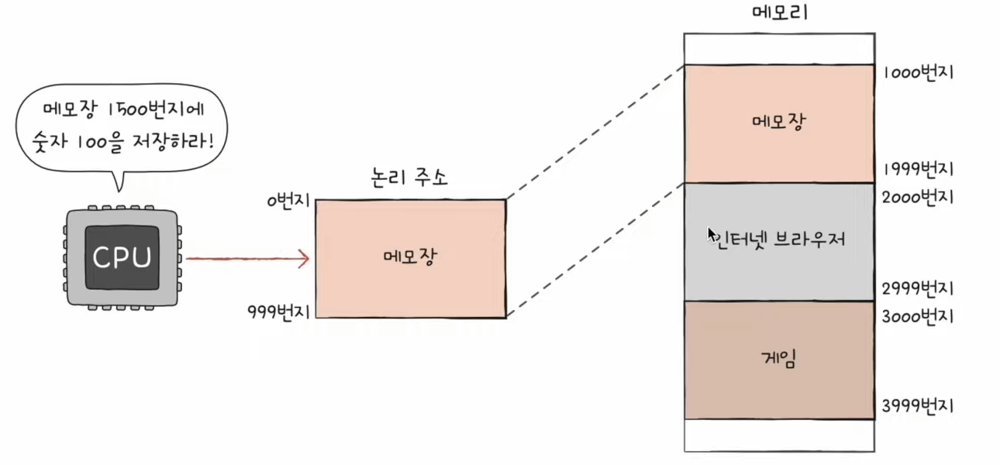
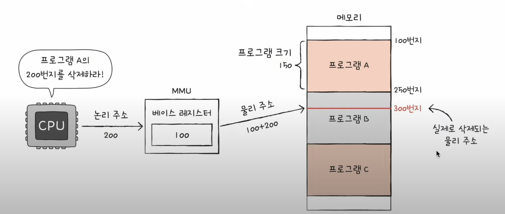
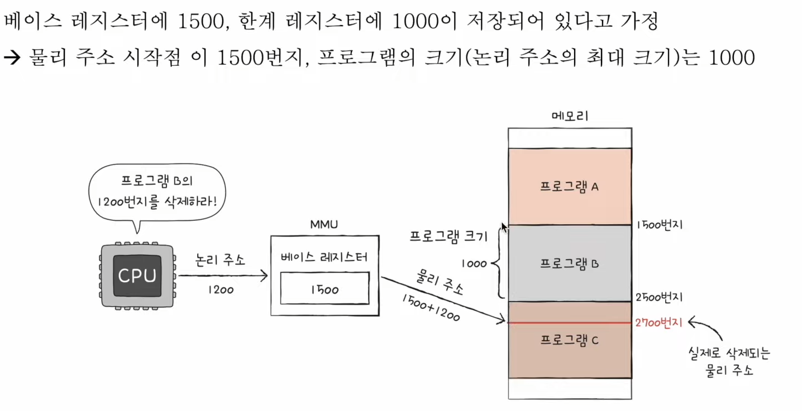
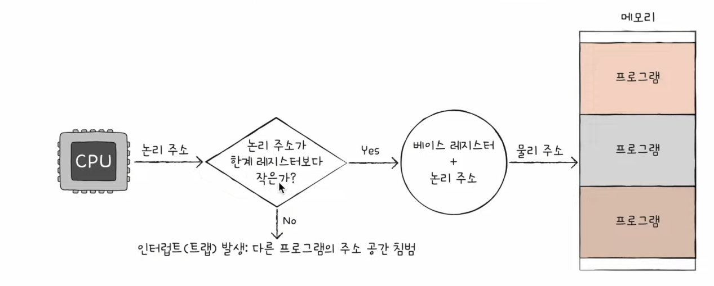

# 16강. 메모리의 주소 공간-물리 주소와 논리 주소

- Q. 논리 주소와 물리 주소로 주소 공간을 나눈 이유가 몰까?
- Q. 논리 주소를 물리 주소로 변환하는 방법은?

> Q. CPU와 실행 중인 프로그램은 현재 메모리 몇 번지에 무엇이 저장되었는지 다 알고있나?
>
> A. 아니다! 왜냐하면 메모리에 저장된 값들은 시시각각 변하기 때문!

- 메모리 저장된 값들이 변하는 이유
    - 새롭게 실행되는 프로그램은 보조기억장치로부터 새롭게 메모리에 적재
    - 실행이 끝난 프로그램은 메모리에서 삭제
    - 같은 프로그램을 실행하더라도 실행할 때마다 적재되는 주소는 달라짐

- ⇒ 그래서 이러한 점을 극복하기 위해 '물리주소'와 '논리주소'를 분리해야함!

## 물리주소와 논리주소

### 물리주소

- 메모리 입장에서 바라본 주소
- 말 그대로 정보가 실제로 저장된 하드웨어상의 주소
- 겹치는 주소번지가 있을 수 없지

### 논리 주소

- CPU와 실행 중인 프로그램 입장에서 바라본 주소
- 실행 중인 프로그램 각각에게 부여된 0번지부터 시작하는 주소
- 즉, 0번지가 여러개일수도 있지

### 그럼 물리주소랑 논리 주소 변환 어떻게 이뤄질까?

- ⇒ CPU랑 메모리랑 상호작용을 하려면 어쨌든 논리주소를 물리주소를 변환하는 작용 필요!

- MMU (메모리 관리 장치)라는 하드웨어에 의해 변환
    - 논리주소를 물리주소로 바꿔주는 장치!
    - MMU는 논리주소와 '베이스레지스터'(프로그램의 기준주소) 값을 더하여 논리주소를 물리주소로 변환

- 아래 그림은, 기준주소인 '15000'에 논리주소 값 '100'을 더해서 '15100'번지 물리주소가 메모리에서 사라지는 로직이다

### 정리 땅땅!

- 베이스 레지스터
    - 프로그램의 가장 작은 물리주소 (프로그램의 첫 물리주소)를 저장하는 셈

- 논리주소
    - 프로그램의 시작점으로부터 떨어진 거리인 셈

## 메모리 보호

> Q. 이런 명령어는 실행되어도 안전할까?
>
> A. 아래와 같은 상황에서는 조심해야한다. 이러한 명령어는 다른 메모리를 침범하게 되서 안전하지 않다.

- ⇒ 그럼 어떻게 이런 명령어의 실행을 막을 수 있을까?

### 한계 레지스터

- 프로그램의 영역을 침범할 수 있는 명령어의 실행을 막음
- 베이스 레지스터가 실행 중인 프로그램의 가장 작은 물리 주소를 저장한다면, 한계 레지스터는 논리 주소의 최대 크기를 저장
- 베이스 레지스터 값 <= 프로그램의 물리 주소 범위 < 베이스 레지스터 + 한계 레지스터 값

- 이처럼 CPU는 메모리에 접근하기전에 접근하려는 논리주소가 '한계 레지스터'보다 작은지 항상 검사한다
- 실행중인 프로그램의 독립적인 실행 공간 확보 & 하나의 프로그램이 다른 프로그램을 침범하지 못하게 보호! 

