# 17강. 캐시 메모리

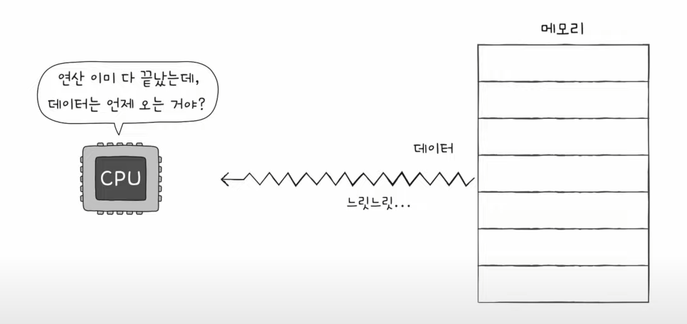

CPU가 메모리에 접근하는 시간은 CPU 연산 속도보다 느리다

## 저장 장치 계층 구조 (memory hierarchy - 메모리 계층구조)

- CPU와 가까운 저장 장치는 빠르고, 멀리 있는 저장 장치는 느리다
- 속도가 빠른 저장 장치는 저장 용량이 작고, 가격이 비싸다

### 레지스터 VS 메모리(RAM) VS USB 메모리

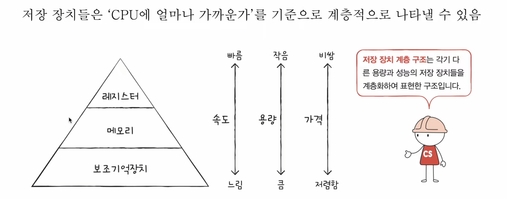

- 결론 : 낮은 가격대의 대용량 저장 장치를 원한다면 느린 속도는 감수해야하고, 빠른 속도의 저장 장치를 원한다면 작은 용량과 비싼 가격은 감수해야한다

## 캐시 메모리

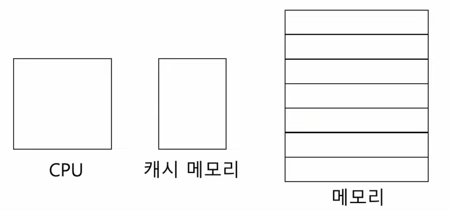

- CPU와 메모리 사이에 위치한, 레지스터보다 용량이 크고 메모리보다 빠른 SRAM 기반의 저장장치
- CPU의 연산 속도와 메모리 접근 속도의 차이를 조금이나마 줄이기위해 탄생
- CPU가 매번 메모리에 왔다갔다 하는건 시간이 오래 걸리니까, 메모리에서 CPU가 사용할 일부 데이터를 미리 캐시 메모리로 가지고 와서 쓰자! 이런 느낌

- 비유해보기

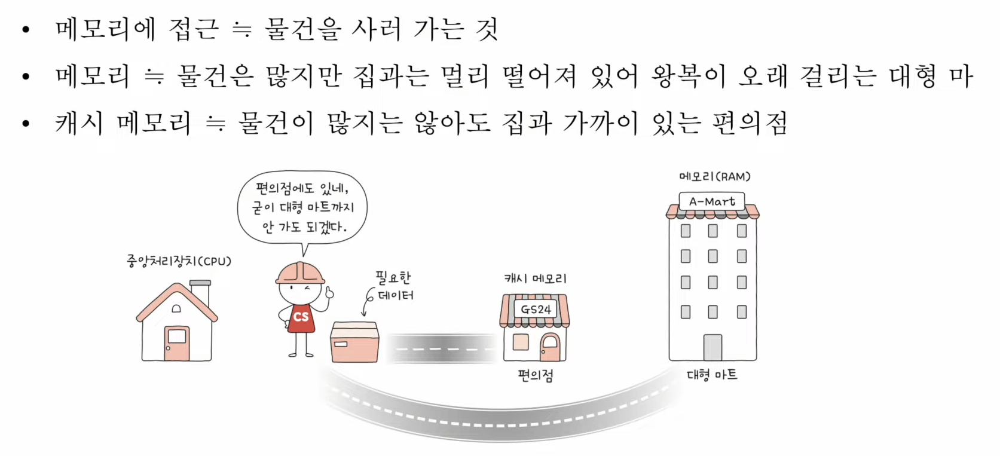

- 그래서 현재는 이렇게 대부분 사용합니다

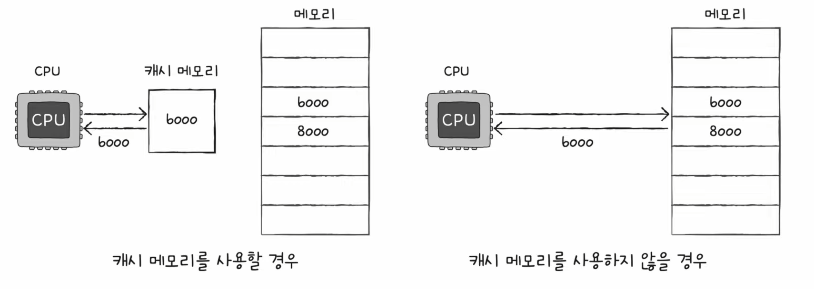

### '캐시 메모리'가 추가된 메모리 계층 구조

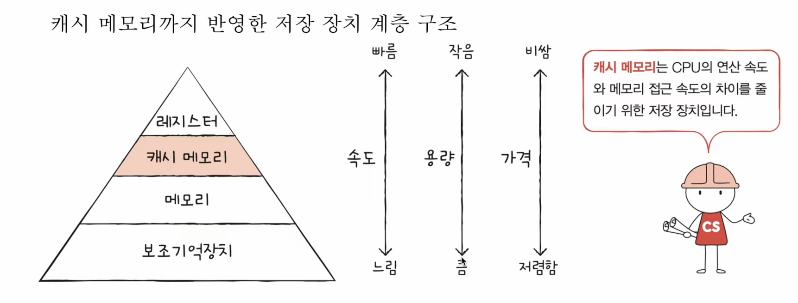

### 계층적 캐시 메모리

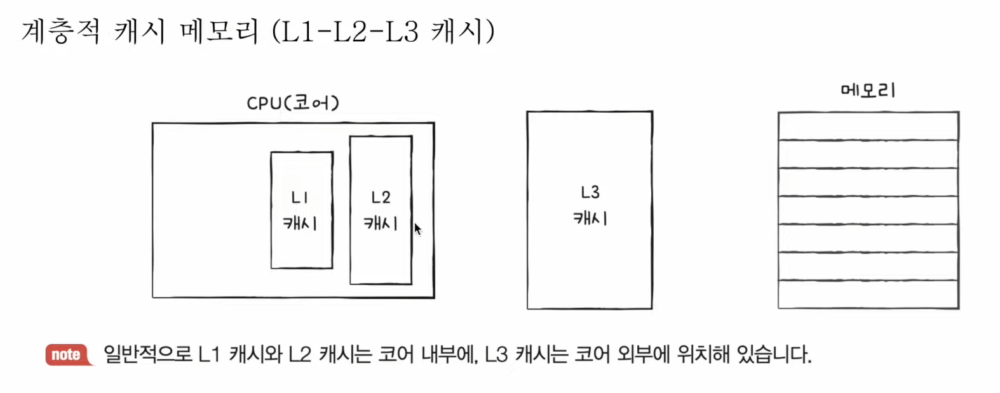

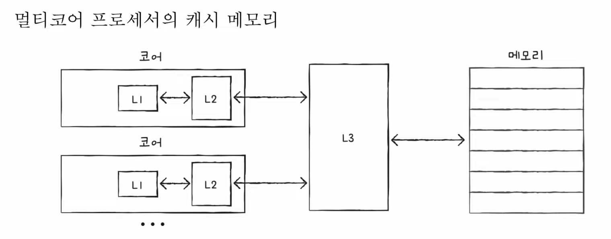

- 멀티코어 프로세서의 캐시 메모리
    - 멀티코어의 경우에는 L3 캐시는 공유해서 사용하는 경우가 많다
    - 이런 경우에는 서로 다른 코어 안에 있는 L1, L2 캐시들 안에 있는 메모리들이 다른 메모리를 저장하게 될 수도 있다
    - 그렇다는건 즉 '데이터의 일관성'이 깨지게 될 수도 있는거지
    - 그러므로 전체적으로 캐시메모리의 싱크를 맞춰주는 것이 중요한 관점이 될 수 있다

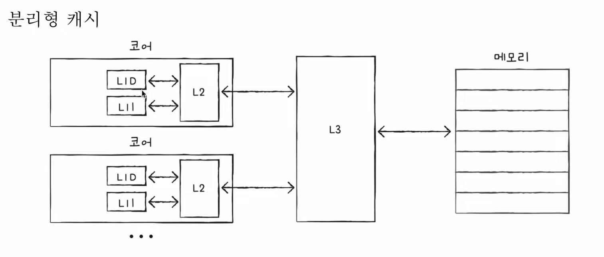

- 분리형 캐시
    - 가뜩이나 CPU와 가장 가까이에 있어서 제일 빠른 캐시인 L1 캐시를 더더 빠르게 하기 위해서 또 나눴다!
        - 명령어만을 담고 있는 L1I
        - 데이터만을 담고 있는 L1D 캐시메모리로 나눔

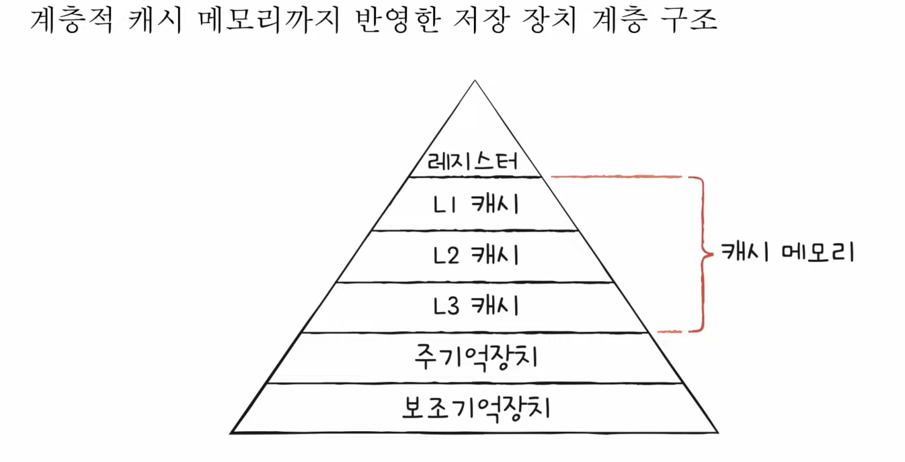

- 계층적 캐시 메모리까지 반영한 저장 장치 계층 구조!

## 캐시메모리의 '예측'

- 캐시 메모리는 메모리보다 용량이 작다
- 당연하게도 메모리의 모든 내용을 저장할 수 없다
- 그러므로 CPU가 '자주 사용'할만한 내용을 '예측'해서 저장하기!

### (1) 캐시히트

- 메모리에 접근하는 것보다 성능이 당연하게 높아지겠지?

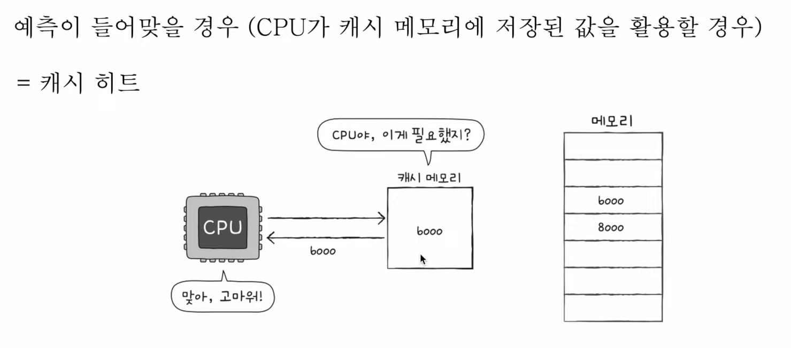

### (2) 캐시미스

- 반대로 예측이 틀렸을 때! -> 성능하락!!!

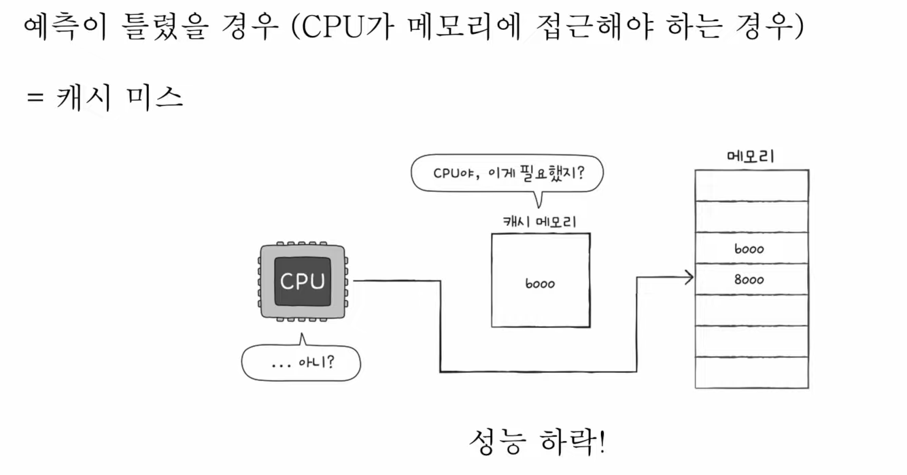

### 캐시 적중률

- 캐시히트 횟수 / (캐시 히트 횟수 + 캐시 미스 횟수)
    - 요즘 컴퓨터의 캐시적중률은 못해도 80퍼센트가 넘는다!

- 결론 : 캐시 적중률을 높여야한다 = CPU가 사용할 법한 데이터를 잘 예측해야 한다!

## 참조 지역성의 원리 (locality of reference)

- CPU가 메모리에 접근할 떄의 주된 경향을 바탕으로 만들어진 원리
    - (1) CPU는 최근에 접근했던 메모리 공간에 다시 접근하려는 경향이 있다
    - (2) CPU는 접근한 접근한 메모리 공간 근처를 접근하려는 경향이 있다

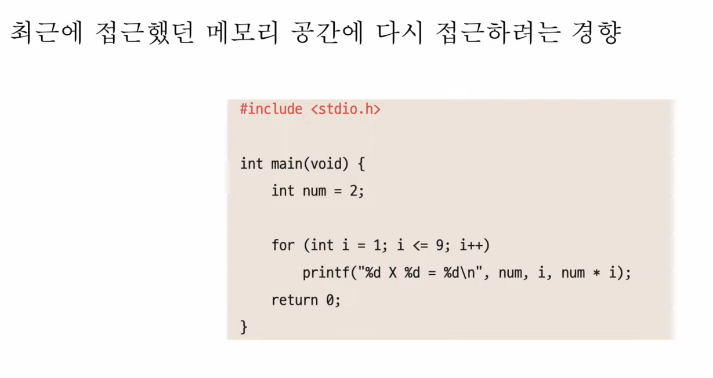
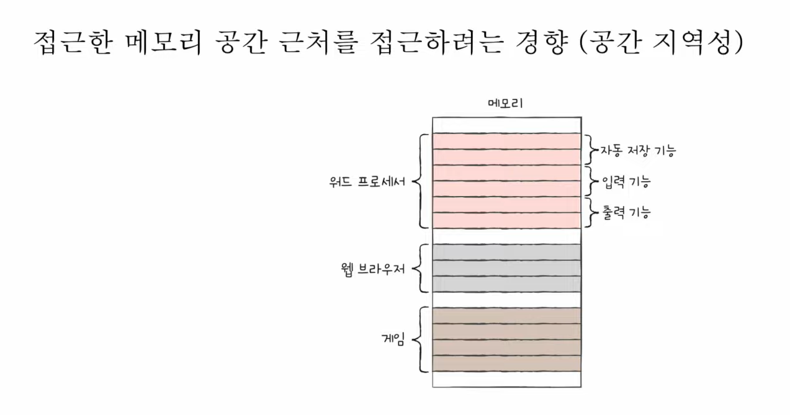