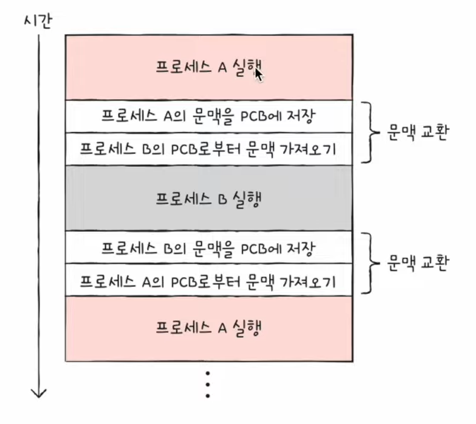
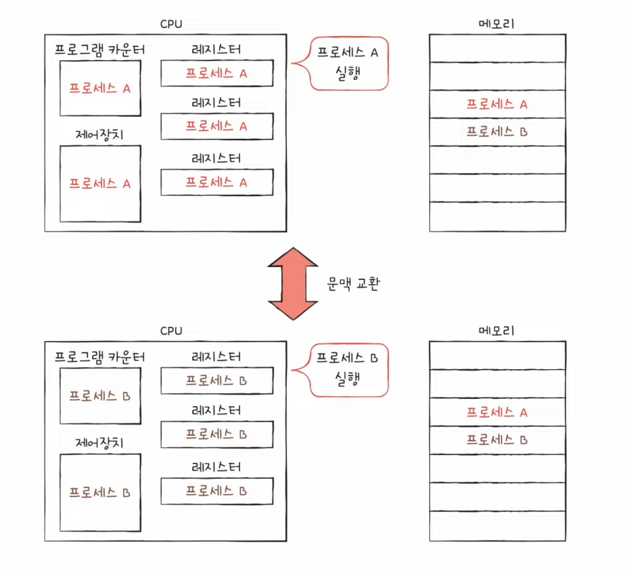
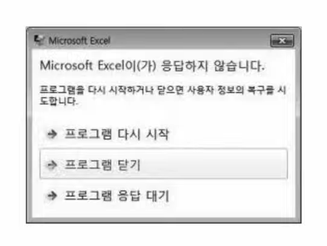

# 17강. 캐시 메모리

CPU가 메모리에 접근하는 시간은 CPU 연산 속도보다 느리다

## 저장 장치 계층 구조 (memory hierarchy - 메모리 계층구조)

- CPU와 가까운 저장 장치는 빠르고, 멀리 있는 저장 장치는 느리다
- 속도가 빠른 저장 장치는 저장 용량이 작고, 가격이 비싸다

### 레지스터 VS 메모리(RAM) VS USB 메모리

- 결론 : 낮은 가격대의 대용량 저장 장치를 원한다면 느린 속도는 감수해야하고, 빠른 속도의 저장 장치를 원한다면 작은 용량과 비싼 가격은 감수해야한다

## 캐시 메모리

- CPU와 메모리 사이에 위치한, 레지스터보다 용량이 크고 메모리보다 빠른 SRAM 기반의 저장장치
- CPU의 연산 속도와 메모리 접근 속도의 차이를 조금이나마 줄이기위해 탄생
- CPU가 매번 메모리에 왔다갔다 하는건 시간이 오래 걸리니까, 메모리에서 CPU가 사용할 일부 데이터를 미리 캐시 메모리로 가지고 와서 쓰자! 이런 느낌

- 비유해보기

- 그래서 현재는 이렇게 대부분 사용합니다

### '캐시 메모리'가 추가된 메모리 계층 구조

### 계층적 캐시 메모리

8:50초
[12강](https://www.youtube.com/watch?v=qLCP0PwRp_w&list=PLVsNizTWUw7FCS83JhC1vflK8OcLRG0Hl&index=21&t=20s&ab_channel=%ED%95%9C%EB%B9%9B%EB%AF%B8%EB%94%94%EC%96%B4)