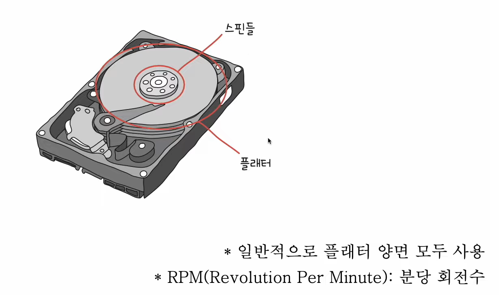
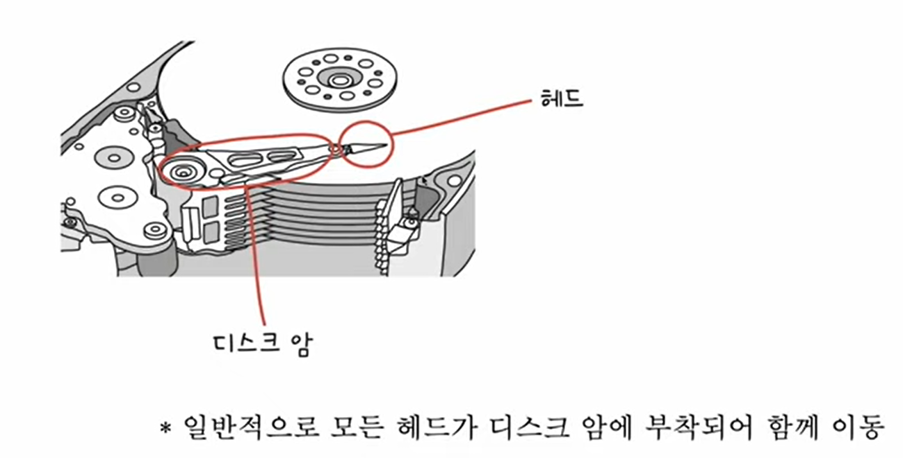
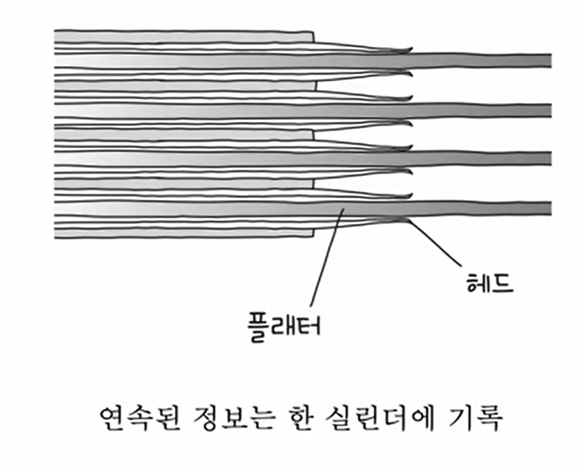
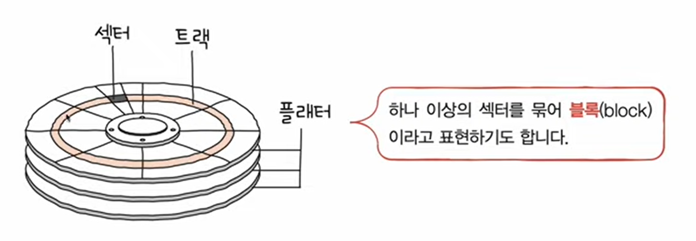
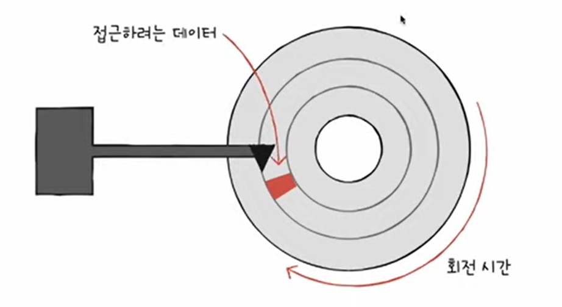
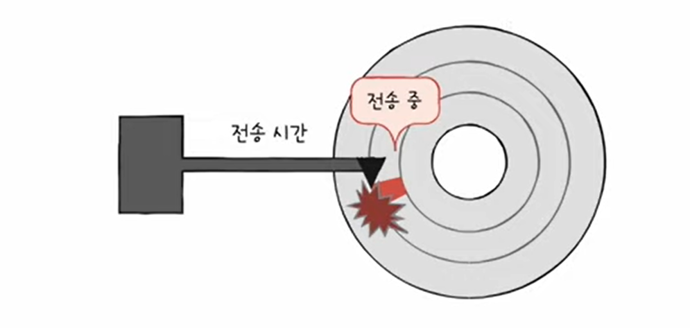
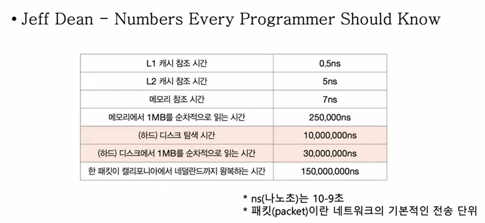
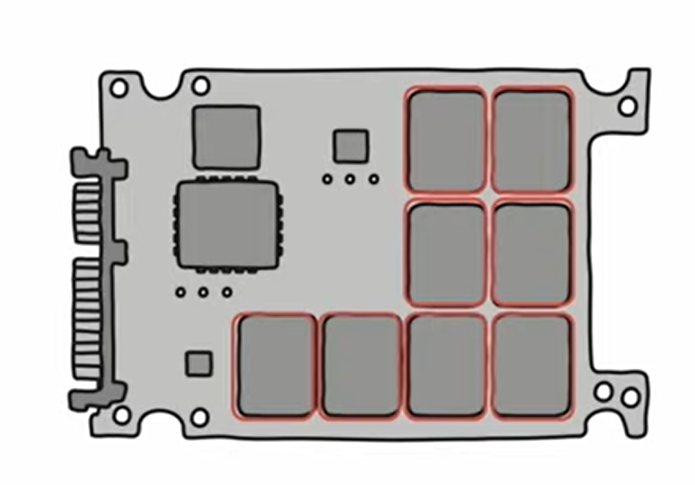
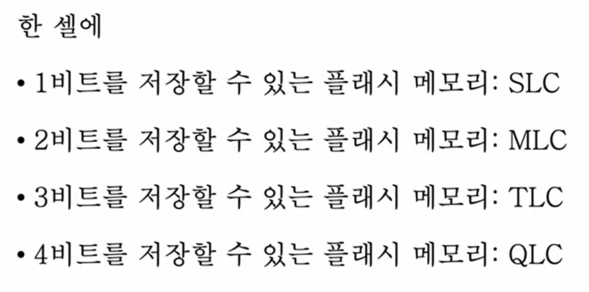

# 18강. 다양한 보조기억장치

> 하드디스크와 플래시 메모리에 대해 알아보자!

- 하드디스크와 플래시메모리(usb, ssd, sd카드)에는 수명이 있다
- 특정 수 이상의 메모리를 썼다 지웠다를 반복하면 보조기억장치로써 수명을 다하게 된다

---

## 하드디스크

### (1) 하드디스크 - 구성

- 자기적인 방식으로 데이터 저장
    - 플래터는 여러겹으로 사용한다 (양면도 사요가능)
    - 스핀들이 플래터를 돌려준다 (LP판처럼!)

- 플래터를 읽고 쓸 수 있도록 하는게 '헤드'
    - 자기물질을 읽는 요소
    - 면마다 헤드가 각각 달려있다
- '디스크암' : 헤드를 움직여주는 애

### (2) 하드디스크 - 저장단위

- 기본적으로 트랙(track)과 섹터(sector) 단위로 데이터가 저장된다
- 섹터의 크기 : 512바이트~4096바이트

- 실린더 : 같은 트랙이 모여서 이루는 것
    - 연속된 정보는 한 실린더에 기록된다 -> 이 부분 조금 이해안감 ?

### (3) 하드디스크 - 데이터 접근 과정

> 하드 디스크가 저장된 데이터에 접근하는 시간

1. 탐색 시간 (seek time)
    - 접근하려는 데이터가 저장된 트랙까지 헤드를 이동하는 시간

  

2. 회전 지연 (rotational latency)
    - 헤드가 있는 곳으로 플래터를 회전시키는 시간

3. 전송 시간 (transfer time)
    - 하드 디스크와 컴퓨터간에 데이터를 전송하는 시간

> 모든 프로그래머들이 알아야하는 숫자들
> 시간단위가 이렇게나 크고 중요한 변위이다.

 
 

---

## 플래시 메모리

- 전기적으로 데이터를 읽고 쓰는 반도체 기반 저장 장치
- 범용성이 넓기에 보조기억장치에만 속한다고 보기에는 어려움
    - ssd, sd카드, usb

### 플래시 메모리 종류

- NAND 플래시 메모리
    - 오늘날 대용량으로 많이 사용하는건 이거다! (아래의 대부분의 설명은 NAND 플래시 메모리를 기반으로 설명된다)
- NOR 플래시 메모리

### 플래시 메모리 단위 : 셀 (cell)

- 플래시 메모리에서 데이터를 저장하는 가장 작은 단위
- 이 셀이 모이고 모여 수 MB, GB, TB 저장 장치가 된다
- 한 셀에 얼만큼의 비트를 저장할 수 있느냐에 따라 성능이나 가격이나 수명을 결정하는 요소

### 플래시 메모리 타입 : SLC, MLC, TLC, QLC

- 이를 통해 알수있는 점 : 같은 플래시 메모리라도 타입에 따라서 수명, 가격, 성능이 다르다!
- 쉽게 비유를 통해서 알아보자!

> 사람 1명🧍🏻 == 1비트  
> 셀 == 집🏠  
> 이라고 생각해보면  
> **SLC == 1집에 1명  
> MLC == 1집에 2명  
> TLC == 1집에 3명**

- SLC
    - 한 집에 한 명 사는 구조
    - 한 셀로 두 개의 정보 표현 (0,1)
    - 비트의 빠른 입출력 (혼자 나갈준비하는건 빠르잖아..)
    - 긴 수명
    - 용량 대비 고가격 (혼자서 월세내는건 비싸잖아..)

 

- MLC
    - 한 집에 두 명 사는 구조
    - 한 셀로 네 개의 정보 표현 - 대용량화 유리 (00,01,10,11)
    - SLC보다 느린 입출력
    - SLC보다 짧은 수명
    - SLC보다 저렴
    - 시중에서 많이 사용 (SLC보다는 MLC, TLC, QLC가 더 많이 사용된다)

- TLC
    - 한 집에 세 명 사는 구조
    - 한 셀로 여덟 개의 정보 표현 - 대용량화 유리 - 2의 3승
    - MLC보다 느린 입출력
    - MLC보다 짧은 수명
    - MLC보다 저렴
    - 시중에서 많이 사용 (SLC보다는 MLC, TLC, QLC가 더 많이 사용된다)

### 플래시 메모리 단위 - 심화

- 읽기/쓰기 단위와 삭제 단위는 다르다
    - 읽기/쓰기는 '페이지' 단위로 이루어짐
    - 삭제는 (페이지 단위보다 큰) '블록' 단위로 이루어짐

- 페이지의 상태
    - Free 상태
        - 어떠한 데이터도 저장하고 있지 않아 새로운 데이터를 저장할 수 있는 상태
    - Valid 상태
        - 이미 유효한 데이터를 저장하고 있는 상태
    - invalid 상태
        - 유효하지 않은 데이터 (쓰레기 값)을 저장하고 있는 상태
- (플래시 메모리는 하드 디스크와 다르게 덮어쓰기가 불가능하다)

- 가비지 컬렉션 (유효한 페이지들만 새로운 블록으로 복사한 후 기존 블록을 삭제하여 공간을 정리하는 기능!)
    - 유효한 페이지들만을 새롱누 블록으로 복사
    - 기존의 블록을 삭제

