# 19강. RAID의 정의와 종류

> Q. 1TB 하드디스크 4개 VS 4TB 하드디스크 1개  
> 어떤게 더 좋을까?
>
> A. 1TB 하드디스크 네개로 RAID를 구성하면 4TB 하드디스크 한개의 성능과 안전성을 능가할수 있다!

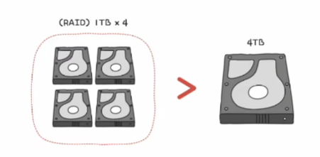

## RAID

- Redundant Array of Independent Disks
- 하드 디스크와 SSD로 사용하는 기술
- 데이터의 안전성 혹은 높은 성능을 위해 여러 물리적 보조기억장치를 마치 하나의 논리적 보조기억장치처럼 사용하는 기술
- 쉽게 말하면 여러개를 하나처럼 엮어서 사용할 수 있는 기술을 뜻함

## RAID 레벨 (종류)

- RAID를 구성하는 기술
- RAID 0, RAID 1, RAID 2 ,,, 그로부터 파생된 RAID 10, RAID 50,,
- 그중에서도 RAID 0, RAID 1, RAID 4, RAID 5, RAID 6이 잘 사용된다

### (1) RAID 0

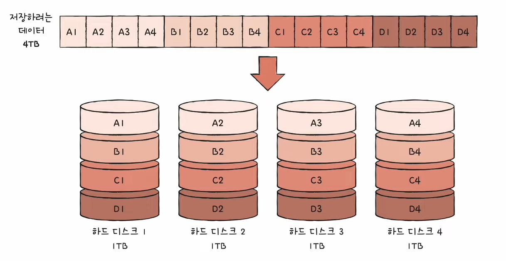

- 특징 : 데이터를 단순히 나누어 저장하는 방식
    - 각 하드디스크는 번갈아 가며 데이터를 저장합니다
    - 저장하는 데이터가 하드디스크 개수만큼 나뉘어 저장
    - 스트라입 (stripe) : 마치 줄무늬처럼 분산되어 저장된 데이터
    - 스트라이핑 (striping) : 분산하여 저장하는 것

- RAID 0 (제로)의 장단점
    - 장점 : 입출력 속도의 향상!  
      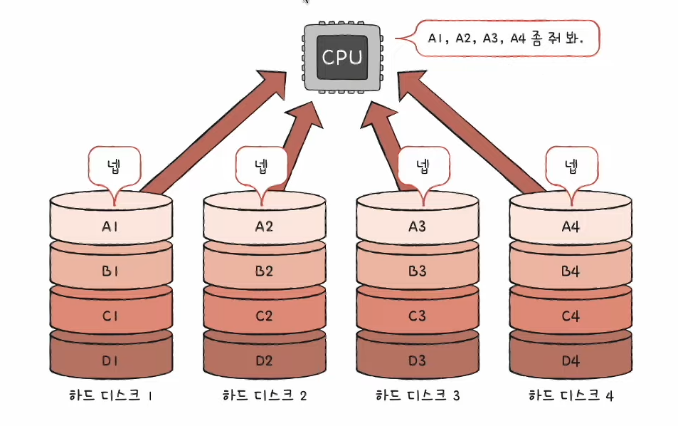
    - 단점 : 저장된 정보가 안전하지 않음  
      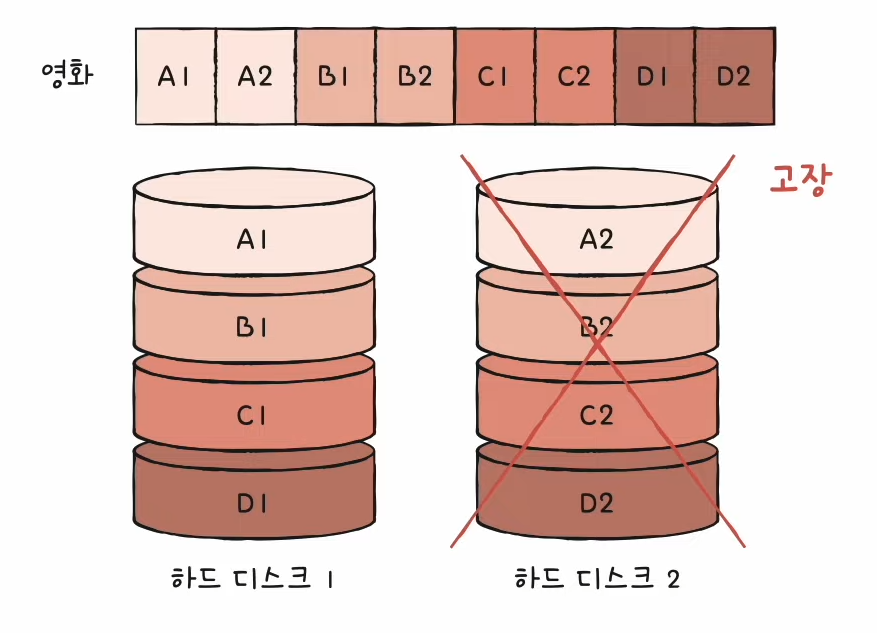

### (2) RAID 1

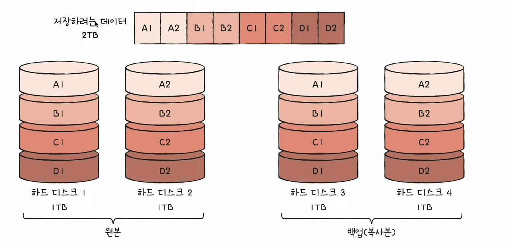

- 특징 : 미러링 (mirroring)
    - 복사본을 만드는 방식
    - 데이터를 쓸 때 원본과 복사본 두 군데에 씀

- 장단점
    - 장점
        - 완전한 백업본이 있으니까 안전하다!
    - 단점
        - 느린 쓰기 속도 - 두군데 쓰니까 (쓰기 속도 특히!)
        - 하드 디스크 개수가 한정되었을 때 사용가능한 용량이 적어짐
            - 복사본이 만들어지는 용량만큼 사용 불가 -> 많은 양의 하드 디스크가 필요 -> 비용
              증가   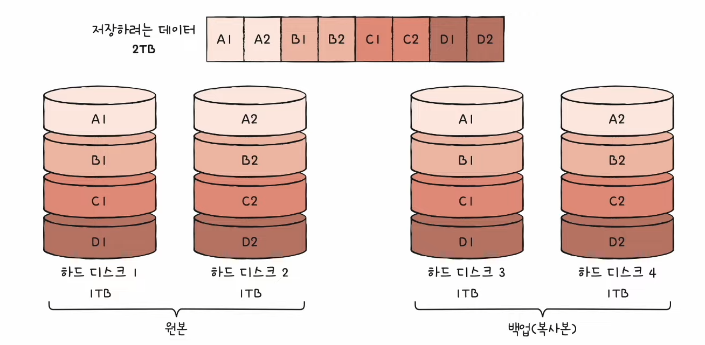

### (3) RAID 4

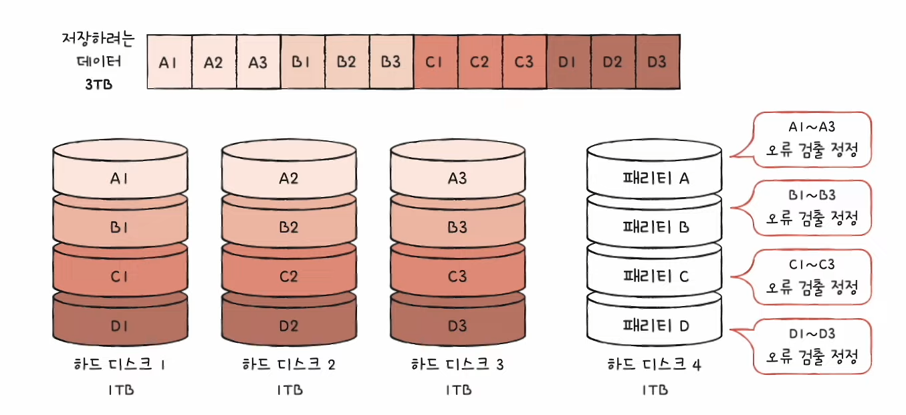

- RAID 1처럼 완전한 복사본을 만드는 대신, 오류를 검출하고 복구하기 위한 정보를 저장
- '패리티 비트' 저장
    - 원래 '패리티 비트' 단어 자체로만 보면 오류 검출만 가능하고 오류 복구는 불가능한 도구
    - 그렇지만 RAID에서 사용되는 패리티비트는 오류복구가 가능!
    - 패리티를 저장한 장치를 이용해 다른 장치들의 오류를 검출하고, 오류가 있다면 복구
        - RAID 1보다 적은 하드 디스크로도 데이터를 안전하게 보관!
- 단점
    - 패리티 디스크의 병목현상이 생길 수 있음   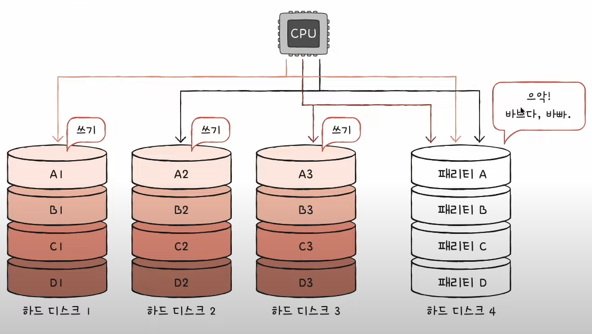
        - 어떤 정보를 각 하드디스크에 쓸 때마다 하드디스크 4에다가 매번 똑같이 써주면서 오류검출을 해야하니까 디스크4에서 병목현상 발생가능!

### (4) RAID 5

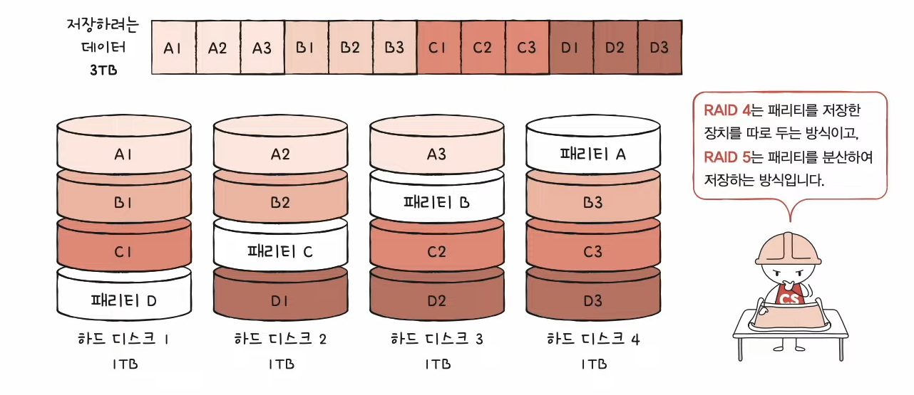

- RAID4의 병목현상을 보완한다
- 패리티 정보를 분산하여 저장하는 방식

### (5) RAID 6

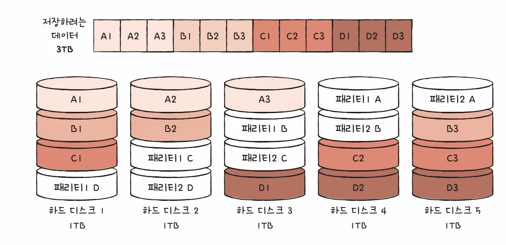

- 두 종류의 패리티 (오류를 검출하고 복구할 수 있는 수단)
- 두 종류의 패리티를 사용하니까 RAID 5보다 훨씬 더 안전!
- 그렇지만 그만큼 쓰기속도는 RAID 5보다 느림

## 결론

> RAID 레벨이 종류가 많으니까,,

- 각 RAID 레벨마다 장단점이 있음
- 어떤 상황에서 무엇을 최우선으로 원하는지에 따라 최적의 RAID 레벨은 달라질 수 있음
- 각 RAID 레벨의 대략적인 구성과 특징을 아는 것이 중요!

- 아래 이미지와 같이 RAID 직접 설정 가능

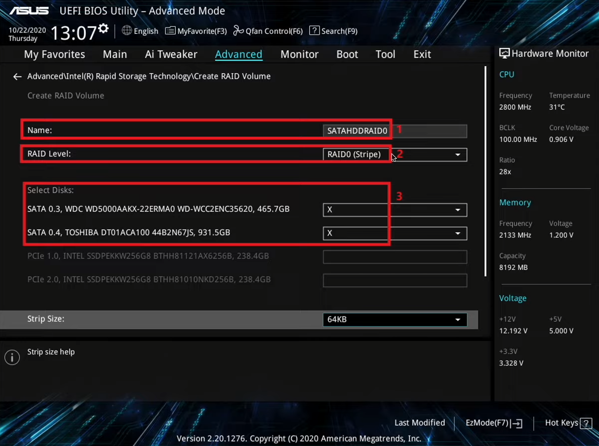