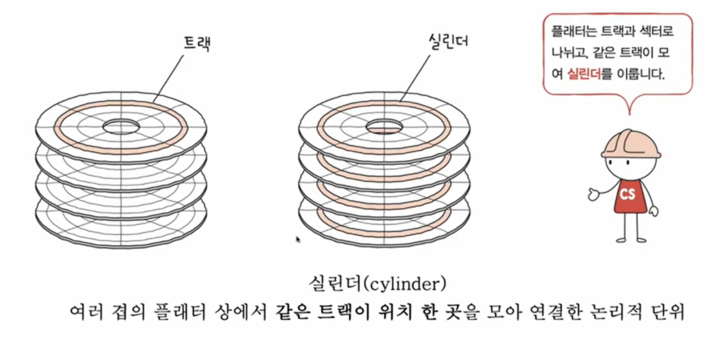

# 2강. 컴퓨터의 구조의 큰 그림

## 컴퓨터 구조

### 컴퓨터가 이해하는 정보

#### 데이터

- 숫자, 문자, 이미지, 동영상과 같은 정적 정보
- 컴퓨터와 주고받는, 내부에 저장된 정보

#### 명령어

- 컴퓨터 = 명령어 처리하는 기계
- 즉, 명령어
    - 컴퓨터를 실질적으로 움직이는 정보
    - 데이터는 명령어를 위한 재료

### 컴퓨터의 네 가지 핵심 부품

- 메인보드(MotherBoard)에 각각 장착한다

- (1) CPU
- (2) 메모리
- (3) 보조기억장치
- (4) 입출력장치

### 메모리 (보통 RAM을 지칭)

- 현재 실행되는 프로그램의 명령어와 데이터를 저장하는 부품
-   
- 프로그램이 실행되려면 메모리에 저장되어야 한다
- 메모리는 프로그램의 '명령어'와 '데이터'를 저장한다
- 메모리에 저장된 값의 위치는 '주소'로 알 수 있다

### CPU (컴퓨터의 두뇌)

- 메모리에 저장된 명령어를 읽어 들이고, 해석하고, 실행하는 부품
- ALU(산술논리연산장치) : 계산기
- 레지스터 : CPU 내부의 작은 저장장치 (임시저장)
- 제어장치 : 제어 신호를 내보내고, 명령어를 해석하는 장치
    - 제어신호 : 컴퓨터 부품들을 관리하고 작동시키는 전기신호(ex:메모리쓰기신호, 메모리읽기신호)

#### 전체적인 흐름

CPU의 제어장치가 제어신호(메모리읽기신호)를 내보내고, 메모리에서 명령어를 가져와서 레지스터에 저장 후, 다시 제어장치를 통해 해석 한 후에 다시 또 메모리 읽기신호로 메모리에서 필요한 데이터를 가져와 레지스터에
저장해서 제어장치로 해석하고 ALU를 통해 계산하고, 계산한 값을 레지스터에 저장한다.

### 저장장치 차이

- 메모리 (RAM) : 비싸다 / 전원이 꺼지면 저장 내용 잃는다 (휘발성) -> 실행할 정보
- 보조기억장치 : 전원이 꺼져도 보관될 프로그램을 저장하는 부품 -> 보관할 정보

### 입출력장치

- 보조기억장치, 입출력 장치를 완벽하게 구분하기 쉽지않다. 보통은 주변장치(peripheral device)라고 한다.
    - 주변장치 : 프로세서나 메모리, 버스 등처럼 컴퓨터의 필수적인 부분은 아니지만 비교적 근거리에 위치하고 있는 장치
    - 보조기억장치 : 메모리를 보조하는 특별한 입출력 장치 느낌

### 메인보드(motherboard)

- 메인보드에 연결된 부품은 '버스'를 통해 정보를 주고 받음 - 통로 역할
- 다양한 종류의 버스가 있는데 컴퓨터의 핵심 부품 연결하는 버스는 : 시스템 버스 (척추 느낌)
- 

- 시스템 버스의 내부구성
    - 주소 버스 : 주소를 주고받는 통로
    - 데이터 버스 : 명령어와 데이터를 주고 받는 통로
    - 제어 버스 : 제어 신호를 주고받는 통로
      