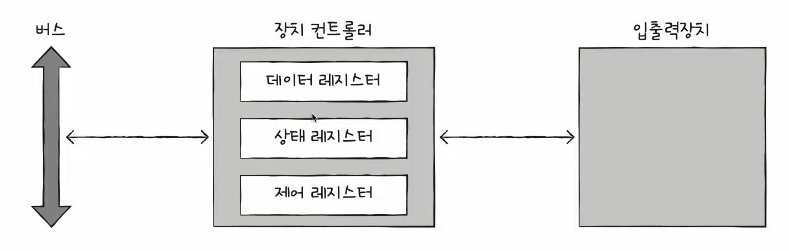
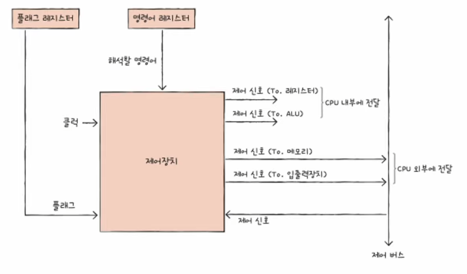
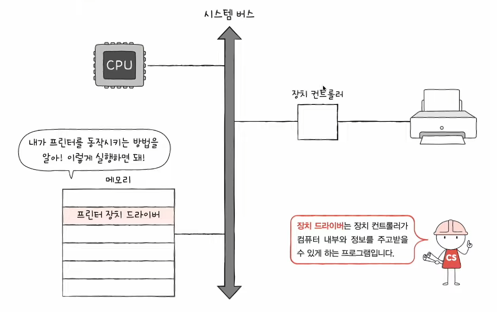

# 20강. 장치 컨트롤러와 장치 드라이버

> Q. 입출력장치(+보조기억장치)는 컴퓨터 내부와 어떻게 데이터를 주고받는 걸까?

## CPU - 입출력장치 정보 주고받기

- 입출력장치는 앞서 학습한 CPU, 메모리보다 다루기가 더 까다롭다

> **왜???**

### 1. 입출력장치에는 종류가 너무나도 많다!

  

- 장치가 다양하면 장치마다 속도, 데이터 전송 형식 등도 다양하다
- 다양한 입출력장치와 정보를 주고받는 방식을 **규격화**하기 어렵다

### 2. 일반적으로 CPU와 메모리의 데이터 전송률은 높지만 입출력장치의 데이터 전송률은 낮다.

- 전송률(tranfer rate)
    - 데이터를 얼마나 빨리 교환할 수 있는지를 나타내는 지표
- 이러한 전송률의 차이때문에 다루기가 어렵다

> => 이러한 이유들로 등장한게 바로 **장치 컨트롤러!**

## 장치 컨트롤러

- 입출력장치는 장치 컨트롤러를 통해 컴퓨터와 연결된다
- 입출력 제어기 (I/O controller) / 입출력 모듈 (I/O module)

### 장치 컨트롤러의 역할

- (1) CPU와 입출력장치 간에 통신 중개
    - 입출력 장치가 다양해서 규격화하기 어려운데 그걸 중개해주는 일종의 변역가 역할 수행
- (2) 오류 검출
    - 오류를 검출해준다
- (3) 데이터 버퍼링
    - 버퍼링
        - 전송률이 높은 장치와 낮은 장치 사이에 주고받는 데이터를 버퍼라는 임시저장 공간에 저장하여 전송률을 비슷하게 맞추는 방법
             

### 장치 컨트롤러의 구조

(상태 레지스터와 제어 레지스터는 하나의 레지스터(상태/제어 레지스터)로 사용되기도 한다)

- 데이터 레지스터
    - CPU와 입출력장치 사이에 주고받을 데이터가 담기는 레지스터 (버퍼역할한다고 보면돼)
    - 최근엔 RAM을 사용하기도 함
- 상태 레지스터
    - 상태 정보저장
        - 입출력장치가 입출력 작업을 할 준비가 되었는지,
        - 입출력 작업이 완료되었는지,
        - 입출력 장치에 오류는 없는지 등의 상태 정보를 저장한다
- 제어 레지스터
    - 입출력장치가 수행할 내용에 대한 제어 정보

## 장치 드라이버

- 장치 컨트롤러의 동작을 감지하고 제어하는 프로그램
    - 장치 컨트롤러가 하드웨어 적인 통로라면 장치 드라이버는 하나의 소프트웨어적인 통로라고 보면 돼!

- **컴퓨터**(운영체제)가 연결된 장치의 드라이버를 인식하고 실행할 수 있다면 컴퓨터 내부와 정보를 주고받을 수 있음
- 반대로 **컴퓨터**(운영체제)가 장치 드라이버를 인식하거나 실행할 수 없다면 그 장치는 컴퓨터 내부와 정보를 주고받을 수 없음!

