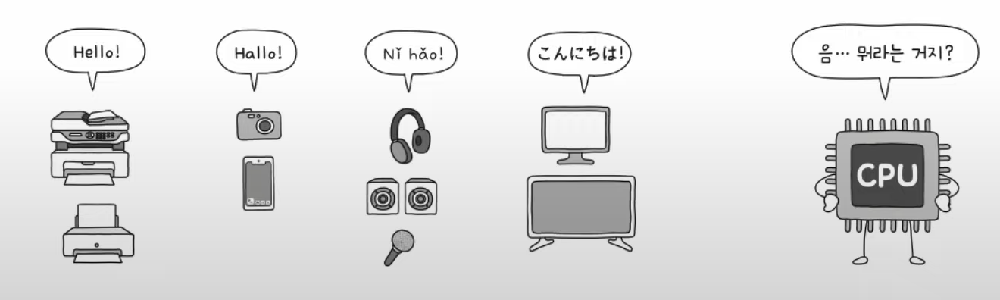

# 20강. 장치 컨트롤러와 장치 드라이버

> Q. 입출력장치(+보조기억장치)는 컴퓨터 내부와 어떻게 데이터를 주고받는 걸까?

## CPU - 입출력장치 정보 주고받기

- 입출력장치는 앞서 학습한 CPU, 메모리보다 다루기가 더 까다롭다

**왜???**

- 이유
    - 입출력장치에는 종류가 너무나도 많다!
        - 장치가 다양하면 장치마다 속도, 데이터 전송 형식 등도 다양하다
        - 다양한 입출력장치와 정보를 주고받는 방식을 **규격화**하기 어렵다
    - 일반적으로 CPU와 메모리의 데이터 전송률은 높지만 입출력장치의 데이터 전송률은 낮다.
      

