# 21강. 다양한 입출력 방법

> ⚡ 입출력 방식의 종류 : 프로그램 입출력 / 인터럽트 기반 입출력 / DMA 입출력

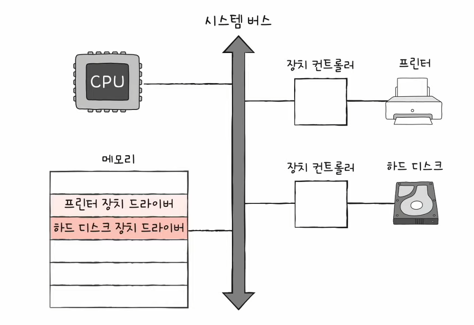

## 1. 프로그램 입출력

- 프로그램 속 명령어로 입출력장치를 제어하는 방법
- 입출력 명령어로써 장치 컨트롤러와 상호작용
- CPU가 장치 컨트롤러의 레지스터 값을 읽고 씀으로써 이루어진다

### < 1-1 쓰기 과정 >

> 메모리에 저장된 정보를 하드 디스크에 백업하는 과정을 예시로 들어보자!  
> (= 하드 디스크에 새로운 정보 '쓰기')

#### (1) CPU는 하드디스크 컨트롤러의 제어 레지스터에 쓰기 명령 내보내기

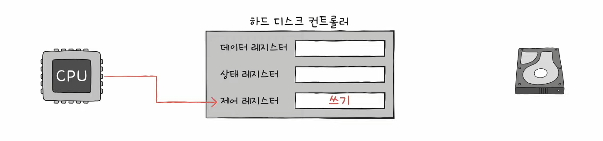

#### (2) CPU는 하드디스크 컨트롤러의 제어 레지스터에 쓰기 명령 내보내기

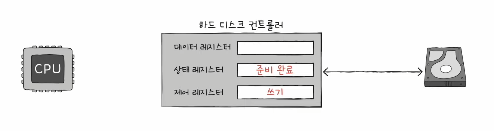

#### (3-1) CPU는 상태 레지스터를 주기적으로 읽어보며 하드 디스크의 준비여부를 확인

#### (3-2) 하드 디스크가 준비되었다면 백업할 메모리의 정보를 데이터 레지스터에 쓰기

(아직 백업 작업 (쓰기 작업)이 끝나지 않았다면 1번부터 반복, 쓰기가 끝났다면 작업 종료)

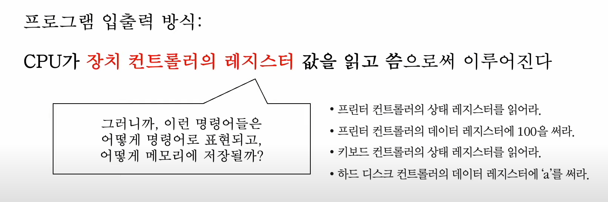

그런데 여기에서 CPU가 어떻게 레지스터(입출력장치들의 주소)들을 인식할 수 있을까?

### < 1-2 프로그램 입출력 방식 >

- (1) 메모리 맵 입출력
    - 메모리에 접근하기 위한 주소공간과 입출력장치에 접근하기 위한 주소공간을 하나의 주소공간으로 간주하는 방법
    - 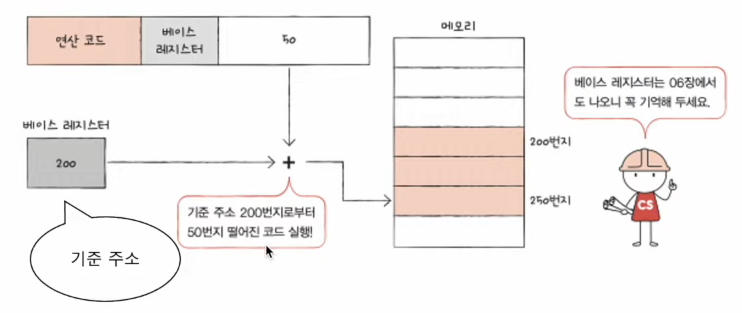
    - 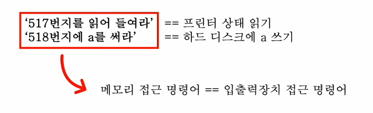
    - 메모리 접근 명령어와 입출력 장치 접근 명령어와 같다
        - 그 이유는 하나의 주소공간을 가지고 있기 때문!

- (2) 고립형 입출력
    - 메모리를 위한 주소공간과 입출력을 위한 주소공간을 분리하는 방법
    - 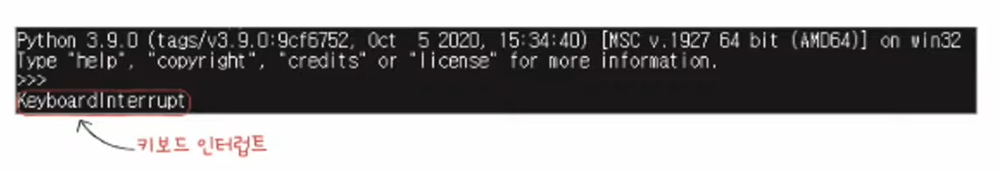
    - 제어버스쪽을 보면 메모리 읽기/쓰기 선과 입출력장치 읽기/쓰기 선이 별도로 각각 나누어져 있는 것을 확인할 수 있다
    - 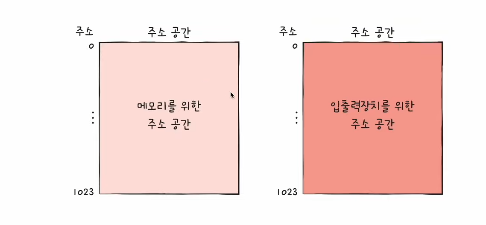
    - (입출력 읽기/쓰기 선을 활성화시키는) 입출력 전용 명령어 사용

- 정리
    - 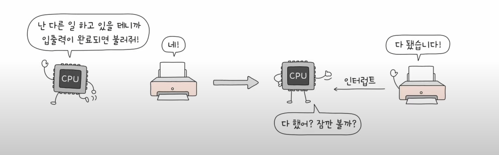

---

## 2. 인터럽트 기반 입출력

- 하드웨어 인터럽트는 장치 컨트롤러에 의해 발생

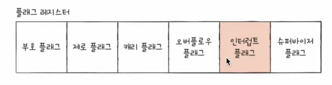

- 이렇게 되면 CPU는 CPU사이클을 알뜰살뜰 쓰면서 더 효율적으로 쓸 수 있는거임
    - 왜냐면 프로그램 입출력때보면 CPU는 상태레지스터를 '주기적으로' 읽어보면서 하드디스크의 준비여부를 확인하는데 인터럽트를 이용하면 요청신호가 오면 그때 시작하면 되니까 더 효율적이라는 거임
    - 인터럽트방식과 반대되는 즉, '주기적인' 방식은 '폴링'이라고 한다

### < 2-1 동시다발적인 인터럽트 >

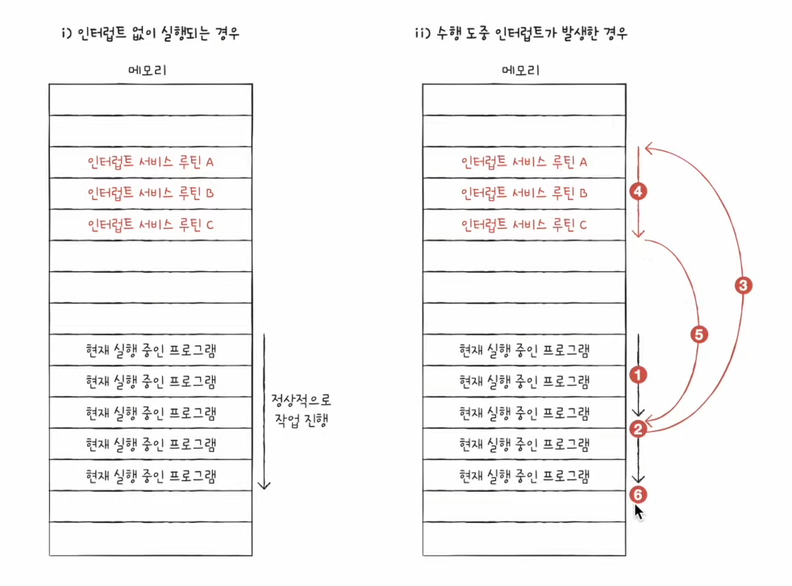

> 입출력장치가 많을 때 어떻게 처리할까??

#### (1) 인터럽트 발생 순서대로 처리

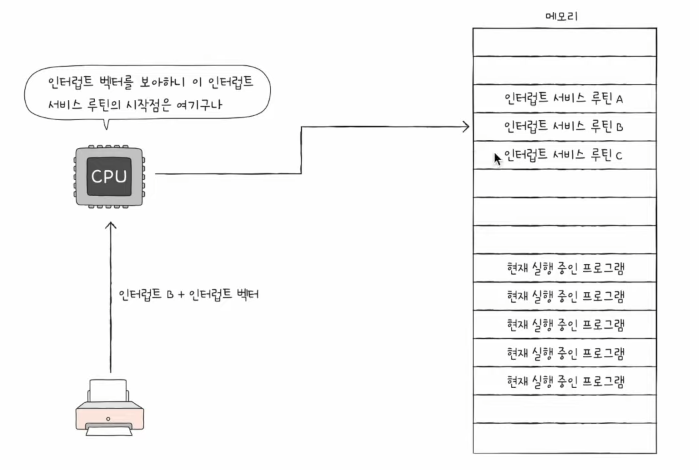

- 간단하게 생각해보면 플래그 레지스터 속 인터럽트 비트를 비활성화 한채 인터럽트를 처리해서 순차적으로 처리 진행

#### (2) 우선순위를 반영해서 처리

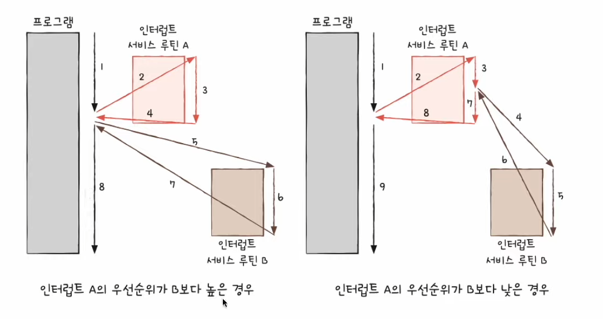

- NMI 즉 non maskable interrupt가 발생하면, 우선순위를 반영해서 처리한다
- NMU가 발생하면 플래그 제리스터 속 인터럽트 비트를 활성화한 채 입터렅르르 처리하는 경우

#### PIC (Programmable Interrupt Controller)

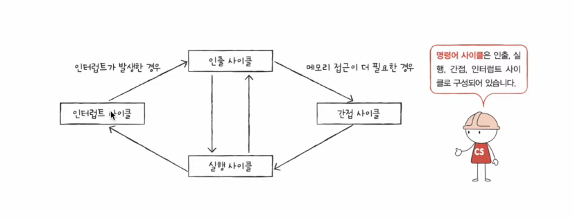  
(그림을 보면 아래에 여러 핀들이 있는데 거기에 각각 장치컨트롤러들이 연결되는 것이다)

- 다중인터럽트를 처리하는 방식에는 다양한 방식이 있지만 그중 가장 대중적인 방식

1. 여러 장치 컨트롤러에 연결되어
2. 장치 컨트롤러의 하드웨어 인터럽트의 우선순위를 판단한 뒤 (NMI우선순위까지 판단하지는 않음)
3. CPU에게 지금 처리해야 하는 인터럽트가 무엇인지 판단하는 하드웨어

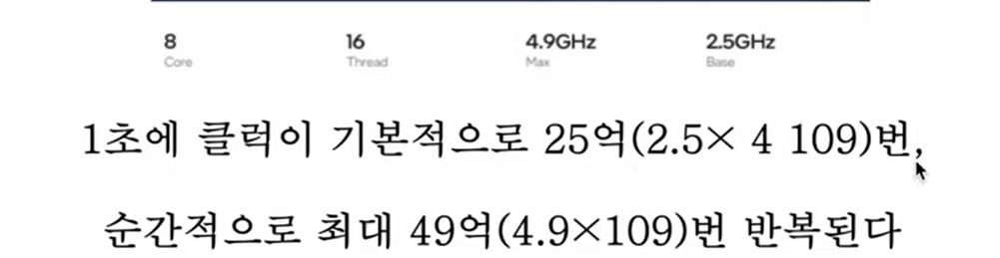

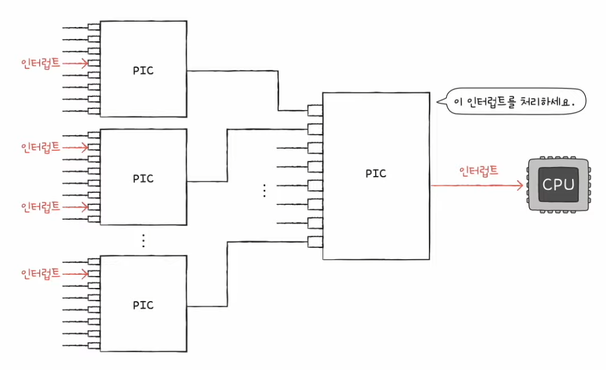  
(이렇게 보통 여러개가 한꺼번에 사용된다)

### 프로그램 입출력, 인터럽트 기반 입출력의 '공통점'

- 입출력장치와 메모리간의 데이터 이동은 **CPU**가 주도하고,   이동하는 데이터도 반드시 **CPU**를 거친다

> 무슨뜻이지? 예시를 통해 생각해보자

- 입출력장치의 데이터를 메모리에 저장하는 경우,

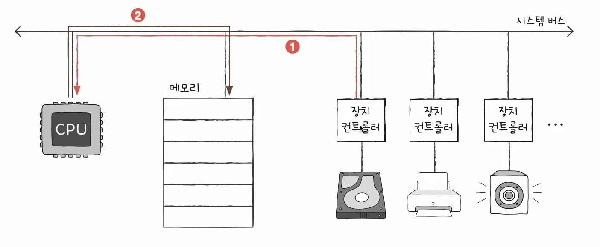