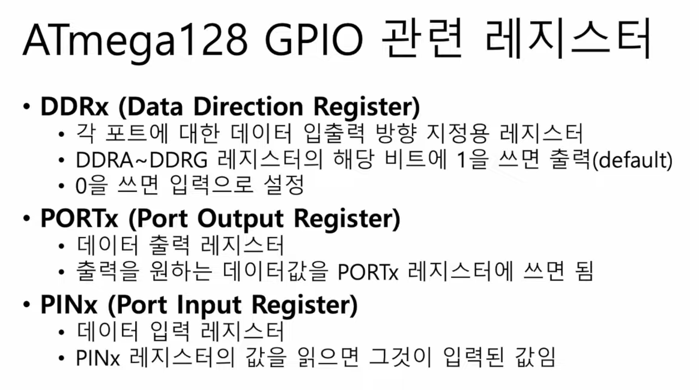
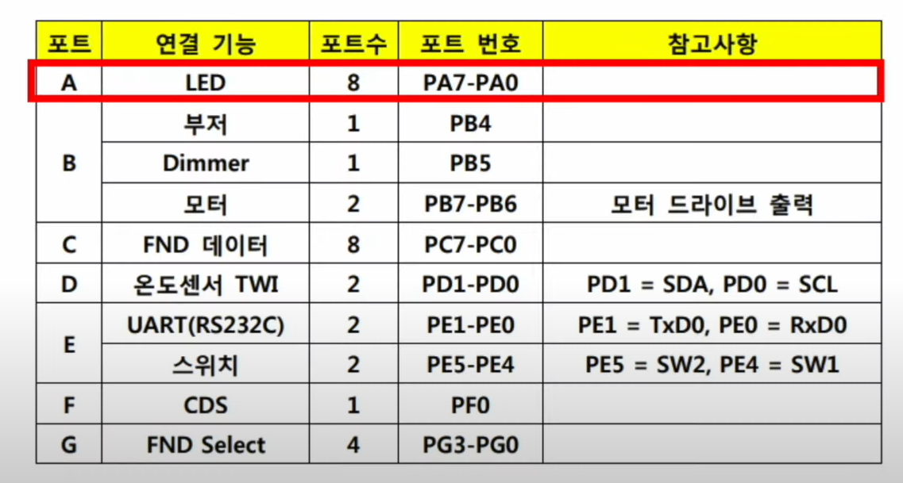
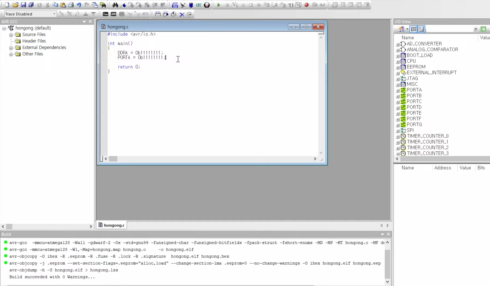
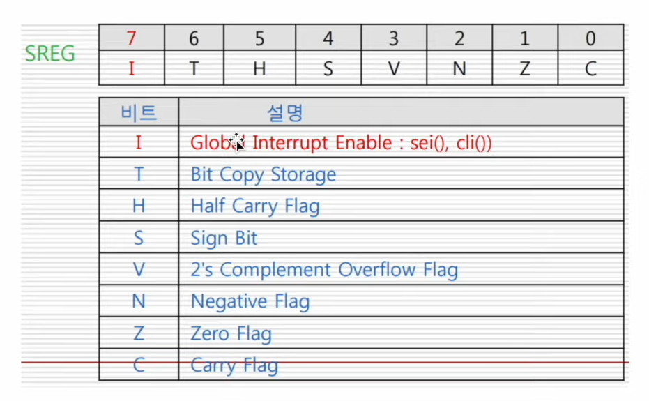
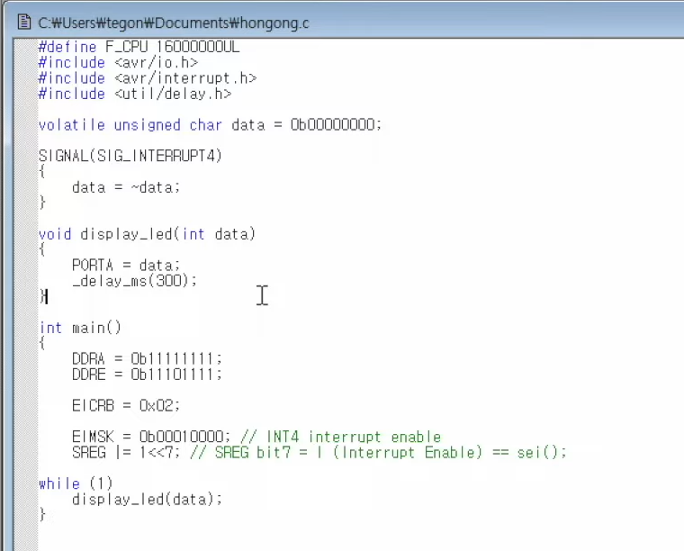

# 22강. 레지스터를 직접 조작하며 입출력 해보기

> 입출력 작업을 할 때 어떤 식으로 레지스터를 읽고 쓰는지 이해하는게 key point!

## 1. 레지스터를 직접 조작해서 입출력장치 사용하기

- DDRx 이렇게 x가 있는 부분에 포트 연결시키고 싶은걸 써넣는 것
    - ex) DDRA (led 연결)

- DDRA - A로 연결되어있는 부품은 모두 출력으로 설정이 된다
- PORTA - 어떤 값이 출력되냐면, 모든 LED를 출력하라는 의미가 담긴 11111111 -> 8개의 LED에 빛이 들어오게 된다

> → 이런식으로 레지스터를 직접 조작해서 입출력장치 사용할 수 있다!

## 2. 입출력장치의 인터럽트를 어떻게 레지스터에서 다루지?

- I가 1로 되어있으면 하드웨어의 인터럽트를 받아들일 수 있게 설정되는 것

- 스위치 1번에 해당되는 것만 인터럽트 허용하겠다
- 어떤 값을 쓰느냐에 따라 어떤 입출력장치의 인터럽트를 허용하는지를 설정할 수 있게된다
- 직접 인터럽트 정의가능

