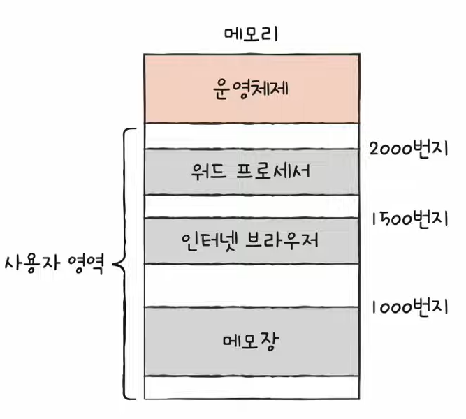
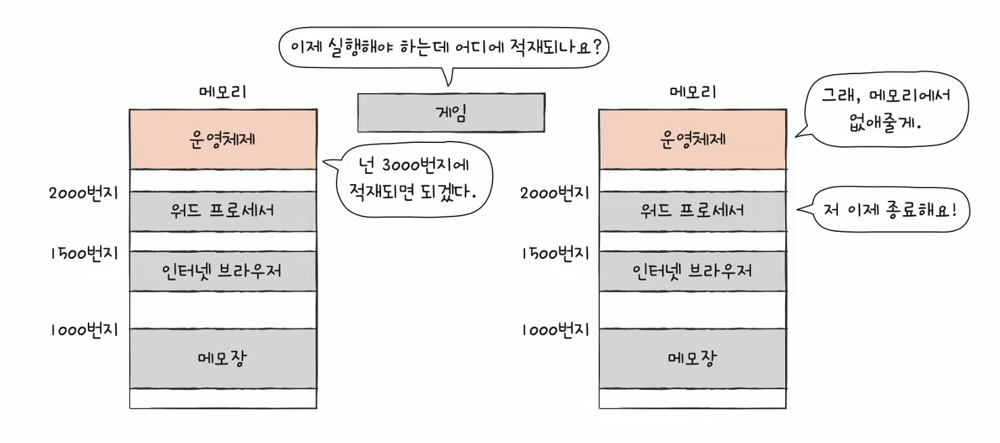
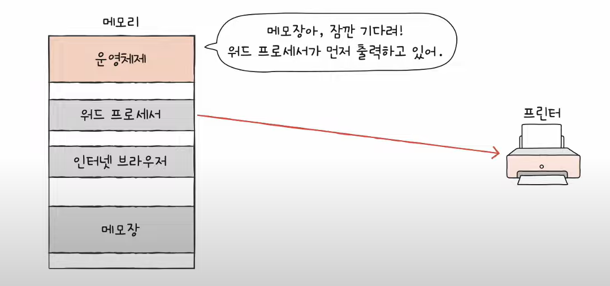
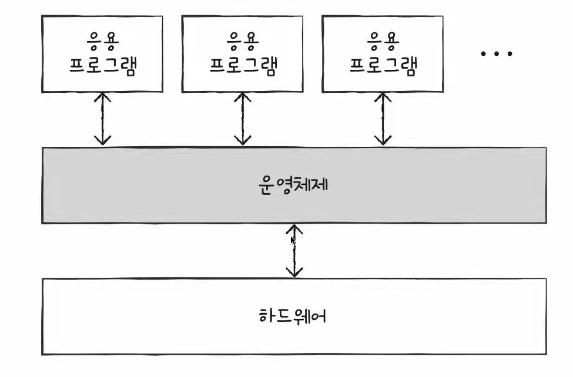

# 23강. 운영체제를 알아야 하는 이유

> 컴퓨터 부품만 있다고 알아서 동작하는게 아니고 가장 근원적인 '운영체제'가 필요하다!

## 운영체제

- 모든 프로그램은 실행을 위해 **자원**을 필요로 한다

### 여기서 자원이란??

- 프로그램 실행에 있어 마땅히 필요한 요소
- 즉 프로그램 실행에 있어 마땅히 필요한 요소
    - 당연히 컴퓨터의 네 가지 핵심 부품 포함 !

### 운영체제란?

- 운영체제는 실행한 프로그램에 필요한 자원을 할당하고, 프로그램이 올바르게 실행되도록 돕는 특별한 프로그램
- 운영체제도 메모리에 적재되는데 운영체제는 중요하고 특별하니까 '커널영역'이라는 메모리의 한 공간에 저장된다

- 응용프로그램 (application software)
    - 사용자가 특정 목적을 위해 사용하는 일반적인 프로그램
    - 메모장, 프리미어, 워드 등

> Q. 위 이미지에서 그럼 누가 워드 프로세서를 메모리 2000번지에 저장하라고 지정해주는 걸까??
>
> A. 바로 **운영체제**가 메모리 관리를 해주는 것!

## 운영체제가 하는일

### 1. 메모리 관리

- 운영체제는 메모리에서 사용안하는건 삭제하고, 프로그램 어디에 적재되는지 결정하는 일을 한다

### 2. CPU 관리

- CPU는 여러개의 프로그램을 빠르게 번갈아가면서 실행하는데, 운영체제가 어떤 프로그램을 얼만큼 실행하는지, 어떤게 먼저 실행되는지 등을 결정한다

### 3. 입출력장치 관리

- 입출력장치의 순서 등을 관리

> < 정리 >
>
> 운영체제는 우리가 실행하는 응용 프로그램과 하드웨어 사이에서 연결해주는 다리 역할을 하는 특별한 프로그램 !
>
> 

- 운영체제는 '정부'라고 예시로 자주 든다

## 운영체제 알아야하는 이유

- 운영체제 없이 프로그램을 개발하는 것은 말이 안된다
- 이유 : 만약 운영체제가 없다면 개발자는 하드웨어를 조작하는 코드를 직접 작성해야한다
    - 예) 1과 2를 더하는 결과를 모니터에 출력하는 간단한 프로그램
        - 프로그램을 메모리에 적재하는 코드 필요
        - CPU로 하여금 1과 2를 더하게 하는 코드 필요
        - 모니터에 계산 결과를 출력하는 코드 필요
        - 등등

- 운영체제는 사용자를 위한 프로그램이 아닌, '**프로그램**'을 위한 프로그램이다!
    - 개발자가 만드는 프로그램은 운영체제에게 도움을 받아서 만들어짐
    - 그러므로 문제가 생기면 운영체제가 가장 먼저 알아차리게 된다
        - 가장 하드웨어랑 맞닿아있으니까!

### 운영체제를 공부하게 된다면?

- 문제 해결 능력 - 오류 메세지에 대한 깊은 이해
    - 대부분의 에러 메세지를 내보내는 근원적인 주체는 운영체제이다!