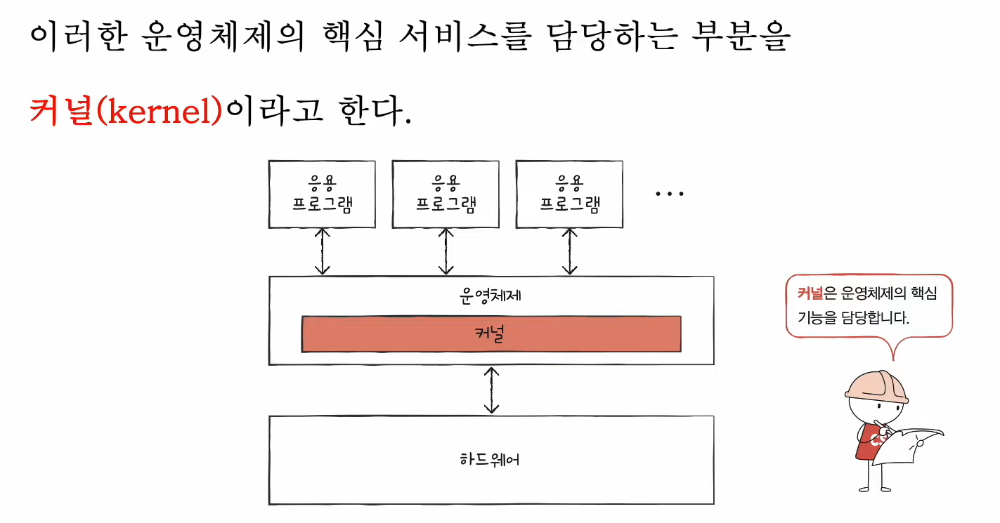
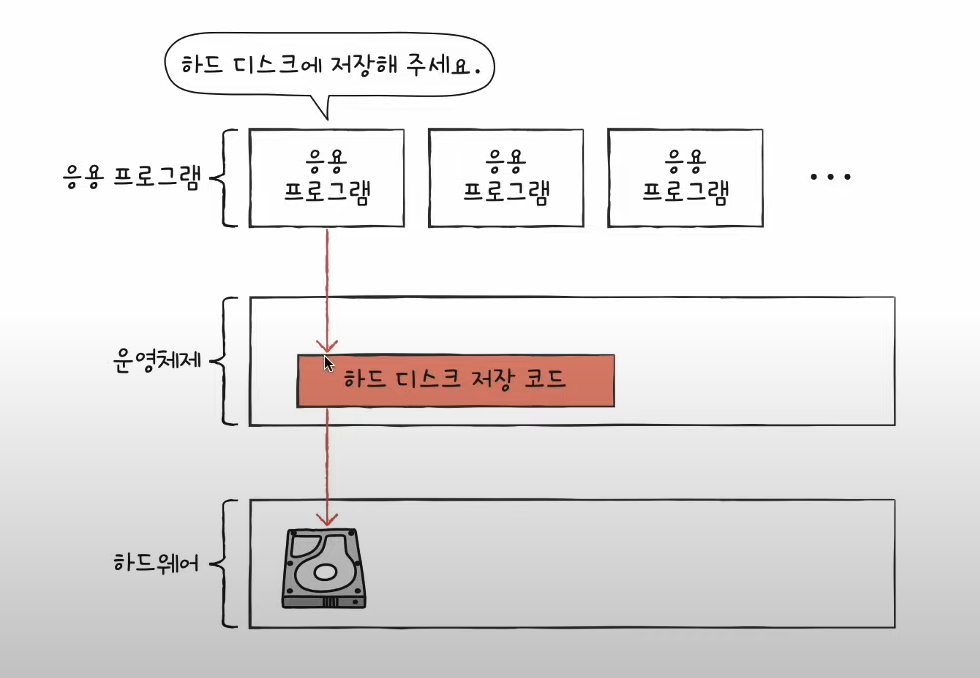
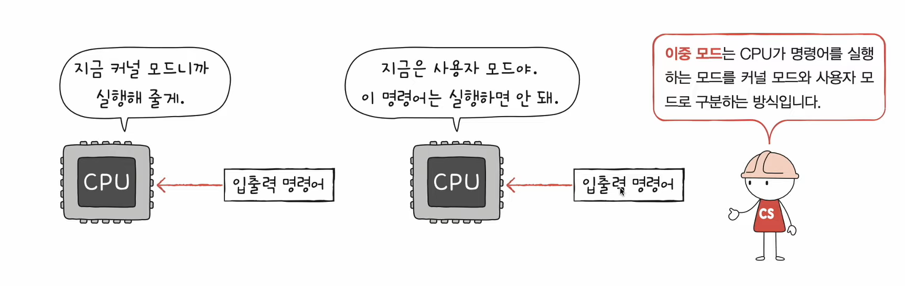
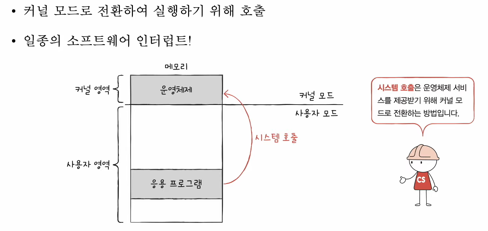
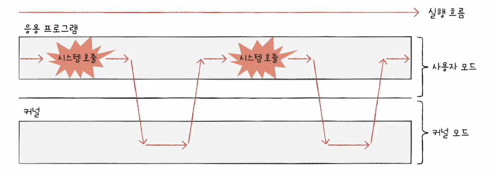

# 24강. 운영체제의 큰 그림

> 🔑 **< key point >** 🔑
>   <u>운영체제는 뭐 해줘? </U>
>   커널이 몰까?
>   운영체제의 서비스 종류?
>   시스템 콜(시스템 호출)과 이중 모드?

---

## 운영체제의 심장, 커널

- 운영체제는 현존하는 프로그램 중 규모가 가장 큰 프로그램 중 하나
- 다양한 종류의 운영체제가 있다
    - windows, android, macos ios, linux 등
- 그러므로 운영체제가 제공하는 기능은 다양하다
- 그렇지만 <u>가장 핵심적인 서비스는 존재</u>한다

### 여기서 말하는 핵심적인 서비스란?

- 자원에 접근하고 조작하는 기능, 프로그램이 올바르고 안전하게 실행되게 하는 기능 등

### 이걸 해주는게 바로, *'커널'*

- 자동자의 엔진, 사람의 심장과 같은 역할
- 그럼 운영체제에는 속하는데 커널에는 속하지 않는 기능도 있을까?
    - 유저 인터페이스 (UI, user interface)
- 이건 그냥 사용자와 컴퓨터 간의 통로일 뿐 운영체제의 핵심기능(커널)은 아니다

### 커널이 하는 일

- 사용자가 실행하는 프로그램은 자원에 직접 접근할 수 있을까? 접근해도 될까?
- 안된다! 자원에 직접 접근은 위험하다

- 그러므로 운영체제는 응용 프로그램들이 자원에 접근하려 할 때 오직 '자신을' 통해서만 접근하도록 하여 자원 보호!

- 운영체제의 코드를 실행해서 접근! 즉 운영체제는 자원 접근을 대행하는 일종의 '문지기'
- 아래와 같은 방식으로 진행

---

### < 이중모드 >

- CPU가 명령어를 실행하는 모드를 사용자 모드, 커널 모드로 구분하는 방식

- 위 이미지의 '슈퍼바이저 플래그'가 구분해준다

#### (1) 사용자 모드

- 운영체제 서비스를 제공 받을 수 없는 실행 모드
- 커널 영역의 코드를 실행할 수 없는 실행 모드
- 자원 접근 불가

#### (2) 커널 모드

- 운영체제의 서비스를 제공받을 수 있는 실행 모드
- 자원 접근을 비롯한 모든 명령어 실행 가능
- 자원 접근 가능

### < 시스템 호출 (system call) >

- 사용자 모드로 실행 중인 프로그램이 운영체제 서비스를 받기 위해 운영체제에 보내는 요청
    - 이를 통해 커널 모드로 전환하여 '운영체제 서비스'를 제공받을 수 있다

- 시스템 호출 명령어 실행 시 CPU는 기존 작업을 백업하고 커널 내 시스템 호출을 수행하는 코드를 실행한 뒤 다시 기존 작업으로 복귀

- 일반적으로 응용 프로그램은 실행 과정에서 운영체제 서비스를 빈번하게 이용하며 시스템 호출을 발생시키고, 사용자 모드와 커널 모드를 오가며 실행

---

## 운영체제의 세 가지 핵심 서비스

### (1) 프로세스 관리

- 프로세스(process) == 실행 중인 프로그램
    - 태스크라고도 불림
    - 수많은 프로게스들이 '동시에' 실행
        - 일반적으로 CPU(코어)는 한 번에 하나의 프로세스만 실행할 수 있어 조금씩 번갈아가며 실행
    - 다양한 프로세스를 일목요연하게 관리하고 실행할 수 있도록 한다
    - 자원 접근 및 할당
- 중점 : 프로세스와 스레드, 프로세스 동기화, 교착상태 해결 등을 이해해야 함 !

### (2) 자원접근 및 할당

#### cpu

- 프로세스들에 공정하게 CPU를 할당하기 위한 CPU 스케줄링
    - 어떤 프로세스부터 CPU를 이용하게 할 것이며 얼마나 오래 이용하게 할 것인지 결정
        

#### 메모리

- 페이징, 스와핑, 등등
    - 새로운 프로세스가 적재될 때 어느 주소에 적재해야 할지 결정 메모리 공간이 꽉 차 있거나 프로세스를 적재하지 못하는 상황 발생 시 어떻게 처리?
        

#### 입출력장치

- '인터럽트 서비스 루틴'은 운영체제가 제공하는 기능
    - 커널 영역에 존재 파일 시스템 관리 보조기억장치 속 데이터를 파일과 디렉터리로 관리하는 파일 시스템 file system

### (3) 파일 시스템 관리

- 파일과 시스템 관리
    - 관련된 정보를 파일이라는 단위로 저장장치에 보관
    - 파일들을 묶어 폴더(디렉토리) 단위로 저장장치에 보관

