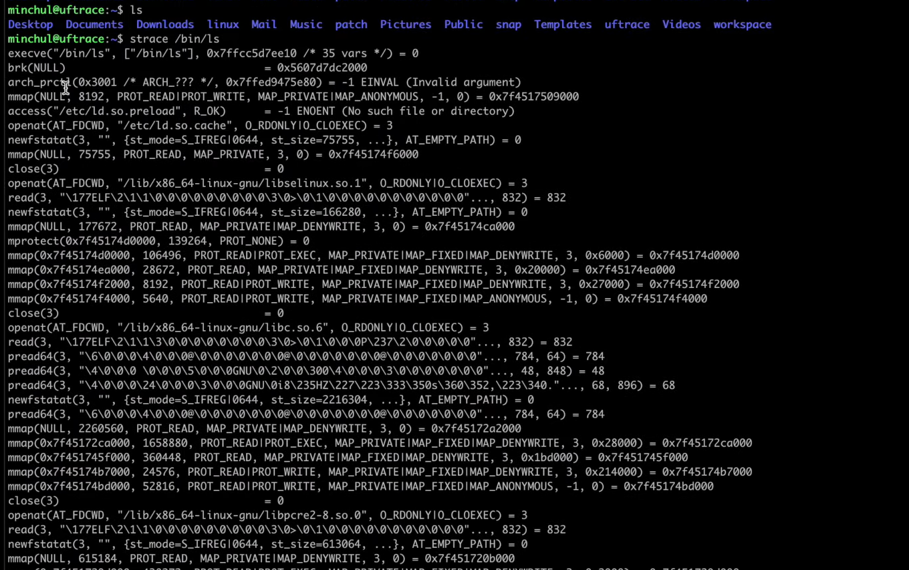

# 25강. 시스템 호출(system call) 직접 관찰하기

> 리눅스 (우분투)에서 시스템 직접 관찰하기

## linux - strace

- strace라는 도구(명령어)로 시스템 콜을 파악할 수 있음
- 아주 단순한 명령어라도 빈번하게 시스템 콜을 일어난다
- 위 이미지에서는 ls라는 명령어의 시스템 콜을 알아봄
    - `strace /bin/ls`

## Windows - DTrace

- linux와 macOS의 운영체제의 결이 같다
- windows는 조금 다르다
    - 시스템 콜 오픈소스 사용해서 알아볼 수 있음
    - [Windows의 DTrace](https://learn.microsoft.com/ko-kr/windows-hardware/drivers/devtest/dtrace)
    - Windows의 DTrace는 Windows 운영 체제에서 시스템 활동을 추적하고 문제를 진단하는 데 사용되는 강력한 디버깅 도구
        - DTrace는 커널, 사용자 모드 애플리케이션 및 드라이버에서 작동하는 모든 소프트웨어 구성 요소에서 실행 중인 코드의 활동을 추적할 수 있음
        - 시스템 내부의 작동 방식을 자세히 이해할 수 있으며, 성능 문제를 진단하고 최적화할 수 있음
    - 사용방법
        - Windows Performance Toolkit(WPT) 패키지를 다운로드하고 설치
        - 명령 프롬프트를 열고 관리자 권한으로 실행
        - xperf -on base 명령어를 실행하여 추적을 시작
        - 추적 중에 필요한 활동을 정의하는 DTrace 스크립트를 작성
        - xperf -d trace.etl 명령어를 실행하여 추적 결과를 ETL 파일로 저장
        - 저장된 ETL 파일을 Windows Performance Analyzer(WPA) 도구를 사용하여 분석

## macOS - dtruss

- macOS에서의 시스템 호출 명령어는 다르다
    - `sudo` - 관리자 권한으로 실행
    - `sudo dtruss /bin/ls`
        - 만약에 dturss가 실행되지 않는다면 아래의 링크 참고하기
        - [dtruss가 실행이 안될 경우](https://github.com/kangtegong/self-learning-cs/blob/main/troubleshooting/DTRUSS.md)