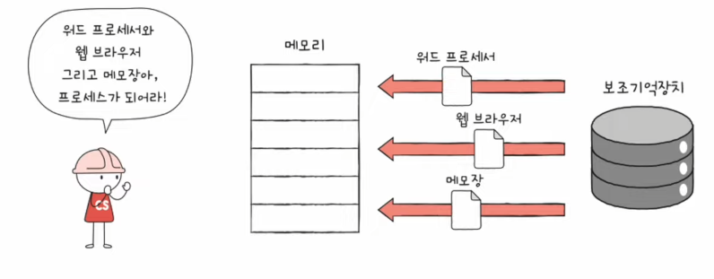
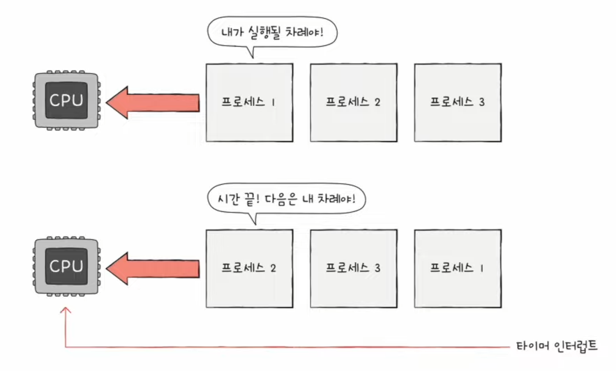
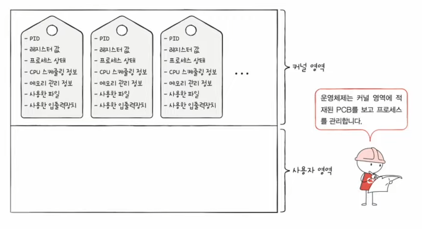
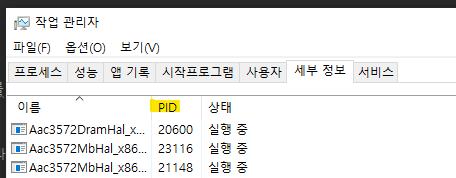
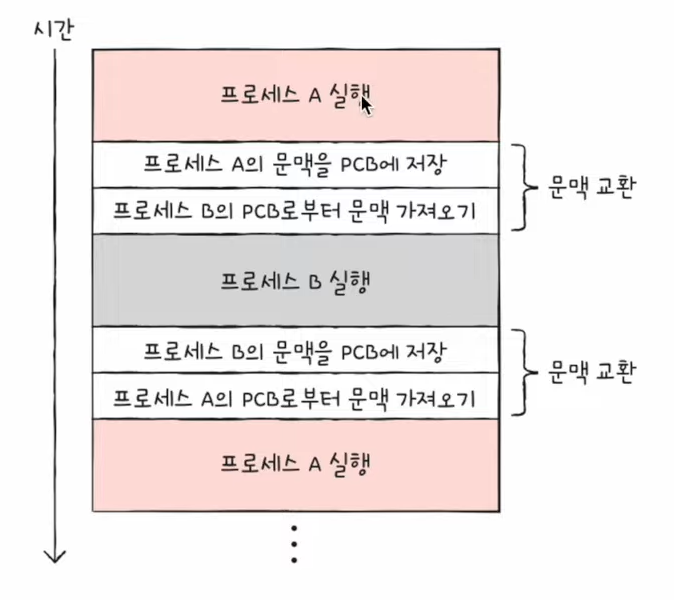
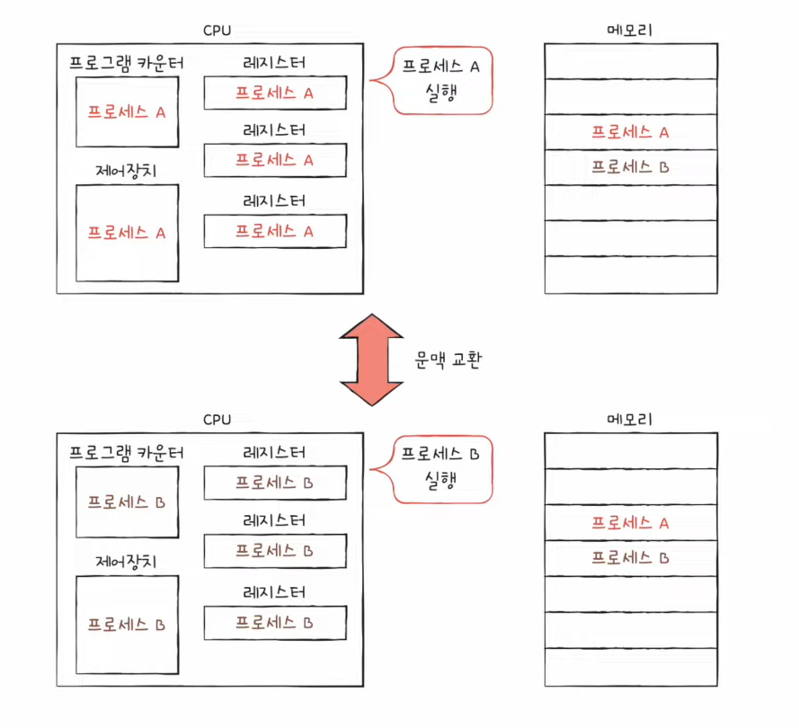
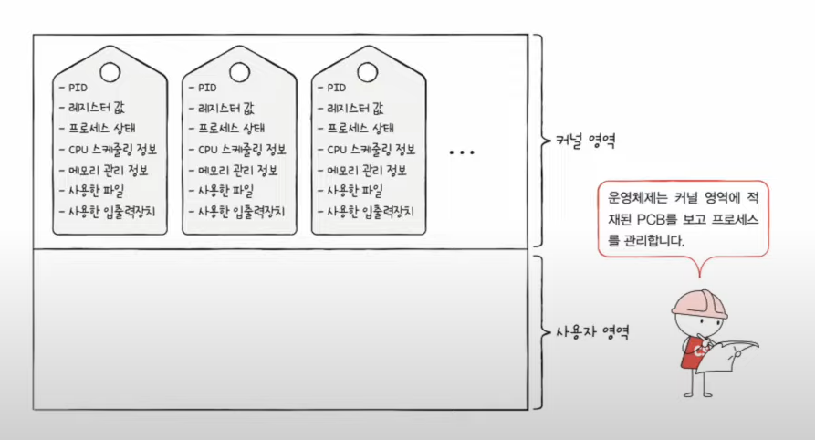
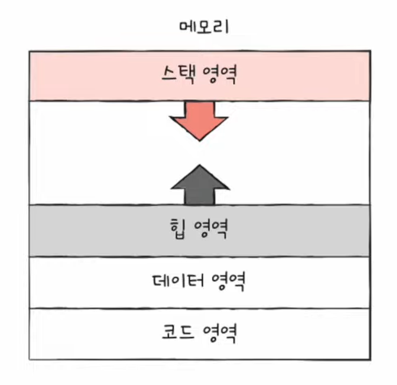

# 26강. 프로세스 개요

> 프로세스에 대해 알아보자-!

## 프로세스

### 프로세스란?

- **프로세스** : 실행중인 프로그램
- 실행하기전에는 그저 보조기억장치에 있는 메모리 덩어리
- 실행하면 그 프로그램은 '프로세스'가 된다
    - 이런 과정을 '프로세스를 생성한다'라고 표현

### 프로세스 종류

- 포그라운드 프로세스 (foreground process)
    - 사용자가 볼 수 있는 공간에서 실행되는 프로세스
- 백그라운드 프로세스 (background process)
    - 사용자가 볼 수 없는 공간에서 실행되는 프로세스
        - (1) 사용자와 직접 상호작용이 가능한 백그라운드 프로세스
            - 데몬(daemon), 서비스(service) 라고 불림
        - (2) 사용자와 상호작용하지 않고 그저 정해진 일만 수행하는 프로세스

## 운영체제는 프로세스를 어떻게 관리하는가?

### 프로세스 제어 블록

- 모든 프로세스는 실행을 위해 CPU가 필요하다
- 그렇지만 CPU 자원은 한정적!
- 즉, 프로세스들은 돌아가면서 한정된 시간만큼만 CPU를 이용할 수 있음
    - 자신의 차례에 정해진 시간만큼 CPU 이용
    - 타이머 인터럽트가 발생하면 차례 양보
        - 타이머 인터럽트 : '야 너 시간 끝났어', 라고 알려주는 특별한 인터럽트 / 클럭신호에 맞게 주기적으로 발생하는 하드웨어 인터럽트의 한 종류

- 그러므로 운영체제는 빠르게 번갈아 수행되는 프로세스들을 관리해야함
- 이를위해 사용하는 자료구조가 <u>'프로세스 제어 블록 (PCB)'</u>
    - 프로세스 관련 정보를 저장하는 자료 구조
    - 마치 상품에 달린 태그와 같은 정보
    - 프로세스 생성 시 커널 영역에 생성, 종료 시 폐기

### PCB에 담기는 대표적인 정보 (운영체제마다 차이있음)

- 프로세스 ID (PID)
    - 특정 프로세스를 식별하기 위해 부여하는 고유한 번호
- 레지스터 값
    - 프로세스는 자신의 실행 차례가 오면 이전까지 사용한 레지스터 중간 값을 모두 복원 -> 실행 재게
    - 프로그램 카운터, 스택 포인터 등등
        - 이전까지 실행한 내용을 자기차례 왔을때 다시 재개할 때 사용해야하니까
- 프로세스 상태
    - 입출력 장치를 사용하기 위해 기다리는 상태, CPU를 사용하기 위해 기다리는 상태, CPU 이용중인 상태..
- CPU 스케줄링 정보
    - 프로세스가 언제 어떤 상태에 CPU를 사용할지에 대한 정보가 담겨있는 스케줄링 정보
- 메모리 정보
    - 프로세스가 어느 주소에 저장되어 있는지에 대한 정보
    - 페이지 테이블 정보 (지금으로서는 '메모리 주소를 알 수 있는 정보가 담기는구나' 라고 받아들이면 됨)
- 사용한 파일과 입출력 장치 정보
    - 할당된 입출력장치, 사용 중인(열린)파일 정보 기록된다

## 문맥 교환 (context switch)

- 한 프로세스 (ex: 프로세스 A) 에서 다른 프로세스 (ex: 프로세스 B)로 <u>실행 순서</u>가 넘어가면 어떤 순서로 진행되나?

### 진행 순서

1. 기존에 실행되던 프로세스 A는 지금까지의 <u>중간 정보</u>를 백업
    - 프로세스 카운터 등 각종 레지스터 값, 메모리 정보, 열었던 파일, 사용한 입출력 장치 등
    - 이러한 중간 정보 == '문맥(context)'
    - 다음 차례가 왔을 때 실행을 재개하기 위한 정보
    - '실행 문맥을 백업해두면 언제든 해당 프로세스의 실행을 재개할 수 있다'
2. 뒤이어 실행할 프로세스 B의 문맥을 복구
    - 자연스럽게 실행중인 프로세스가 바뀐다

### 정리

- '문맥 교환'
    - 기존의 실행 중인 프로세스 문맥을 백업하고, 새로운 프로세스 실행을 위해 문맥을 복구하는 과정
    - context switching
    - 여러 프로세스가 끊임없이 빠르게 번갈아 가면 실행되는 원리

## 사용자영역에서 저장되는 것

> 그렇다면 프로세스는 위처럼 커널영역이 아닌 '사용자 영역'에서는 어떻게 저장될까?

### 사용자 영역 나누기 (대표적인거만)

- 코드 영역 (=텍스트 영역)
- 데이터 영역
- 힙 영역
- 스택 영역

### (1) 코드 영역 (= 텍스트 영역)

- 실행할 수 있는 코드, 기계어로 이루어진 명령어 저장
- 데이터가 아닌 CPU가 실행할 명령어가 담기기에 쓰기가 금지된 영역 (read-only)
- 정적할당영역으로도 불림 (한번 사이즈가 정해지면 바뀔일이 없으니까)

### (2) 데이터 영역

- 잠깐 썼다가 없앨 데이터가 아닌 프로그램이 실행되는 동안 유지할 데이터 저장
    - 전체에서 접근할 수 있는 변수
    - ex : 전역변수 (global variable)
- 정적할당영역으로도 불림 (한번 사이즈가 정해지면 바뀔일이 없으니까)

### (3) 힙 영역

- 프로그램을 만드는 사용자, 즉 프로그래머가 직접 할당할 수 있는 저장공간
- 프로그래머가 할당했다면 그걸 다시 꼭 반환해야한다
    - 그걸 대신 자동적으로 '가비지 컬렉션 (Garbage collection)'이 계속 해주고 있었음
- 이렇게 힙 영역을 지정한 건 계속 메모리를 차지하고 메모리 누수(memory leak)을 야기시킴
- 동적할당영역으로도 불림

### (4) 스택 영역

- 데이터가 일시적으로 저장되는 공간
- 데이터 영역에 담기는 값과는 달리, 잠깐 쓰다가 말 값들이 저장되는 공간
- ex: 매개 변수, 지역 변수 (일시적으로 사용할 데이터)
- 동적할당영역으로도 불림

### 힙영역과 스택 영역의 크기는 가변적

- 일반적으로는 힙영역은 낮은 주소 -> 높은 주소로 할당
- 일반적으로는 스탭영역은 높은 주소 -> 낮은 주소로 할당
- 그렇기때문에 겹칠 일이 별로 없음