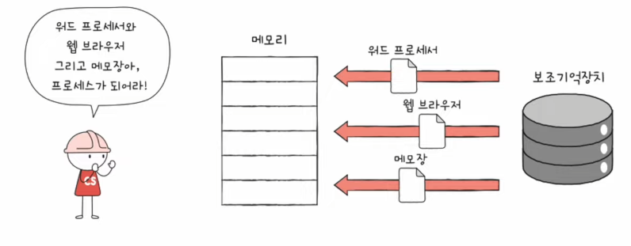
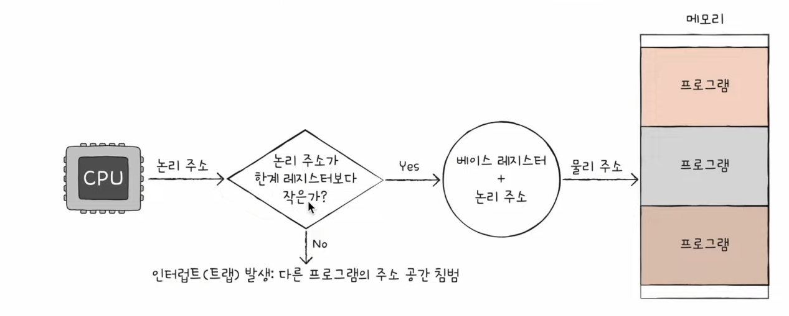

# 26강. 프로세스 개요

> 프로세스에 대해 알아보자-!

## 프로세스

### 프로세스란?

- **프로세스** : 실행중인 프로그램
- 실행하기전에는 그저 보조기억장치에 있는 메모리 덩어리
- 실행하면 그 프로그램은 '프로세스'가 된다
    - 이런 과정을 '프로세스를 생성한다'라고 표현

### 프로세스 종류

- 포그라운드 프로세스 (foreground process)
    - 사용자가 볼 수 있는 공간에서 실행되는 프로세스
- 백그라운드 프로세스 (background process)
    - 사용자가 볼 수 없는 공간에서 실행되는 프로세스
        - (1) 사용자와 직접 상호작용이 가능한 백그라운드 프로세스
            - 데몬(daemon), 서비스(service) 라고 불림
        - (2) 사용자와 상호작용하지 않고 그저 정해진 일만 수행하는 프로세스

## 운영체제는 프로세스를 어떻게 관리하는가?

### 프로세스 제어 블록

- 모든 프로세스는 실행을 위해 CPU가 필요하다
- 그렇지만 CPU 자원은 한정적!
- 즉, 프로세스들은 돌아가면서 한정된 시간만큼만 CPU를 이용할 수 있음
    - 자신의 차례에 정해진 시간만큼 CPU 이용
    - 타이머 인터럽트가 발생하면 차례 양보
        - 타이머 인터럽트 : '야 너 시간 끝났어', 라고 알려주는 특별한 인터럽트 / 클럭신호에 맞게 주기적으로 발생하는 하드웨어 인터럽트의 한 종류

- 그러므로 운영체제는 빠르게 번갈아 수행되는 프로세스들을 관리해야함
- 이를위해 사용하는 자료구조가 <u>'프로세스 제어 블록 (PCB)'</u>
    - 프로세스 관련 정보를 저장하는 자료 구조
    - 마치 상품에 달린 태그와 같은 정보
    - 프로세스 생성 시 커널 영역에 생성, 종료 시 폐기

### PCB에 담기는 대표적인 정보 (운영체제마다 차이있음)

- 프로세스 ID (PID)
    - 특정 프로세스를 식별하기 위해 부여하는 고유한 번호
- 레지스터 값
    - 프로세스는 자신의 실행 차례가 오면 이전까지 사용한 레지스터 중간 값을 모두 복원 -> 실행 재게
    - 프로그램 카운터, 스택 포인터..
- 프로세스 상태
- CPU 스케줄링 정보
- 메모리 정보
- 사용한 파일과 입출력 장치 정보