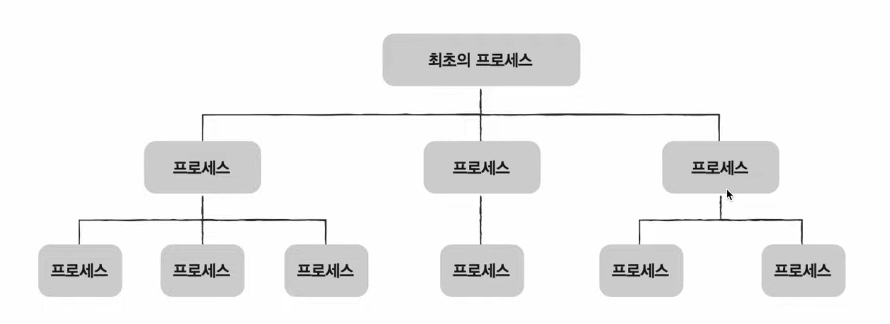
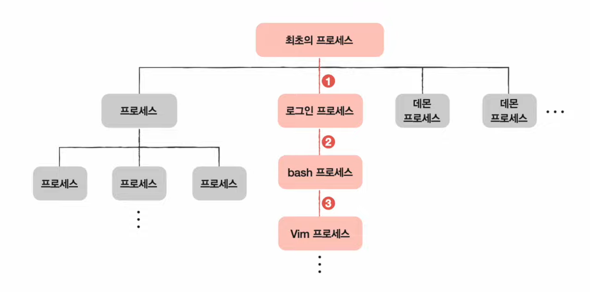
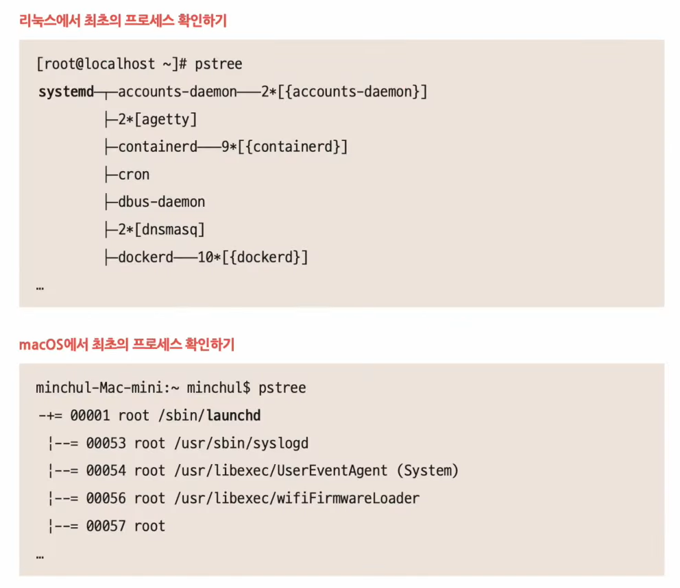
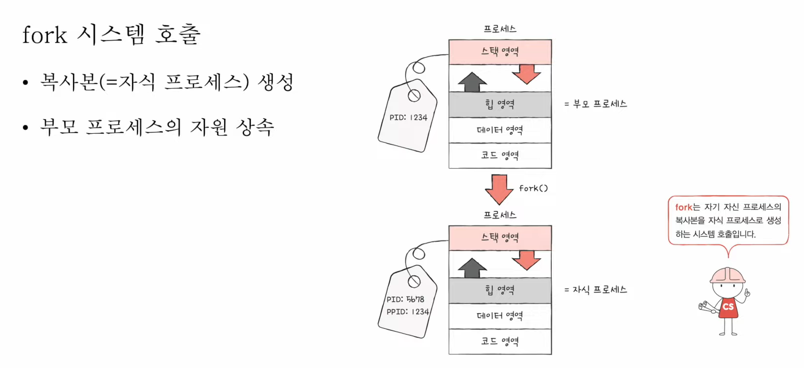

# 27강. 프로세스 상태와 계층 구조

- 운영체제는 프로세스의 상태를 PCB에 기록한다

## 1. 프로세스 상태

- 운영체제마다 조금씩 차이가 있다
- 보통 아래와 같이 5가지의 상태가 있다

### (1) 생성 상태

- 이제 막 메모리에 적재되어 PCB를 할당 받은 상태
- 준비가 완료되었다면 준비 상태로 변함

### (2) 준비 상태

- 당장이라도 CPU를 할당 받아 실행할 수 있지만, 자신의 차례가 아니기에 기다리는 상태
- 자신의 차례가 된다면 실행 상태로 변함(=디스패치)

### (3) 실행 상태

- CPU를 할당 받아 실행 중인 상태
- 할당된 시간 모두 사용 시 (타이머 인터럽트 발생 시) 준비 상태로 되돌아감
- 실행 도중 입출력장치를 사용하면 입출력작업이 끝날 때까지 대기 상태로 변함

### (4) 대기 상태

- 프로세스가 실행 도중 입출력장치를 사용하는 경우
- 입출력 작업은 CPU에 비해 느리기에 이 경우 대기 상태로 접어둠
- 입출력 작업이 끝나면 (입출력 완료 인터럽트를 받으면) 준비 상태로 되돌아감

### (5) 종료 상태

- 프로세스가 종료된 상태
- PCB, 프로세스의 메모리 영역 정리

## 2. 프로세스의 계층 구조

> 대부분의 운영체제는 프로세스를 계층구조로 운영
 
> 그렇지만 windows는 계층구조가 아니긴 함

- 프로세스 실행 도중 (시스템 호출을 통해) 다른 프로세스 생성 가능
    - 새 프로세스를 생성한 프로세스 : <u>부모 프로세스</u>
    - 부모 프로세스에 의해 생성된 프로세스 : <u>자식 프로세스</u>
- 부모 프로세스와 자식 프로세스는 별개의 프로세스이므로 각기 다른 PID를 가짐
    - 일부 운영체제에서는 자식 프로세스 PCB에 부모 프로세스 PID(PPID-Parent PID)를 명시하기도 함

> 그림으로 그려보자면?
>

### <예시>

최초의 프로세스 - 로그인 프로세스 - bash 프로세스 - vim 프로세스

> 최초의 프로세스 알아보기
 
> ( pstree 명령어를 통해서 프로세스 트리 구조를 파악할 수 있음 )

- 그림으로보면
    - 리눅스에서는 'systemd' 프로세스가 '최초의 프로세스'
    - macOS에서는 'launchd' 프로세스가 '최초의 프로세스'

## 3. 프로세스 생성기법

- 쉬운 비유 : '복제'와 '옷 갈아입기'

> 부모 프로세스는 자식 프로세스를 어떻게 만들어 내고, 자식 프로세스는 어떻게 자신만의 코드를 실행할까?
>
> ( 이하 내용은 Windows 운영체제와는 큰 관련이 없음, 다르니까 )

### (1) fork

- 부모 프로세스는 fork 시스템 호출을 통해 자신의 복사본을 자식 프로세스로 생성 - '복제'
    - 복제되긴하지만 별개의 프로세스니까 PID나 메모리 주소 등은 당연히 다르다

### (2) exec

- 자식 프로세스는 exec 시스템 호출을 통해 자신의 메모리 공간을 다른 프로그램으로 교체 - '옷갈아입기'
    - 내 메모리 공간을 새로운 프로그램으로 덮어써라! (전환)
    - 코드/데이터 영역은 실행할 프로그램 내용으로 바뀌고 나머지 영역은 초기화

