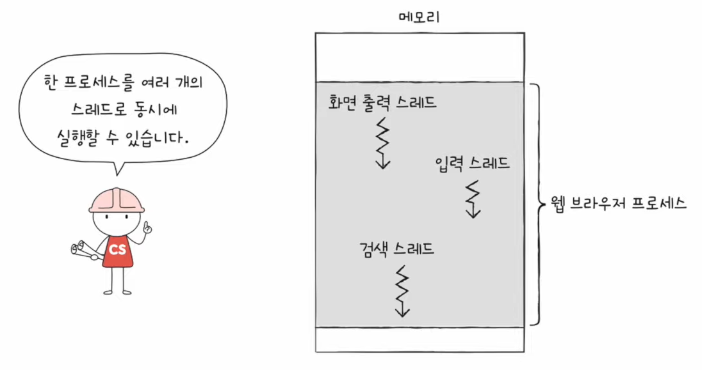
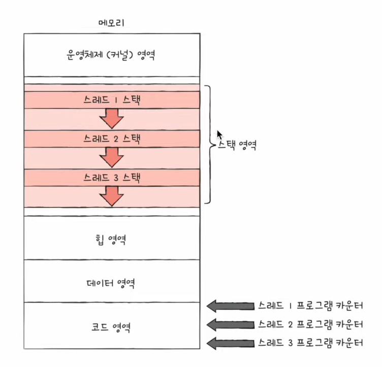
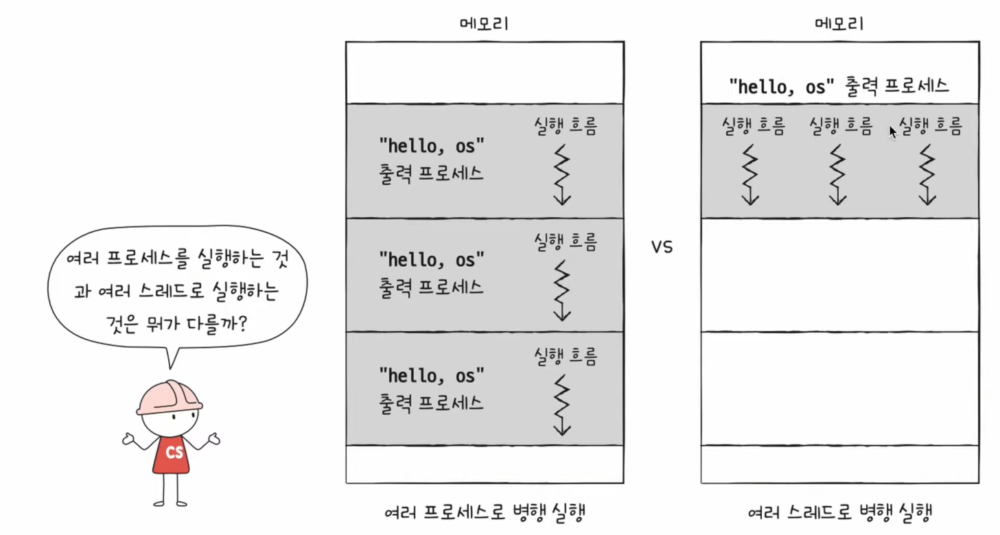
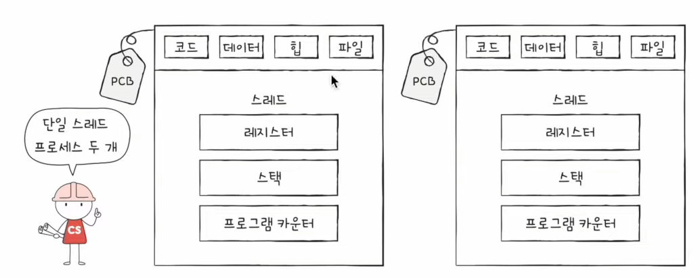
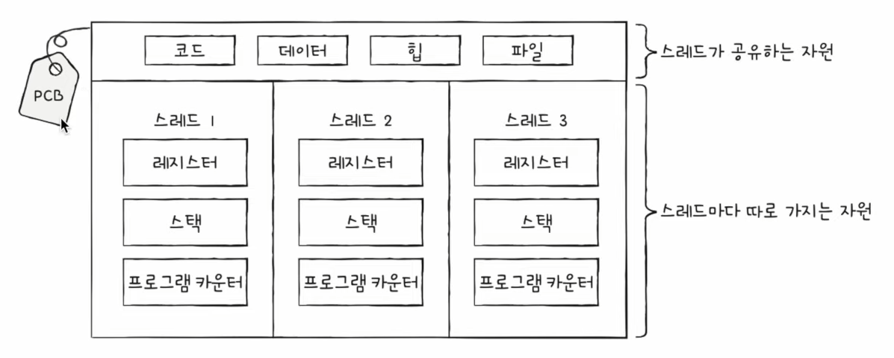

# 28강. 스레드

## 스레드란?

- 스레드(thread)
    - 프로세스를 구성하는 실행 흐름의 단위
    - 하나의 프로세스는 하나 이상의 스레드를 가질 수 있다
- 단일 스레드 프로세스
    - 실행 흐름이 하나인 프로세스

### 스레드의 구성요소

- 스레드 ID, 프로그램 카운터를 비롯한 레지스터 값, 스택 등 실행에 필요한 최소한의 정보
- 프로세스를 이루는 스레드들은 그 프로세스의 자원을 공유하고 있다.
    - 위 이미지를 보면 같은 데이터 영역을 공유하고 있는걸 확인 가능.

- 리눅스 운영체제에서의 스레드
    - 리눅스와 프로세스를 별개로 나눌 필요 없다. 그냥 실행의 문맥일 뿐이다
- 그렇지만 다른 운영체제에서는 아직까지도 스레드와 프로세스를 구분한다

## 멀티 프로세스 VS 멀티 스레드

> 동일한 작업을 수행하는 단일 스레드 프로세스 여러 개 실행
>   VS  
> 하나의 프로세스를 여러 스레드로 실행
>
> 어떤 차이가 있을까?

### (1) 프로세스 특징

- 프로세스를 fork 하면 코드 / 데이터 / 힙 영역 등 모든 자원이 복제되어 저장됨
    - 저장된 메모리 주소를 제외하면 모든 것이 동일한 프로세스 두 개가 통째로 메모리에 적재
    - fork를 세번, 네번 하면 메모리에는 같은 프로세스가 통째로 세개, 네개 적재된다는 것과 동일

### (2) 스레드 특징

- 스레드들이 갖는 것
    - 각기 다른 스레드 ID
    - (별도의 실행을 위해 꼭 필요한) 프로그램 카운터값을 포함한 레지스터 값
    - 스택
- 위에 세개만 가지고 프로세스가 가지는 자원은 공유한다!

### (3) 정리

- 프로세스끼리는 자원 공유 X → 남남처럼 독립적으로 실행
- 스레드는 플세스 자원 공유 O → 협력과 통신에 유리
    - 때로는 문제가 될 수도 있다!
        - 하나에 스레드에 문제가 생기면 전체 프로세스에 문제가 생길 수 있음
        - 모든 곳에 영향을 받으니까!

- 근데 사실, 프로세스끼리는 자원을 주고받을 수 있다!
- 프로세스 간 통신 (IPC)
    - 파일을 통한 프로세스 간 통신, 공유 메모리를 통한 프로세스 간 통신 