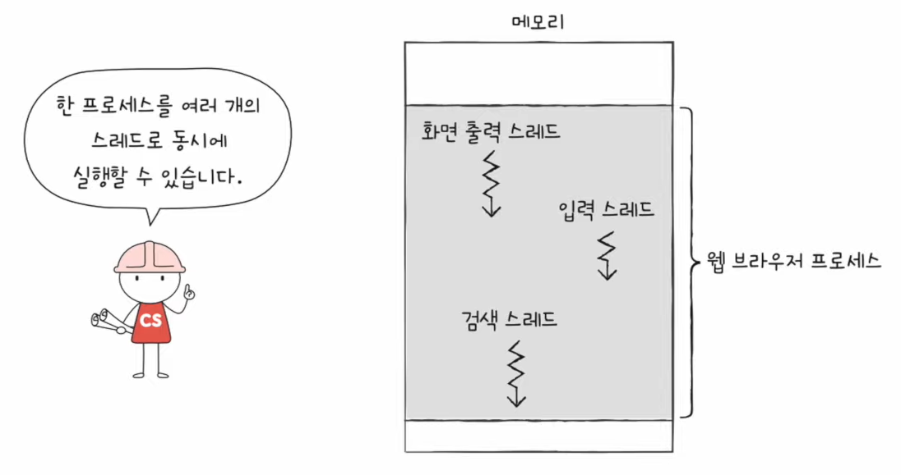
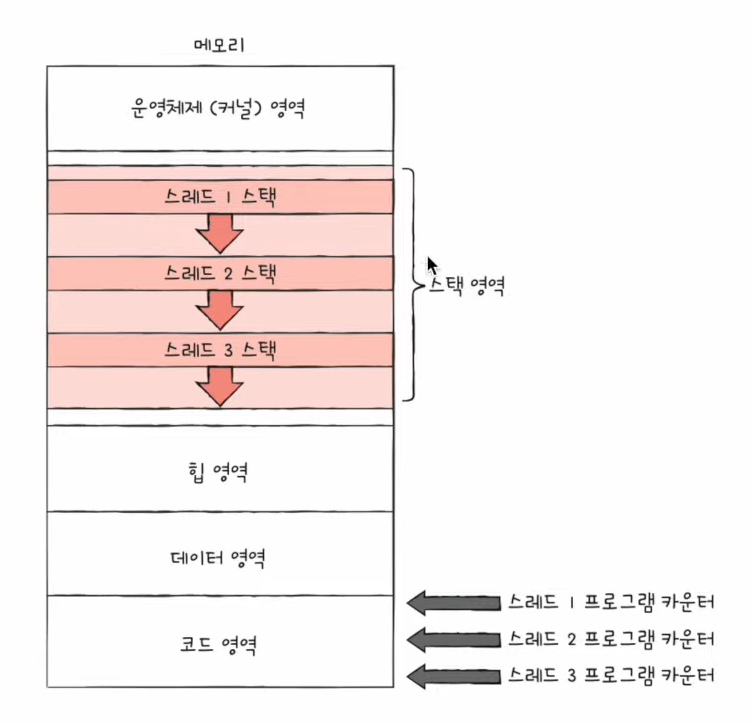

# 28강. 스레드

## 스레드란?

- 스레드(thread)
    - 프로세스를 구성하는 실행 흐름의 단위
    - 하나의 프로세스는 하나 이상의 스레드를 가질 수 있다
- 단일 스레드 프로세스
    - 실행 흐름이 하나인 프로세스

### 스레드의 구성요소

- 스레드 ID, 프로그램 카운터를 비롯한 레지스터 값, 스택 등 실행에 필요한 최소한의 정보
- 프로세스를 이루는 스레드들은 그 프로세스의 자원을 공유하고 있다.
    - 위 이미지를 보면 같은 데이터 영역을 공유하고 있는걸 확인 가능.

- 리눅스 운영체제에서의 스레드
    - 리눅스와 프로세스를 별개로 나눌 필요 없다. 그냥 실행의 문맥일 뿐이다
- 그렇지만 다른 운영체제에서는 아직까지도 스레드와 프로세스를 구분한다

## 멀티 프로세스 VS 멀티 스레드

> <u>동일한 작업을 수행하는 단일 스레드 프로세스 여러 개 실행 VS 하나의 프로세스를 여러 스레드로 실행</u>
>
> 어떤 차이가 있을까?

