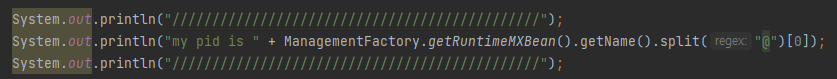
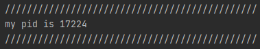

# 29강. 파이썬 코드로 프로세스 확인

> **KEY POINT** : 자식 프로세스랑 부모 프로세스의 pid는 어떻게 확인하는지, 코드를 어떻게 실행하는지
>
> (나는 자바 코드로 구현함)

### PID 값 구하기

- 자바 코드
  
- 콘솔 결과
  

- 계속 호출할때마다 (파일 여러번 실행) PID 값이 계속 바뀐다
    - 운영체제가 PID 값을 그때그때 부여해주고, 프로세스가 끝나면 PID를 수거하기 때문!

