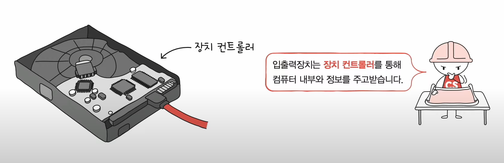
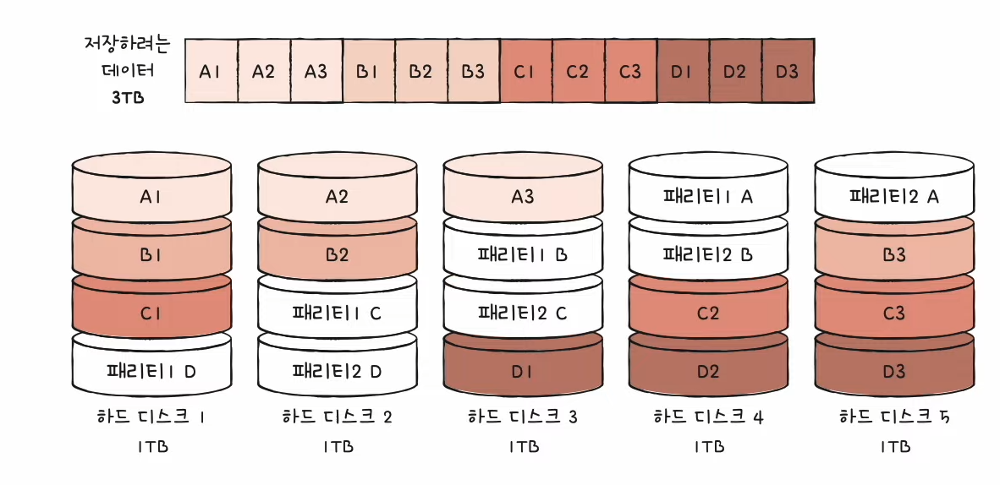
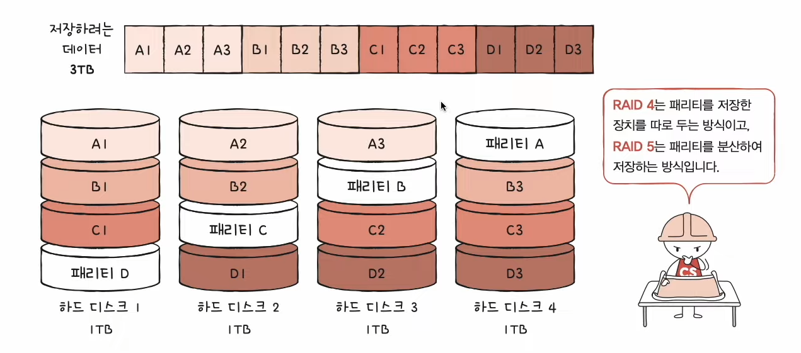
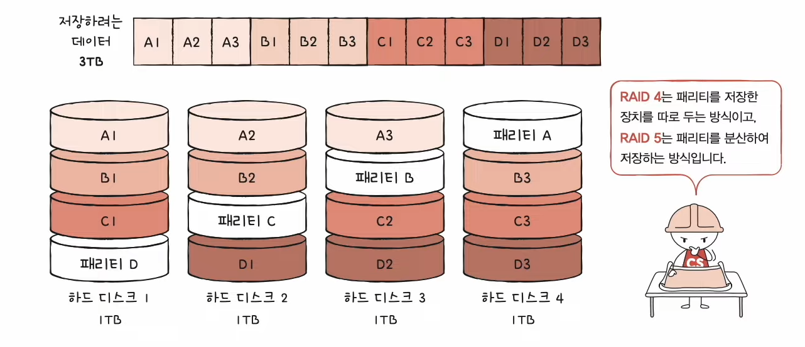
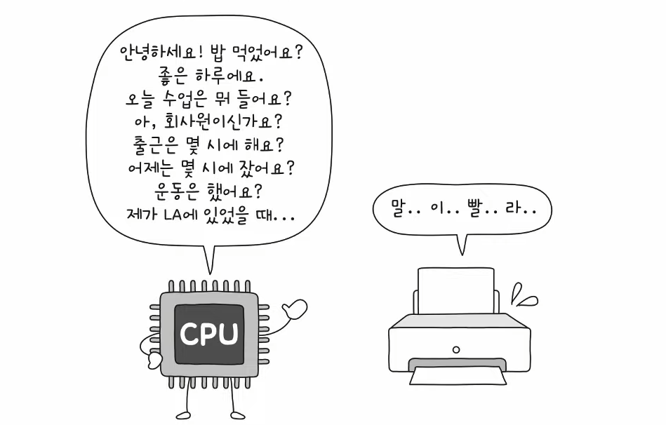

# 3강. 컴퓨터의 4가지 핵심 부품 직접 보기

- keyPoint : 핵심부품 살펴보자-!

> 아래의 해설 출처 : 위키백과

## 전체 조합

[위 이미지 출처](https://m.blog.naver.com/PostView.naver?isHttpsRedirect=true&blogId=dpal44&logNo=220425875131)

## 메인보드

메인보드(mainboard), 마더보드(motherboard 또는 mobo), 주회로 기판(main circuit board), 주 기판(base board), 플레이너 보드(planar board) 또는 시스템
보드(system board)는 범용 컴퓨터 또는 기타 다른 확장 가능한 시스템(expandable system)에 쓰이는, 주회로가 내장된 보드이다. 컴퓨터, 엘리베이터와 같은 확장 가능한 전자기기에 쓰이는 필수
주요 부품의 일종으로, 각종 케이블이나 배선을 통합하여 연결하는 회로와 입출력 포트가 설치되어 있는 전자기판이다. 시스템을 작동시키는 CPU나 램과 같은 핵심 부품을 장착할 수 있는 슬롯과 주변 장치를 연결할 수
있는 인터페이스를 제공하는 인쇄회로기판(PCB)을 의미한다. 애플의 매킨토시나 아이폰 등에서는 로직 보드(logic board) 라는 이름으로 불리기도 한다.

PC용 마더보드는 사운드 카드, 네트워크 카드를 내장하고 있는 경우가 많으며, 용도에 따라서는 CPU, 램, 저장장치까지 마더보드에 내장되어 있는 경우도 있다.

## 메모리

주기억장치(主記憶裝置) 또는 컴퓨터 메모리(computer memory)는 컴퓨터에서 수치·명령·자료 등을 기억하는 컴퓨터 하드웨어 장치를 가리킨다. 이 용어는 1차 기억 장치와 동의어이다. 컴퓨터 메모리는 예를
들어 램(RAM)처럼 빠른 속도로 동작하는데, 이는 높은 용량을 제공하는 프로그램 및 데이터 기억 공간을 제공하는 기억 장치와는 구별한다. 필요한 경우, 컴퓨터 메모리의 내용은 보조기억장치로 전송할 수 있는데 이는
가상 메모리라 불리는 메모리 관리 기법을 통해 가능하다. 메모리의 고전적인 동의어 표현은 스토어(store)이다.

## SDD

솔리드 스테이트 드라이브(solid-state drive, SSD) 또는 솔리드 스테이트 디스크(solid state disk)는 반도체를 이용하여 정보를 저장하는 장치이다.

솔리드 스테이트 드라이브는 순수 전자식으로 작동하므로 기계식인 하드 디스크 드라이브(HDD)의 문제인 긴 탐색 시간, 반응 시간, 기계적 지연, 실패율, 소음을 크게 줄여 준다. 반면에 DRAM이 아닌 플래시
메모리가 적용된 SSD의 경우, 데이터 접근 시간이 아닌 연속적인 읽기와 쓰기에 대해 하드 디스크보다 속도가 낮은 경우가 대부분이었다. 하지만 최신 기술이 적용된 SSD의 경우, 대부분 하드 디스크 드라이브 이상의
읽기와 쓰기 속도를 낸다.

## CPU

중앙 처리 장치(中央處理裝置) 또는 CPU(영어: central processing unit, central/main processor)는 컴퓨터 시스템을 통제하고 프로그램의 연산을 실행 · 처리하는 가장 핵심적인
컴퓨터의 제어 장치, 혹은 그 기능을 내장한 칩이다. 컴퓨터 안의 중앙 처리 장치(CPU)는 외부에서 정보를 입력받고, 기억하고, 컴퓨터 프로그램의 명령어를 해석하여 연산하고, 외부로 출력하는 역할을 한다. 따라서
중앙 처리 장치(CPU)는 컴퓨터 부품과 정보를 교환하면서 컴퓨터 시스템 전체를 제어하는 장치로, 모든 컴퓨터의 작동과정이 중앙 처리 장치(CPU)의 제어를 받기 때문에 컴퓨터의 두뇌에 해당한다고 할 수 있다.
실제의 CPU 칩엔 실행 부분뿐만 아니라 캐시 등의 부가 장치가 통합된 경우가 많다. CPU는 기계어로 쓰인 컴퓨터 프로그램의 명령어를 해석하여 실행한다. CPU는 프로그램에 따라 외부에서 정보를 입력받아,이를
기억하고, 연산하며, 결과를 외부로 출력한다. CPU는 컴퓨터 부품과 정보를 교환하면서 컴퓨터 전체의 동작을 제어한다.

## 팬

컴퓨터 팬(computer fan)은 액티브 쿨링을 위해 컴퓨터 케이스의 내부나 케이스에 직접 부착하는 선풍기이다. 차가운 공기가 바깥에서 케이스 내부로 들어올 수 있게 하기 위해 사용한다. 또, 히트 싱크를 통해 안쪽으로부터 뜨거운 공기가 바깥으로 이동하여 특정 부품을 시원하게 만들어준다. 컴퓨터 팬은 82mm, 120mm(일반적), 140mm, 200~220mm 등 표준 크기로 출시된다. 컴퓨터 팬은 3핀 또는 4핀 팬 단자를 사용하여 전원을 공급받으며 통제된다.

## USB 포트

USB가 등장하기 앞서 병렬 인터페이스가 프린터를 비롯한 수많은 주변기기들을 연결하기 위해 사용되었다. 병렬 포트를 사용한 가장 초기의 장치들 가운데 하나가 동글이었던 것으로 여겨지며 소프트웨어 복사 보호의 하드웨어 키 형태로 사용되었다. 그 뒤로 집 드라이브와 스캐너, 외장 모뎀, 사운드 카드, 웹캠, 게임패드, 조이스틱, 외장 하드 디스크 드라이브, CD-ROM 드라이브에도 사용되었다. 어댑터들을 이용하여 병렬을 통한 SCSI 장치들을 구동할 수 있었다. EPROM 프로그래머와 하드웨어 컨트롤러와 같은 다른 장치들도 병렬로 구성하여 연결할 수 있었다.

## 버스

버스(bus)는 컴퓨터 안의 부품들 간에, 또는 컴퓨터 간에 데이터와 정보를 전송하는 통로(통신 시스템)이다. 이러한 표현에는 관련된 모든 하드웨어 부품들 (선, 광섬유 등) 및 통신
프로토콜을 포함한 소프트웨어를 아우른다.

초기의 컴퓨터 버스들은 여러 연결들을 갖춘 병렬의 전기적 선들이었으나, 현재 이 용어는 병렬 전기적 버스와 동일한 논리적 기능을 제공하는 물리적인 배치에 사용된다. 현대의 컴퓨터 버스들은 병렬 및 비트 시리얼 연결을
둘 다 지원하며, 이들 모두 멀티드롭 (전기적 병렬) 또는 데이지 체인 토폴로지로 선을 구성하거나 USB처럼 스위치 허브에 의해 연결할 수도 있다. 입출력 장치와 연결된 통로는 입출력 버스(I/O bus), 메모리와
다른 장치를 이어주는 통로는 메모리 버스(memory bus)라고 한다.

## 라즈베리 파이

라즈베리 파이(영어: Raspberry Pi)는 영국 잉글랜드의 라즈베리 파이 재단이 학교와 개발도상국에서 기초 컴퓨터 과학의 교육을 증진시키기 위해 개발한 신용카드 크기의 싱글 보드 컴퓨터이다.
