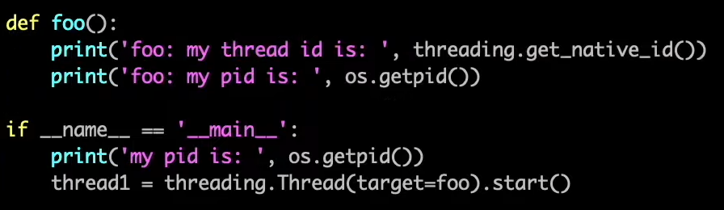

# 30강. 파이썬 코드로 스레드 확인

> **KEY POINT** : 스레드 확인해보기

- 스레드 확인하는 코드 (파이썬)  
  

- 결과  
  

- 세개의 스레드 생성하기  
  

- 각 스레드에서 찍은 pid 값은 모두 같다
    - 동일한 프로세스에서 파생된거니까
- 그렇지만 스레드 자체는 모두 다를테니까 스레드id는 모두 다르다

 

- 각각 다른 스레드를 생성해서 돌리는 코드  
  
  