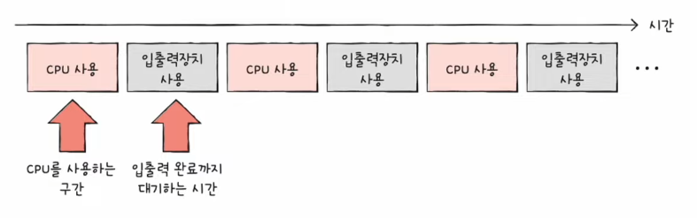
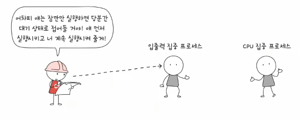
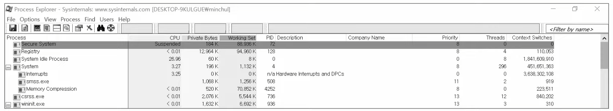
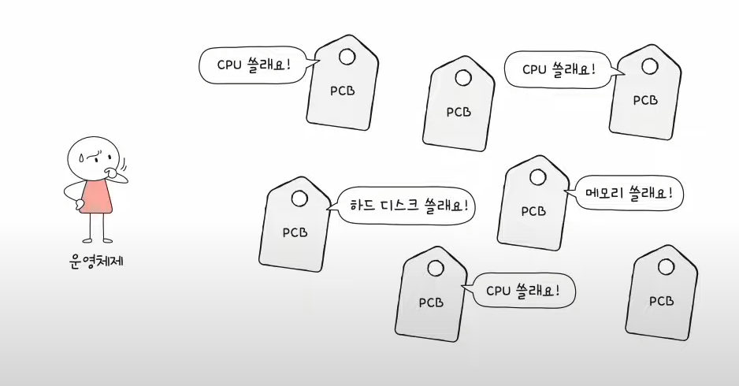
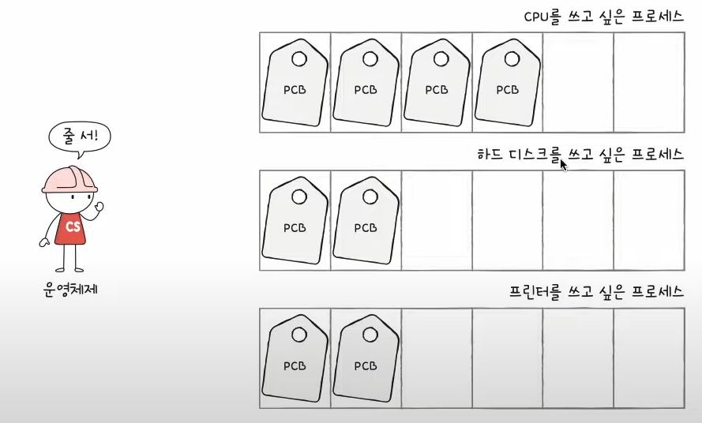
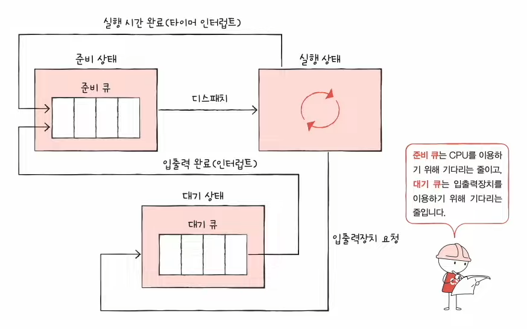
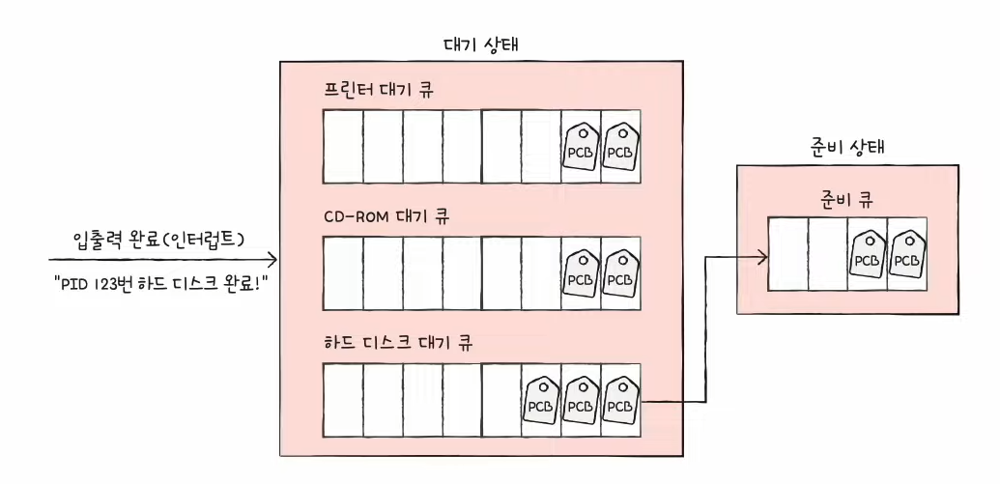
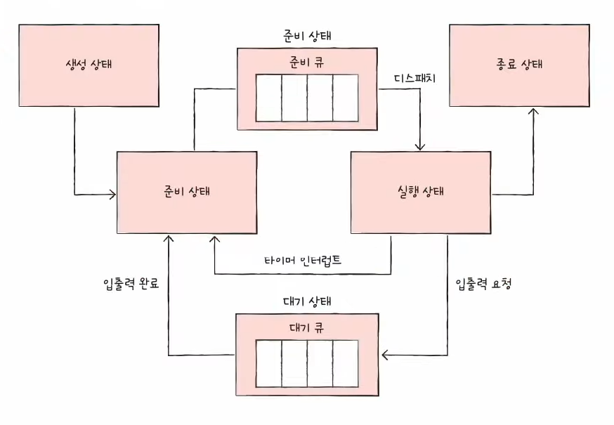
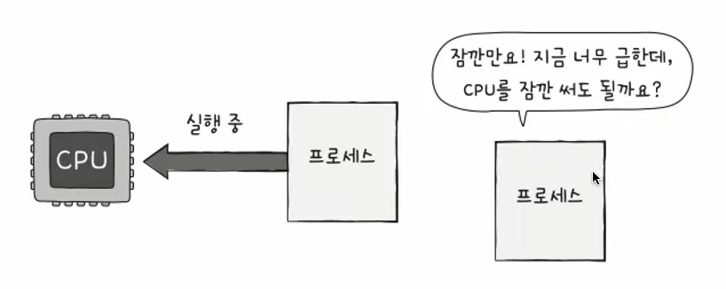

# 31강. CPU 스케줄링 개요

> 운영체제는 CPU를 어떻게 관리하는가

## 1. CPU 스케줄링이란?

- 운영체제가 프로세스들에게 공정하고 합리적으로 CPU 자원을 배분하는 것
    - 전체 성능에 직접적인 영향을 준다

## 2. 프로세스 우선순위

### - 가장 공정한 CPU 스케줄링?

- CPU를 사용하고 싶어하는 프로세스들이 차례로 돌아가면 되지 않을까?
    - 그렇게까지 좋은 방법은 아니다
    - 왜냐하면 프로세스마다 우선순위가 다르기 때문!
        - 빨리 처리해야하는 프로세스, 늦게해도 되는 프로세스 등등
    - 예) 입출력 작업이 많은 프로세스(=입출력 집중 프로세스)의 우선순위는 CPU 작업이 많은 프로세스 (=CPU 집중 프로세스)의 우선선위 보다 높다

### - 프로세스 우선순위 (priority)

- 우선순위가 높은 프로세스일수록 더 빨리, 더 자주 사용되는 것
    - 이미지 상에서는 Priority 부분을 보면 확인할 수 있다

## 3. 스케줄링 큐

- 운영체제가 모든 프로세스 각각의 우선순위를 파악하려면 시간도 오래걸리고 비효율적
- 그래서 생겨난게 <u>'스케줄링 큐'</u>
- 쉽게 생각하면 프로세스들이 줄 서는거라고 생각해

- '큐'라는 자료구조는 반드시 선입선출 방식인데, 스케줄링에서의 큐는 반드시 선입선출일 필요는 없다
    - 우선순위에 따라서 실행된다

### - 준비큐 / 대기큐

- 준비큐 : CPU를 이용하기 위해 기다리는 줄
- 대기큐 : 입출력장치를 이용하기 위해 기다리는 줄
    - 같은 장치를 요구한 프로세스들은 같은 큐에서 대기

### - 프로세스 상태 다이어그램 (중요)

## 4. 선점형 / 비선점형 스케줄링 (중요)

- 선점형 : preemptive scheduling
- 비선점형 : Non-preemptive Scheduling

- 위와 같은 상황에서 할 수 있는 선택지는
    - (1) 현제 CPU를 사용중인 프로세스로부터 CPU 자원을 빼앗아 다른 급한 프로세스에게 할당 = 선점형 스케줄링
    - (2) 현재 CPU를 사용중인 프로ㅔ스 작업이 끝날 때까지 프로세스 기다리게 하기 = 비선점형 스케줄링

### 선점형

- 장점
    - 어느 한 프로세스의 자원 독점을 막고, 프로세스들에 골고루 자원 배분 가능
- 단점
    - 그만큼 문맥 교환 과정에서 오버헤드 발생 가능성 있음

### 비선점형

- 장점
    - 선점형 스케줄링에 비해 문맥교환에서 발생하는 오버헤드 적음
- 단점
    - 모든 프로세스가 골고루 자원 이용하기 어려움

