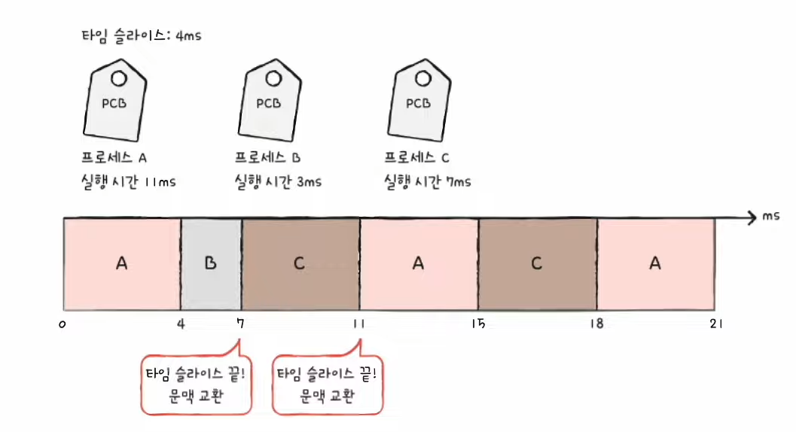

# 32강. CPU 스케줄링 알고리즘

> 7가지 스케줄링 알고리즘을 통해 프로세스들을 스케줄링하는 실질적인 방법 학습하기
>
>(운영체제마다 스케줄링 알고리즘이 다름)

## 1. 선입 선처리 스케줄링

### FCFS (First Come First Served) 스케쥴링

- 단순히 준비 큐에 삽입된 순서대로 처리하는 비선점 스케줄링
- 먼저 CPU를 요청한 프로세스부터 CPU 할당

### 단점 : 프로세스들이 기다리는 시간이 매우 길어질 수 있다는 부작용 (=호위효과)

- 그럼 이 호위효과를 어떻게 방지해야하나?
    - 단순히 생각했을 때는 실행시간이 가장 긴 걸 나중에 실행, 가장 짧은걸 가장 빠르게 실행.
    - 이렇게 하면 전체적인 대기시간이 더 짧아짐
    - 이 방법이 바로 아래의 '최단 작업 우선 스케줄링'!

## 2. 최단 작업 우선 스케줄링

### SJF (Shortest Job First) 스케쥴링

- 호위효과 방지
- CPU 사용시간이 가장 짧은 프로세스부터 처리하는 스케쥴링 방식

## 3. 라운드 로빈 스케줄링

### RR (Round Robin) 스케줄링

- 선입 선처리 스케줄링 + 타임 슬라이스 (time slice)
    - 타임슬라이스 : 각 프로세스가 CPU를 사용할 수 있는 정해진 시간
    - 정해진 타임 슬라이스만큼의 시간 동안 돌아가며 CPU를 이용하는 선점형 스케줄링
        - 큐에 삽입된 프로세스들은 순서대로 CPU를 이용하되, '정해진 시간'만큼만 이용
        - 정해진 시간을 모두 사용하였음에도 아직 프로세스가 완료되지 않았다면 다시 큐의 맨 뒤에 삽입 (문맥교환)

### 타임슬라이스 크기가 중요!

- 너무 크다면?
    - 선입선출과 비슷하게 됨
    - 호위효과 발생 위험
- 너무 작다면?
    - 문맥교환에 의한 오버헤드 때문에 CPU에 부담이 간다

## 4. 최소 잔여 시간 우선 스케줄링

### SRT (Shortest Remaining Time) 스케줄링

- 최단 작업 우선 스케줄링 + 라운드 로빈 스케줄링
    - 최단 작업 우선 스케줄링 : 작업시간이 짧은 프로세스부터 처리하는 스케줄링 알고리즘
    - 라운드 로빈 스케줄링 : 정해진 타임 슬라이스만큼 돌아가며 사용하는 스케줄링 알고리즘
- 즉, 정해진 시간만큼 CPU를 이용하되, 다음으로 CPU를 사용할 프로세스로는 남은 작업 시간이 가장 적은 프로세스 선택!

## 5. 우선순위 스케줄링

### 우선순위 스케줄링

- 프로세스들에 우선순위 부여하고, 우선순위 높은 프로세스부터 실행
- 우선순위가 같은 프로세스들은 선입 선처리로 스케줄링
- 최단 작업 우선 스케줄링, 최소 잔여 시간 스케줄링은 모두 넓은 의미에서 우선순위 스케줄링이라고 할 수 있음
    - 최단작업우선은 가장 짧은 작업이 높은 우선순위를 갖는 거
    - 최소잔여시간은 남아있는 시간이 가장 짧은 프로세스가 높은 우선순위를 갖는 거

### 우선순위 스케줄링의 근본적인 문제

- 기아(starvation) 현상
    - 우선순위 높은 프로세스만 주구장창 실행
    - 우선순위 낮은 프로세스는 (준비 큐에 먼저 삽입되었음에도 불구하고) 실행 연기

### 이를 방지하는 대표적인 기법

- 에이징(aging)
- 오랫동안 대기한 프로세스의 우선순위를 점차 높이는 방식
- 대기 중인 프로세스의 우선순위를 마치 나이 먹듯 점차 증가시키는 방법
    - 우선순위가 낮아도 언젠가는 우선순위가 높아진다!

## 6. 다단계 큐 스케줄링

### Multilevel queue 스케줄링

- 우선순위 스케줄링의 발전된 형태
- 우선순위별로 준비 큐를 여러 개 사용하는 스케줄링 방식
    - 우선순위가 가장 높은 큐에 있는 프로세스를 먼저 처리
    - 우선순위가 가장 높은 큐가 비어 있으면 그 다음 우선순위 큐에 있는 프로세스 처리

### 다단계 큐 스케줄링의 근본적인 문제

- 다른 큐들간에 이동할 수 없음!
    - 우선순위가 낮은 큐에 있는 프로세스들은 언제나 항상 우선순위가 낮을 수밖에 없다

### 이 문제를 해결하기 위해 생겨난 것이!

- '다단계 피드백 큐 스케줄링'

## 7. 다단계 피드백 큐 스케줄링

### Multilevel feedback queue 스케줄링

- 다단계 큐 스케줄링의 발전된 형태
- 큐 간의 이동이 가등한 다단계 큐 스케줄링
- 다단계 큐 스케줄링에서는 기본적으로 큐 간의 이동 불가
    - 우선순위 낮은 프로세스는 계속해서 실행 연기 우려
    - 기아 현상 발생 가능

### 실행순서

- (1) 대기상태의 프로세스는 우선 우선순위 제일 높은 곳에 둔다
- (2) 자기차례 때 이제 CPU 할당 받아서 실행되는데
- (3-1) 만약 타임슬라이스 동안(자기차례동안) 다 끝내면 그럼 끗-
- (3-2) 만약 타임슬라이스 동안 못 끝냈다면 일단 낮은 우선순위로 이동!

### 다단계 피드백 큐에서의 에이징 기법 적용!

- 일정 시간동안 낮은 순위에서 기다리는 프로세스가 있다면, 그 프로세스의 우선순위를 점차 높여서 (에이징 기법 적용해서) 기아 현상 방지할 수 있다!

### 다단계 피드백 큐 정리

- 어떤 프로세스의 CPU 시간이 길면 우선순위가 낮아지고, 어떤 프로세스가 낮은 우선순위 큐에서 너무 오래 기다리면 우선순위를 높이는 방식!
- 구현하기 어렵지만, CPU 스케줄링의 가장 일반적인 방식이다!

