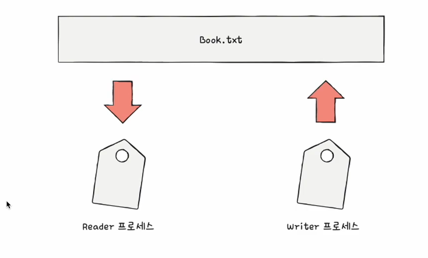
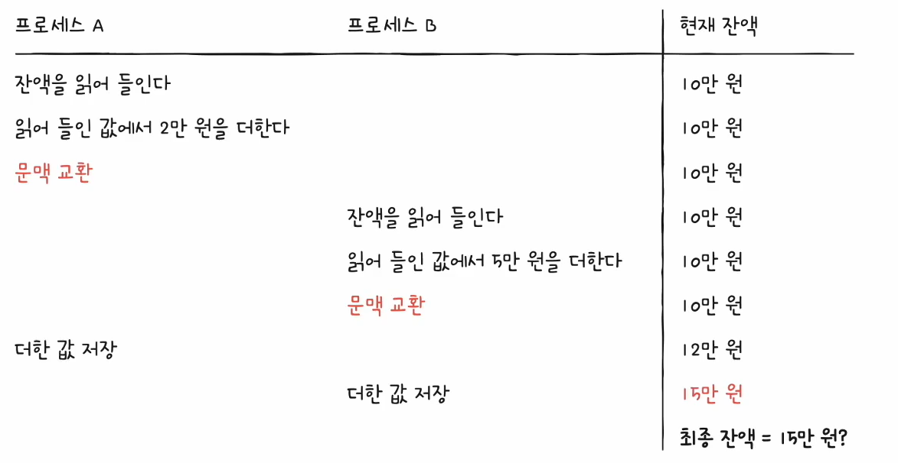

# 33강. 프로세스 동기화

> 이번 챕터에서는 프로세스와 스레드를 모두 묶어서 그냥 프로세스라고 부를 것!

- 프로세스들은 동시다발적으로 실행되며, 서로 협력하며 영향을 주고 받는다.  
  이 과정에서, 자원의 '일관성'을 보장해야 한다.

## 동기화 왜 필요?

- 공동의 목적을 위해 동시에 수행되는 프로세스
    - 예) 워드 프로세스 프로그램
        - 맞춤법 검사 프로세스
        - 입력 내용을 화면에 출력하는 프로세스
        - 등등

> Q. 아무렇게나 마구마구 실행해도 괜찮을까?  
> A. NO!!! 올바른 수행을 위해 프로세스들은 '동기화' 되어야 한다  
> 왜냐하면, 자원의 일관성 보장해야하니까.

## 동기화 의미

- (프로세스) 동기화란?
    - 프로세스들의 수행 시기를 맞추는 것 (사전적 의미)
- 동기화 종류
    - (1) 실행 순서 제어 : 프로세스를 올바른 순서대로 실행하기
    - (2) 상호 배제 : 동시에 접근해서는 안되는 자원에 하나의 프로세스(프로세스, 스레드)만 접근하게 하기
        - (실행의 문맥을 갖는 모든 대상은 동기화 대상이기에 스레드도 동기화 대상이다)

### (1) 실행 순서 제어를 위한 동기화

- reader writer problem
- writer : Book.txt 파일에 값을 저장하는 프로세스
- Reader : Book.txt 파일에 저장된 값을 읽어들이는 프로세스

- Reader와 Writer 프로세스는 무작정 아무렇게나 실행되어선 안된다.
- <u> 실행의 순서 </u>가 있기 때문!
- Reader 프로세스는 'Book.txt 안에 값이 존재한다'는 '특적 조건이 만족되어야만' 실행 가능.
    - Writer 프로세스가 먼저 선행되어야함 !

### (2) 상호 배제를 위한 동기화

- bank account problem
- 공유 불가능한 자원의 동시 사용을 피하기 위한 동기화
- 한 번에 하나의 프로세스만 접근해야 하는 자원에 동시 접근을 피하기 위한 동기화

- 고전적인 예제
    - 현재 계좌에 잔액 : 10만원
    - 프로세스 A
        - 현재 잔액에 2만원 더한다
        - 더한 값 저장
    - 프로세스 B
        - 읽어들이 잔액에 5만원 더한다
        - 더한 값 저장

#### < 동기화 되지 않았을 시 >

- A프로세스, B프로세스 모두 '잔액'이라는 자원을 공유하고 있으니까