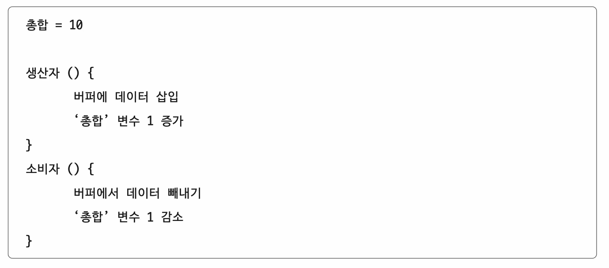

# 33강. 프로세스 동기화

> 이번 챕터에서는 프로세스와 스레드를 모두 묶어서 그냥 프로세스라고 부를 것!

- 프로세스들은 동시다발적으로 실행되며, 서로 협력하며 영향을 주고 받는다.  
  이 과정에서, 자원의 '일관성'을 보장해야 한다.

## 1. 동기화 왜 필요?

- 공동의 목적을 위해 동시에 수행되는 프로세스
    - 예) 워드 프로세스 프로그램
        - 맞춤법 검사 프로세스
        - 입력 내용을 화면에 출력하는 프로세스
        - 등등

> Q. 아무렇게나 마구마구 실행해도 괜찮을까?  
> A. NO!!! 올바른 수행을 위해 프로세스들은 '동기화' 되어야 한다  
> 왜냐하면, 자원의 일관성 보장해야하니까.

## 2. 동기화 의미

- (프로세스) 동기화란?
    - 프로세스들의 수행 시기를 맞추는 것 (사전적 의미)
- 동기화 종류
    - (1) 실행 순서 제어 : 프로세스를 올바른 순서대로 실행하기
    - (2) 상호 배제 : 동시에 접근해서는 안되는 자원에 하나의 프로세스(프로세스, 스레드)만 접근하게 하기
        - (실행의 문맥을 갖는 모든 대상은 동기화 대상이기에 스레드도 동기화 대상이다)

### (1) 실행 순서 제어를 위한 동기화

- reader writer problem
- writer : Book.txt 파일에 값을 저장하는 프로세스
- Reader : Book.txt 파일에 저장된 값을 읽어들이는 프로세스

- Reader와 Writer 프로세스는 무작정 아무렇게나 실행되어선 안된다.
- <u> 실행의 순서 </u>가 있기 때문!
- Reader 프로세스는 'Book.txt 안에 값이 존재한다'는 '특적 조건이 만족되어야만' 실행 가능.
    - Writer 프로세스가 먼저 선행되어야함 !

### (2) 상호 배제를 위한 동기화

`- (1) bank account problem`

- 공유 불가능한 자원의 동시 사용을 피하기 위한 동기화
- 한 번에 하나의 프로세스만 접근해야 하는 자원에 동시 접근을 피하기 위한 동기화

`- (1)번의 고전적인 예제`

- 현재 계좌에 잔액 : 10만원
- 프로세스 A
    - 현재 잔액에 2만원 더한다
    - 더한 값 저장
- 프로세스 B
    - 읽어들이 잔액에 5만원 더한다
    - 더한 값 저장

#### < 동기화 되었을 시 > 잔액 : 17만원

#### < 동기화 되지 않았을 시 > 잔액 : 15마원

- A프로세스, B프로세스 모두 '잔액'이라는 자원을 공유하고 있으니까 !

 

`- (2) producer & consumer problem`

- 생산자 소비자 문제라고도 불림
   
   
  `- (2)번의 고전적인 예제`

- 물건을 계속해서 생상하는 생산자 (producer, 프로세스 혹은 스레드)
- 물건을 계속해서 소비하는 소비자 (consumer, 프로세스 혹은 스레드)
    - '총합' 변수 공유

> 어떤 언어던지 동기화를 위한 코드가 존재한다  
> 아래의 슈도코드를 내가 원하는 언어로 생각하면서 보기!  
>
>의사코드(슈도코드, pseudocode)는 프로그램을 작성할 때 각 모듈이 작동하는 논리를 표현하기 위한 언어

> **Q. 이 상태에서 생산자를 10만번, 소비자를 10만법 실행하면 '총합'은 어떻게 될까?**  
> _(당연히 0이 아닐까?)_  
> **A. 아니다! 때로는 0과 다른 값이 되거나, 오류가 발생할 수도 있다!**  
> _(왜 일까????)_

- 이유
    - 동기화가 되지 않았기 때문에 발생한 문제
    - 동시에 접근해서는 안되는 자원 (총합)에 동시에 접근해서 발생한 문제

> **Q. 그럼 공유하면 안되는 자원이 뭐야?**  
> **A. 공유자원의 의미 살펴보자 !**

## 3. 공유자원과 임계구역

### 공유자원

- 공유자원이란?
    - 여러 프로세스 혹은 스레드가 공유하는 자원
        - 예) 전역변수, 파일, 입출력장치, 보조기억장치 등..

### 임계구역

- 임계구역이란?
    - 동시에 실행하면 문제가 발생하는 자원에 접근하는 코드 영역
        - 예) 앞선 예시의 '총합'변수, '잔액'변수 등..

### 그러니까!

- 임계구역에 진입하고자 하면, 진입한 프로세스 이외에는 대기해야 한다

- 만약 임계구역에 동시에 접근하려고 하면? => 문제가 발생한다 !!

### 레이스 컨디션 (race condition)

- 임게구역에 동시에 접근하려고 했을 때 생기는 문제.
- 임계구역에 동시에 접근하면 자원의 일관성이 깨질 수 있다

- 고급언어 : 개발자가 작성하는 코드
- 저급언어 : 컴퓨터가 이해하는 코드

- 고급언어로 작성된 1줄짜리 코드라도, 저급언어로 변환되었을 때는 여러 코드로 이루어져있기때문에   그 사이에서 문맥교환이 발생하게 된다면 문제가 생길 수 있다!
- 이렇게 되면 자원의 일관성이 깨지기 때문에 '레이스 컨디션'이 발생할 수 있다!

## 4. 임계구역 문제를 해결하기 위해 운영체제가 할 일

### 운영체제가 임계구역 문제를 해결하는 세 가지 원칙

- 상호 배제를 위한 동기화를 위한 세 가지 원칙
    - (1) 상호배제 (mutual exclusion)
        - 한 프로세스가 임계구역에 진입했다면 다른 프로세스는 들어올 수 없다
    - (2) 진행 (progress)
        - 임계구역에 어떤 프로세스도 진입하지 않았다면 진입하고자 하는 프로세스는 들어갈 수 있어야 한다
    - (3) 유한대기 (bounded waiting)
        - 한 프로세스가 임계구역에 진입하고 싶다면 언젠가는 임계구역에 들어올 수 있어야 한다
            - 임계구역에 들어오기 위해 무한정 대기해서는 안된다