# 34강. 프로세스 동기화 기법

> 동기화 기법 / 도구들에 대하여

## 1. 뮤텍스 락 - 첫번째 동기화 기법

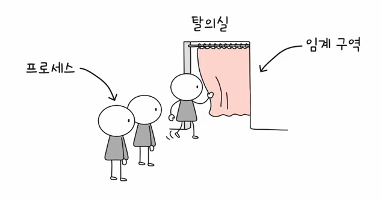

### 뮤텍스 락 원리

- 상호 배제를 위한 동기화 도구(자물쇠 역할), 뮤텍스 락
- 만약 위 예시 이미지와 같을 때, 탈의실(임계구역)에 사람이 있는지 없는지 어떻게 확인하는가?
    - 자물쇠가 잠겨있는지 확인한다
    - 자물쇠 -> '뮤텍스 락'

### 뮤텍스 락의 단순한 형태

- 전역 변수 하나, 함수 두 개
- 역할
    - **(1) 자물쇠 역할 : 프로세스들이 공유하는 전역 변수 lock**
    - **(2) 임게 구역을 잠구는 역할 : acquire 함수**
        - 프로세스가 임계 구역에 진입하기 전에 호출
        - 임계 구역이 잠겨 있다면 -> 임계 구역이 열릴 때까지(lock이 false 일 때까지) 임계 구역을 반복 확인
        - 임계 구역이 열려 있다면 -> 임계 구역 잠그기 (lock을 true로 변경)
    - **(3) 임계 구역의 잠금 해제하는 역할 : release 함수**

### 예시 코드  

  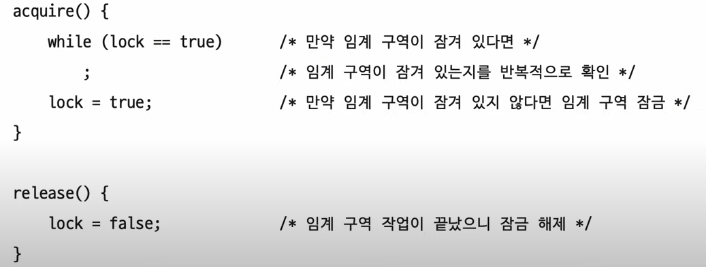

- 중간에 ' ; ' 표시는 무한히 반복하게 만드는 코드 (c언어)
- 바쁜 대기(busy waiting) : 임계 구역이 잠겨있는지 무한히 반복하면서 확인하는 것

## 2. 세마포 - 두번째 동기화 기법

- 좀 더 일반화된 방식의 동기화 도구
- 공유자원이 여러개 있는 경우에도 적용 가능
- 세마포 종류(이진 세마포, 카운팅 세마포) 중에서는 '카운팅 세마포'가 가장 일반적 (아래내용도 모두 '카운팅 세마포')

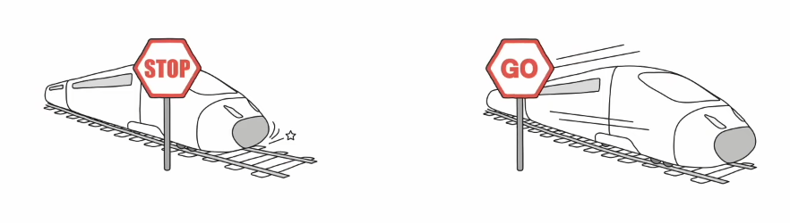

### 세마포 원리

- 임계 구역 앞에서 멈춤 신호를 받으면 잠시 기다리기
- 임계 구역 앞에서 가도 좋다는 신호 받으면 임계 구역 진입

### 세마포의 단순한 형태

- 전역 변수 하나, 함수 두 개
- 역할
    - (1) 전역변수 S : 임계 구역에 진입할 수 있는 프로세스의 개수(사용 가능한 공유 자원의 개수)를 나타냄
    - (2) wait 함수 : 임계 구역에 들어가도 좋은지, 기다려야 할지를 알려주는 함수
    - (3) sigal 함수 : 임계구역 앞에서 기다리는 프로세스에 '가도 좋다' 신호를 주는 함수

### 예시코드

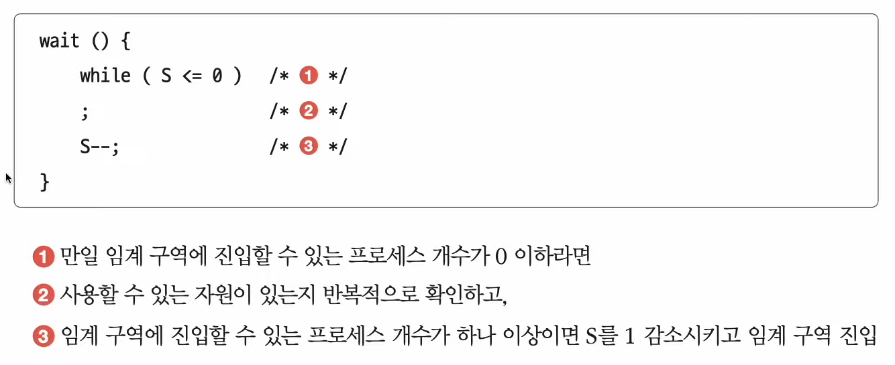
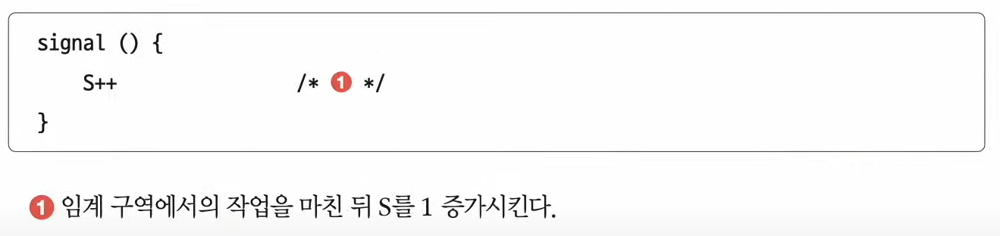

### 예시

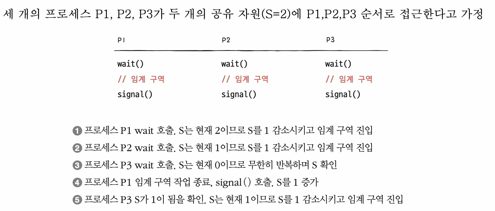

### Busy waiting

- 반복적으로 확인하는 것은 즉 **CPU 사이클 낭비!!**
- 해결방법
    - 사용할 수 있는 자원이 없을 경우, 대기상태로 만듦 (CPU가 작동안해도 되는)
        - 해당 프로세스의 PCB를 대기 큐에 삽입
    - 사용할수 있는 자원이 생겼을 경우, 대기 큐에 프로세스를 준비상태로 만듦
        - 해당 프로세스의 PCB를 대기 큐에서 꺼내 준비 큐에 삽입
- 위 해결방법을 합친 예시코드

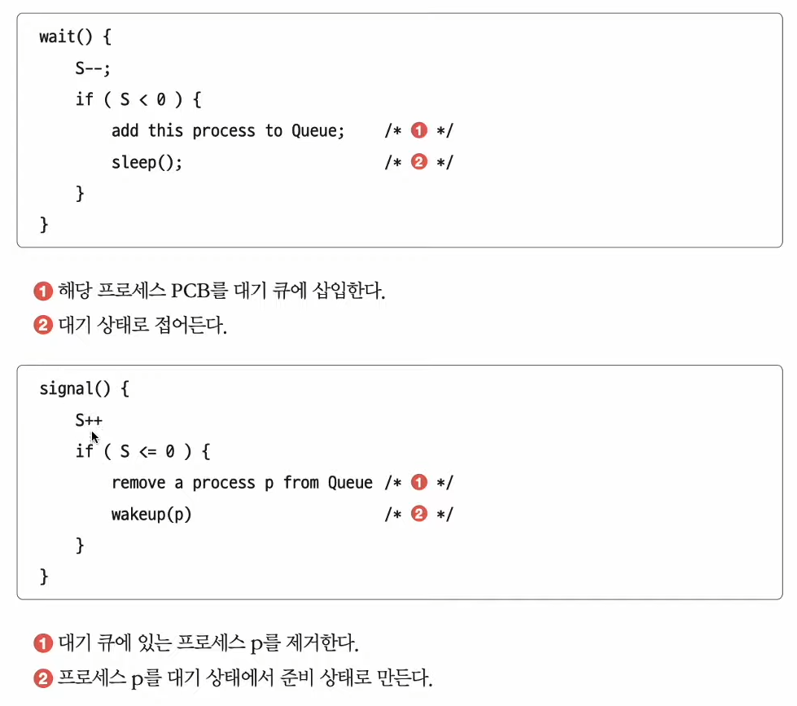

- 세 개의 프로세스 상황 + busy waiting 해결

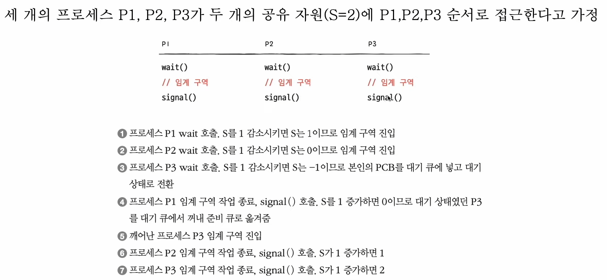

### 세마포를 활용한 실행 순서 동기화

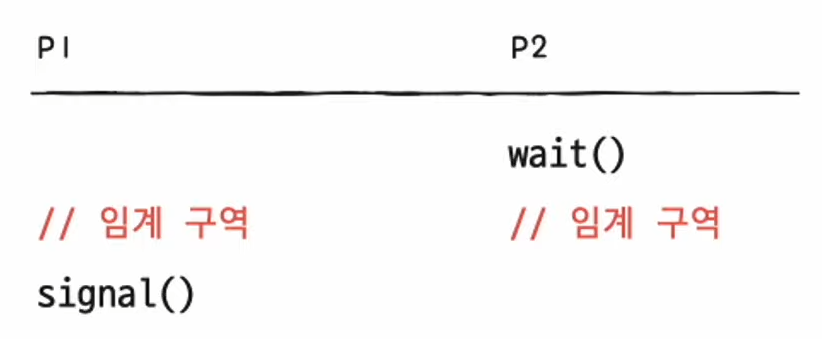

- 세마포의 변수 S를 '0'으로 두고,
- 먼저 실행할 프로세스 뒤에 signal 함수,
- 다음에 실행할 프로세스 앞에 wait 함수 설정하기

- 이렇게 된다면 반드시 P1이 먼저 실행되고 그다음에 P2가 실행된다!

> '세마포'는 가장 일반적인 프로세스 동기화 방식이지만,   사용자 입장에서는 매번 임계구역 앞뒤로 wait(), signal()을 명시적 호출하는 것이 불편하다
>
> 그래서 나온 것이 바로 '모니터'기법

## 3. 모니터 - 세번째 동기화 기법

- 사용자(개발자)가 다루기에 편한 동기화 도구

### (1) 상호 배제를 위한 동기화

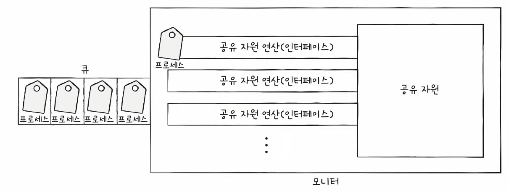

- 인터페이스를 위한 큐
- 공유자원에 접근하고자 하는 프로세스를 (인터페이스를 위한) 큐에 삽입
- 큐에 삽입된 순서대로 (한 번에 하나의 프로세스만) 공유 자원 이용

### (2) 실행 순서 제어를 위한 동기화

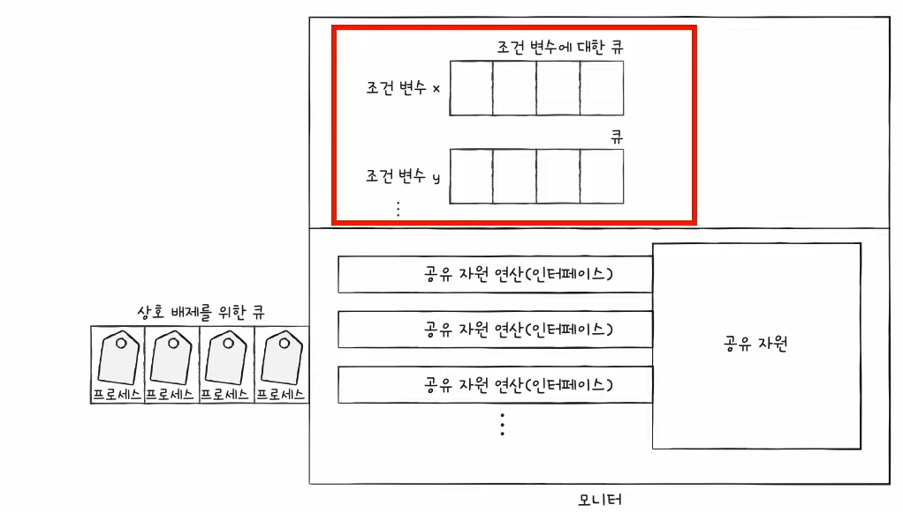

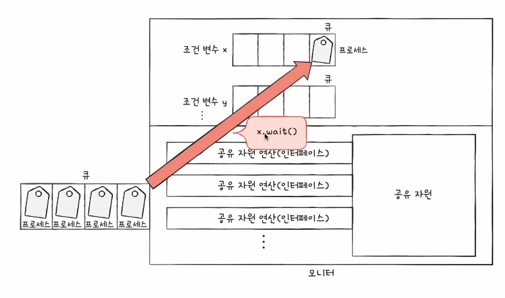

- 조건 변수 (condition variable) 이용
    - 프로세스나 스레드의 실행 순서를 제어하기 위해 사용하는 특별한 변수
    - 조건변수.wait() : 대기 상태로 변경, 조건 변수에 대한 큐에 삽입
    - 조건변수.signal() : wait()으로 대기 상태로 접어든 조건변수를 실행 상태로 변경

- 조건변수에 대한 큐가 따로 있다
    - 이걸 통해 프로세스나 스레드의 실행 순서를 제어할 수 있다

- 두가지 방법이 있음 (모니터 안에는 하나의 프로세스만 있을 수 있다)
    - (1) wait()을 호출했던 프로세스는 signal()을 호출한 프로세스가 모니터를 떠난 뒤 수행 재개
    - (2) signal()을 호출한 프로세스의 실행을 일시중단하고 자신이 실행된 뒤 다시 signal()을 호출한 프로세스의 수행을 재개

### 정리

- 특정 프로세스가 아직 실행될 조건이 되지 않았을 떄에는 wait을 통해 실행을 중단
- 특정프로세스가 실행될 조건이 충족되었을 때에는 signal을 통해 실행을 재개