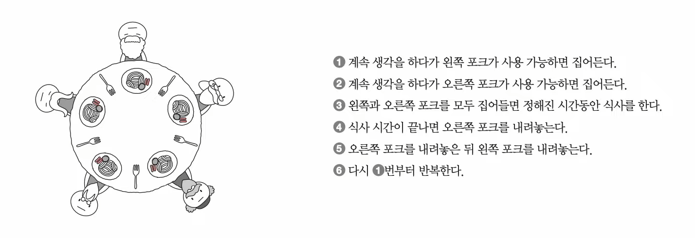
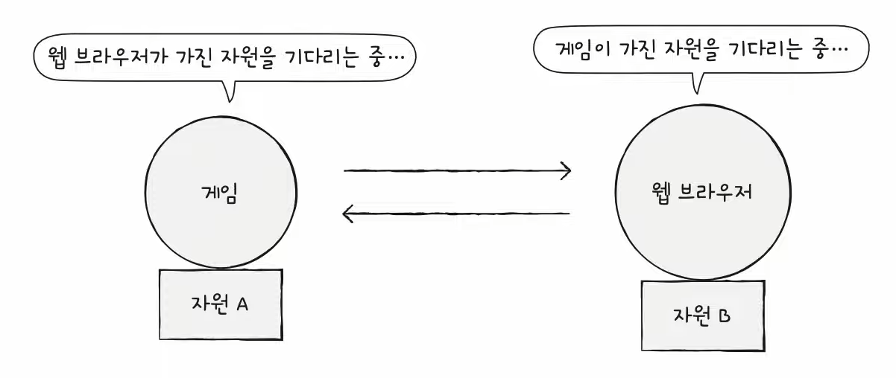
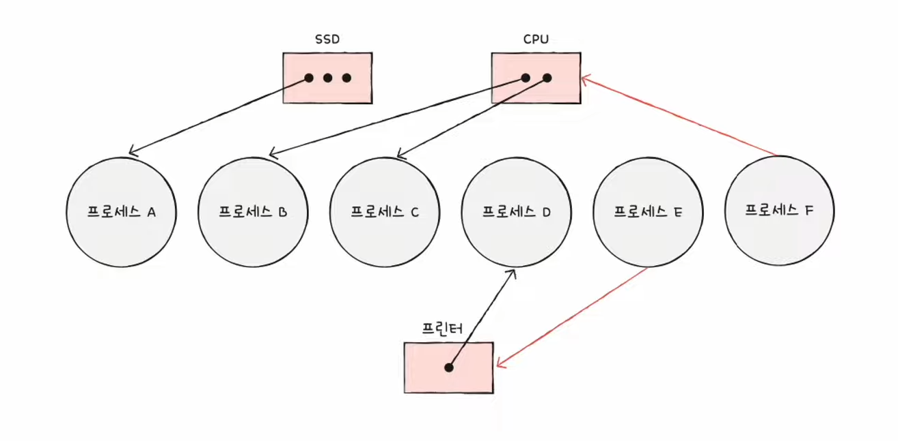
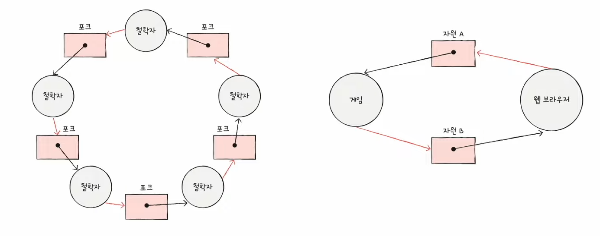

# 35강. 교착 상태 (Deadlock)

> 교착상태는 무엇이고, 왜 언제 발생하는가

## 1. 고전적인 교착 상태 설명 문제

- [Dining philosophers problem (식사하는 철학자 문제)](https://namu.wiki/w/%EC%8B%9D%EC%82%AC%ED%95%98%EB%8A%94%20%EC%B2%A0%ED%95%99%EC%9E%90%20%EB%AC%B8%EC%A0%9C)

- 교착상태가 일어나는 이유
    - 왼쪽 포크를 6명이 모두 집어들면, 오른쪽 포크가 사용 가능할 때까지 기다리는 상태가 된다
    - 그렇지만 모든 사람들이 기다리는 상태에 빠지면 결국 아무도 음식을 먹지 못할 것이다.

- 교착상태
    - 즉 일어나지 않을 사건을 기다리며 진행이 멈춰버리는 현상

## 2. 교착 상태

## 3. 교착 상태 해결법

- (1) 교착 상태가 발생했을 때의 상황을 정확히 표현하기
- (2) 교착 상태가 일어나는 근본적인 이유 이해

### '자원 할당 그래프' 그려보기

- 교착 상태 발생 조건 파악 가능
    - 어떤 프로세스가 어떤 자원을 할당 받아 사용중인지 확인 가능
    - 어떤 프로세스가 어떤 자원을 기다리고 있는지 확인 가능

- 예시

1. 프로세스는 원으로, 자원의 종류는 사각형으로 표현
2. 사용할 수 있는 자원 개수는 자원 사각형 내에 점으로 표현
3. 프로세스가 어떤 자원을 할당 받아 사용 중이라면 자원에서 프로세스를 향해 화살표를 표시
4. 프로세스가 어떤 자원을 기다리고 있다면 프로세스에서 자원으로 화살표를 표시

### 교착 상태 일어난 그래프 특징

- 자원 할당 그래프가 <u>원의 형태</u>를 띄고 있다

## 4. 교착 상태 발생 조건

1. 상호 배제
    - 한 프로세스가 사용하는 자원을 다른 프로세스가 사용할 수 없는 상태
2. 점유와 대기
    - 자원을 할당 받은 상태에서 다른 자원을 할당 받기를 기다리는 상태
3. 비선점
    - 어떤 프로세스도 다른 프로세스의 자원을 강제로 빼앗지 못하는 상태
4. 원형 대기
    - 프로세스들이 원의 형태로 자원을 대기하는 상태

- 위 네가지 조건 중 하나라도 만족하지 않으면 교착 상태 발생 안함
- 모두 만족하면 교착 상태 발생 가능!