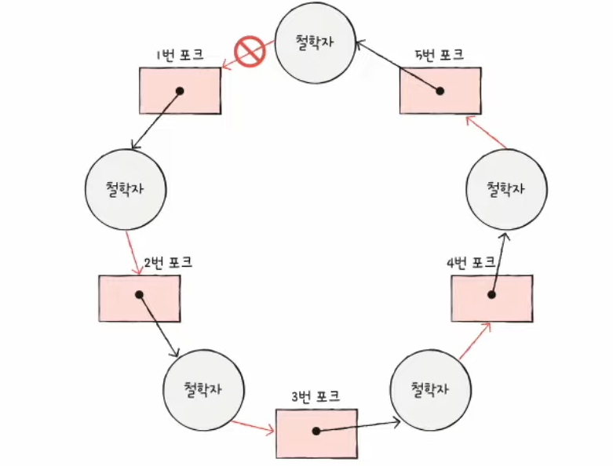
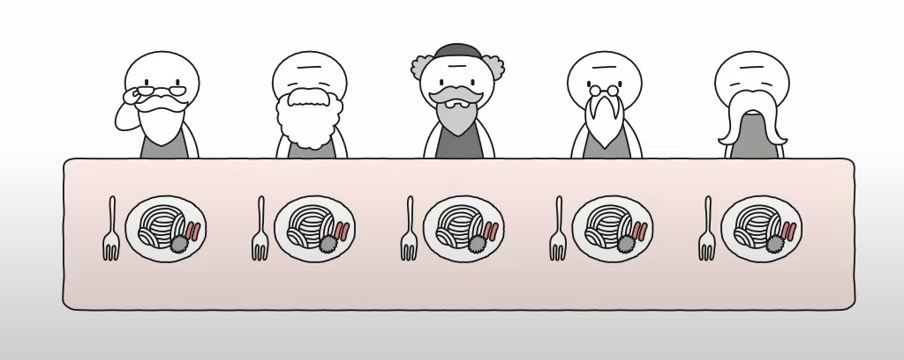

# 36강. 교착 상태 해결 방법

> 교착 상태 해결 : 예방, 회피, 검출 후 회복

## 교착 상태 예방

- 애초에 교착 상태가 발생하지 않도록
- 교착 상태 발생 조건 (상호 배제, 점유와 대기, 비선점, 원형 대기) 중 하나를 없애버리기 (35강 마지막)

### 상호 배제를 없애면?

- 모든 자원을 공유 가능하게 만든다?
    - 이론적으로는 가능하지만 현실적으로는 불가능 (모든 자원공유 불가능)

### 점유와 대기를 없애면?

- (식사하는 철학자)
- 특정 프로세스에 자원을 모두 할당하거나, 아예 할당하지 않는 방식으로 배분 (포크 기다릴거면 왼쪽 포크 내려놓고 기다려라!)
- -> 자원의 활용률을 낮출 수 있는 방식

### 비선점 조건을 없애면?

- 한 프로세스가 다른 프로세스 자원 뺏을 수 있게
- 선점이 가능한 자원 (CPU 등)에 한해 효과적
- 그렇지만 모든 자원이 선점 가능한 것은 아니다
    - 한 프로세스가 사용하고 있으면 다른 프로세스가 사용하지 못하는 식..

### 원형 대기 조건을 없애면?

- 모든 자원에 번호를 붙이고, 오름차순으로 할당하면 원형 대기는 발생하지 않음

- 이건 마치 원형이 아닌 일자로 된 테이블에 앉아있는 것과 같음

