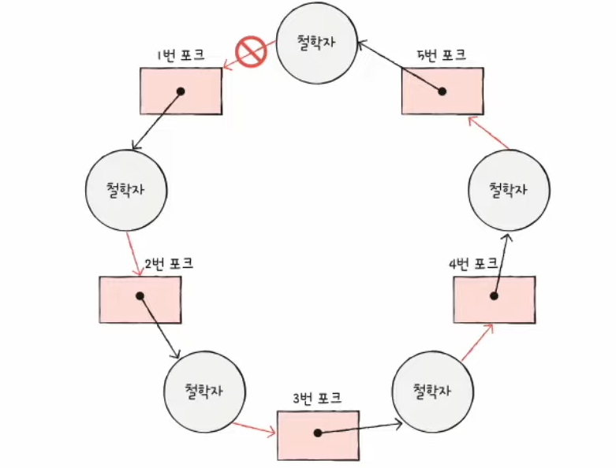
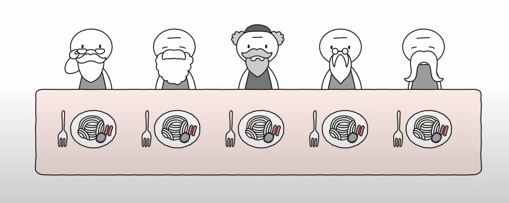
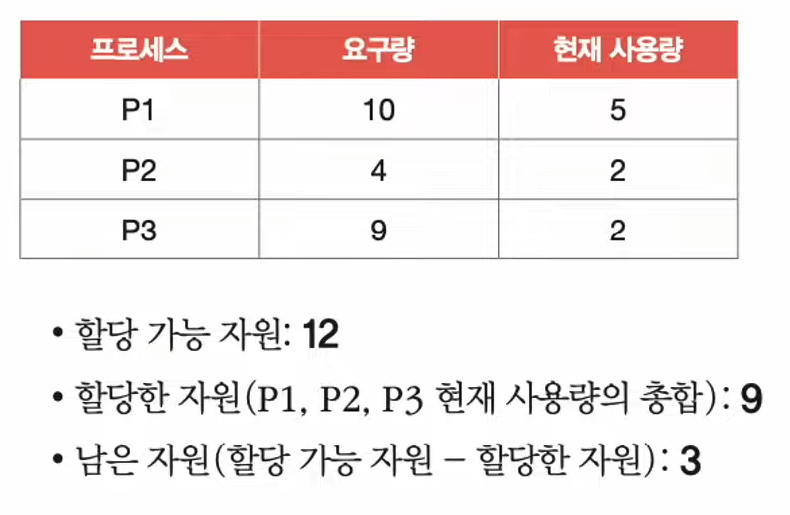
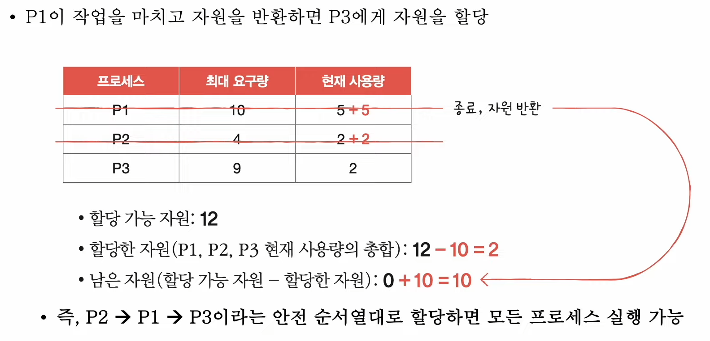
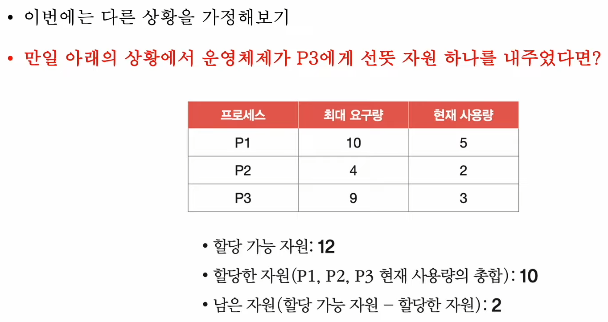
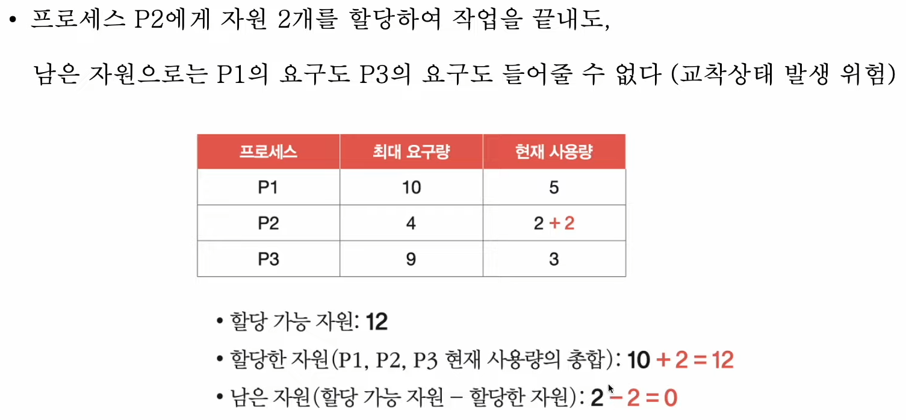

# 36강. 교착 상태 해결 방법

> 교착 상태 해결 : 예방, 회피, 검출 후 회복

## 1. 교착 상태 예방

- 애초에 교착 상태가 발생하지 않도록
- 교착 상태 발생 조건 (상호 배제, 점유와 대기, 비선점, 원형 대기) 중 하나를 없애버리기 (35강 마지막)
    - 교착상태가 발생하지 않음은 보장할 수 있으나 '부작용'이 따른다

### 상호 배제를 없애면?

- 모든 자원을 공유 가능하게 만든다?
    - 이론적으로는 가능하지만 현실적으로는 불가능 (모든 자원공유 불가능)

### 점유와 대기를 없애면?

- (식사하는 철학자)
- 특정 프로세스에 자원을 모두 할당하거나, 아예 할당하지 않는 방식으로 배분 (포크 기다릴거면 왼쪽 포크 내려놓고 기다려라!)
- -> 자원의 활용률을 낮출 수 있는 방식

### 비선점 조건을 없애면?

- 한 프로세스가 다른 프로세스 자원 뺏을 수 있게
- 선점이 가능한 자원 (CPU 등)에 한해 효과적
- 그렇지만 모든 자원이 선점 가능한 것은 아니다
    - 한 프로세스가 사용하고 있으면 다른 프로세스가 사용하지 못하는 식..

### 원형 대기 조건을 없애면?

- 모든 자원에 번호를 붙이고, 오름차순으로 할당하면 원형 대기는 발생하지 않음

- 이건 마치 원형이 아닌 일자로 된 테이블에 앉아있는 것과 같음
    - 도미노처럼 한 사람이 포크(자원) 해제하면 연달아서 주르륵 해제할테니까!

- 그렇지만!,
    - 자원에 번호 붙이는 것은 어려운 작업
    - 어떤 자원에 어떤 번호를 붙이느냐에 따라 활용률이 달라진다
        - 자주 사용되지 않은 프로세스에 높은 순위번호가 붙을 때 / 자주 사용되는 프로세스에 낮은 순위번호 붙을 때

## 2. 교착 상태 회피

- 교착 상태를 '무분별한 자원 할당으로 인해 발생'했다고 간주
- 교착 상태가 발생하지 않을 만큼 조심 조심 할당!
- 배불할 수 있는 자원의 양을 고려하여 교착 상태가 발생하지 않을 만큼만 자원 배분

### 교착 상태 회피 주요 개념

- (1) 안전 순서열 : 교착 상태 없이 안전하게 프로세스들에 자원을 할당할 수 있는 순서
- (2) 안전 상태 : 교착 상태 없이 모든 프로세스가 자원을 할당받고 종료 될 수 있는 상태
    - 안전 순서열이 있는 상태
- (3) 불안전 상태 : 교착 상태가 발생할 수도 있는 상태
    - 안전 순서열이 없는 상태

#### 예시

- 컴퓨터 시스템에 총 12개 자원 존재
- 프로세스 p1, p2, p3가 각각 5개 / 2개 / 2개의 자원 할당 받아 실행 중
    - 운영체제가 배불할 수 있는 자원 개수는? 3개
- 프로세스 p1, p2, p3는 각각 최대 10개 / 4개 / 9개 자원 요구 할 수 있음

##### 표로 정리하면 이런 식

##### p1, p2, p3가 모두 최대로 자원을 요구한 최악의 상황 가정

##### 다른 상황 가정해보기

- 교착 상태 위험있음
- 안전 순서율이 없는 상태 - 불안전 상태

### 교착 상태 회피 정리

- 안전 상태에서 안전 상태로 움직이는 경우에만 자원을 할당하는 방식
- 항시 안전 상태를 유지하도록 자원을 할당하는 방식
- ex) 은행원 알고리즘

## 3. 교착 상태 검출 후 회복

- 교착 상태의 발생을 인정하고 사후에 조치하는 방식
- 프로세스가 자원을 요구하면 일단 할당, 교착 상태가 검출되면 회복
- 종류 : 선점을 통한 회복, 프로세스 강제 종료를 통한 회복

### (1) 선점을 통한 회복

- 교착상태가 해결될 때까지 한 프로세스씩 자원을 몰아주는, 몰빵해주는 방식

### (2) 프로세스 강제 종료를 통한 회복

- (1) 교착 상태가 놓인 프로세스 모두 강제 종료 방식
    - 확실하게 교착 상태 완벽히 해결
    - 대신, 작업 내역을 잃을 위험이 있다!
- (2) 교착 상태가 해결될 때까지 한 프로세스씩 강제 종료 방식
    - 계속 교착상태가 해결되었는지 확인하느라 오버헤드든다
    - 작업 내역 최소화되는 이점있음

## 4. 교착 상태 무시

- 타조 알고리즘

