# 37강. 연속 메모리 할당

> 연속메모리 할당에 대해 학습하기전 '스와핑' 개념 알기

## 1. 스와핑

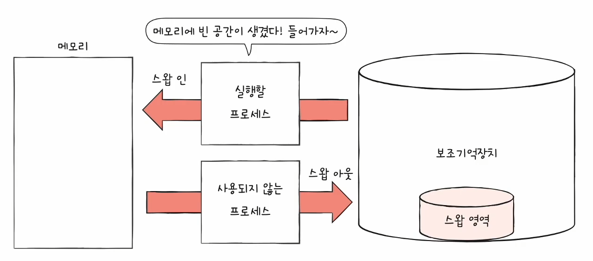

- 현재 사용되지 않는 프로세스들을 보조기억장치의 일부 영역으로 쫓아내고
- 그렇게 생긴 빈 강간에 새 프로세스 적재
- 개념
    - 스왑 인 / 스왑 아웃
    - 스왑 영역

### 장점

- 프로세스들이 요구하는 메모리 공간 크기가 실제 메모리 크기보다 커도 실행 가능

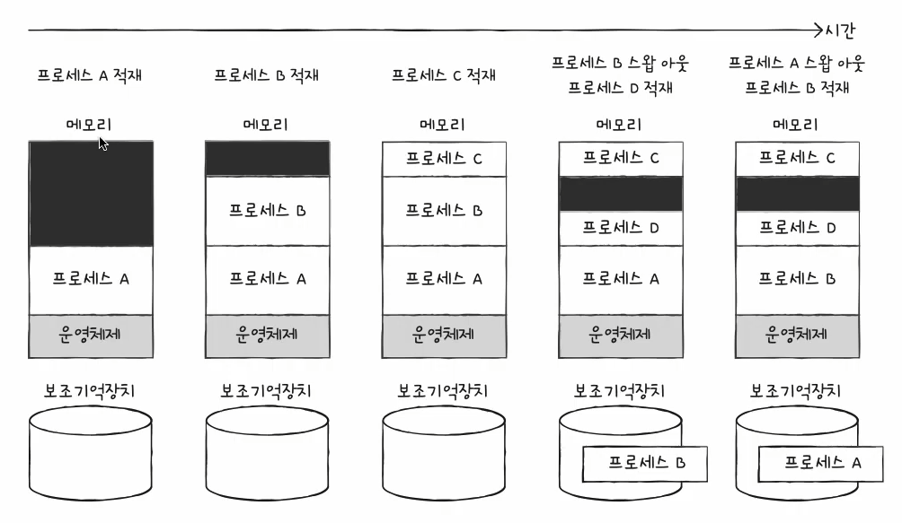

### 스왑 영역 크기 확인

- free, top 명령어 사용

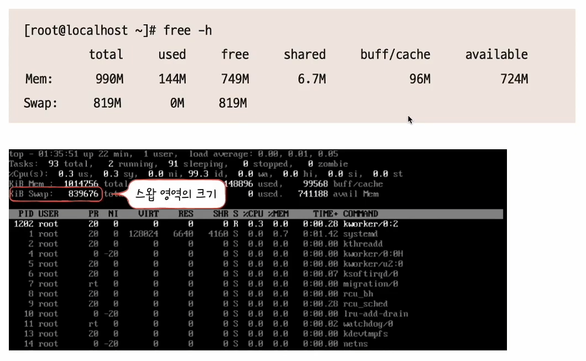

## 2. 연속메모리 할당

- 프로세스에 연속적인 메모리 공간을 할당

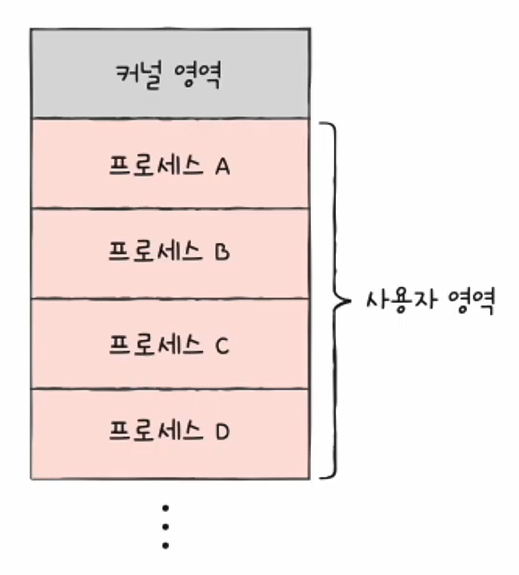

### 연속 메모리 할당 방식

- 프로세스는 메모리의 빈 공간에 할당되어야 한다
- Q. 빈 공간이 여러개 있다면??
- A. 어떻게 할당할지에 대한 할당 방식 종류에 따라 다르다.
    - 종류 : 최초 적합 / 최적 적합 / 최악 적합

### (1) 최초 적합

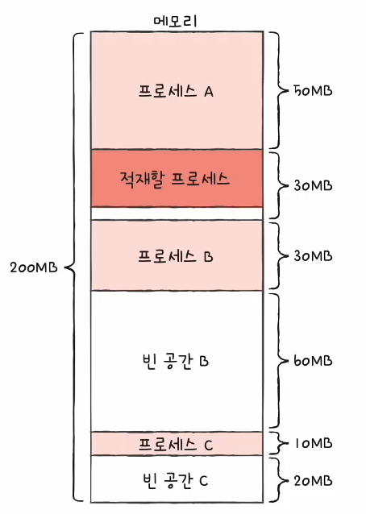

- 최초 적합 (first-fit)
- 운영체제가 메모리 내의 빈 공간을 순서대로 검색하다 적재할 수 있는 공간을 발견하면, 그 공간에 프로세스를 배치하는 방식
- 장점
    - 검색 최소화
    - 빠른 할당

### (2) 최적 적합

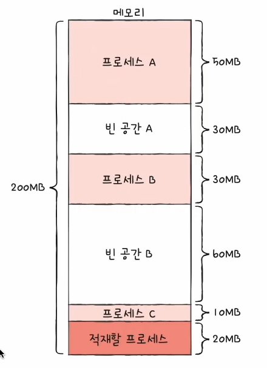

- 최적 적합 (best-fit)
- 운영체제가 빈 공간을 모두 검색해본 뒤, 적재 가능한 가장 작은 공간에 할당

### (3) 최악 적합

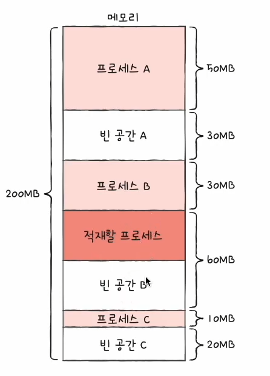

- 최악 적합 (worst-fit)
- 운영체제가 빈 공간을 모두 검색해본 뒤, 적재 가능한 가장 큰 공간에 할당

### 연속 메모리 할당 방식의 의의

- 기본적이라고 생각하겠지만
- 사실 연속적으로 메모리에 할당하는 방식은, 메모리를 "비효율적"으로 사용하는 방식!
- 이유 : '외부 단편화(external fragmentation)'이라는 잠재적인 문제 발생하기 때문!

## 3. 외부 단편화

1. 메모리가 200MB가 있다

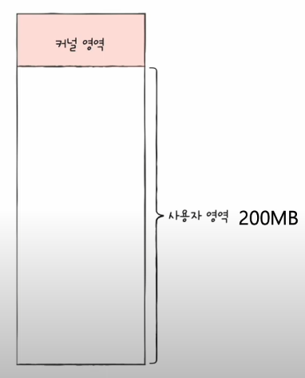

2. 이렇게 4개의 프로세스(A,B,C,D)를 메모리에 올렸다

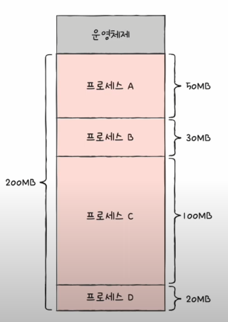

3. 프로세스 B, D 실행 끝났다

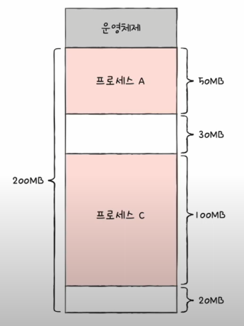

> Q. 이때! 현재 사용 가능 메모리는 50MB이다. 그렇다면 50MB짜리 프로세스를 올릴 수는 있을까?
>   A. 당연히 안된다!

### 외부 단편화

- 프로세스들이 실행되고 종료되길 반복하며 메모리 사이사이에 빈 공간 발생
- 외부 단편화
    - 프로세스를 할당하기 어려울 만큼 작은 메모리 공간들로 인해 메모리가 낭비되는 상황
- 이게 바로 연속 메모리 할당 방식의 문제점!

#### < 예시 >

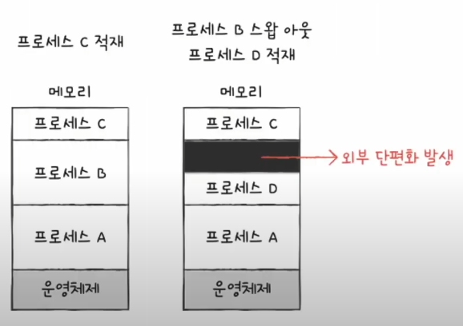
 
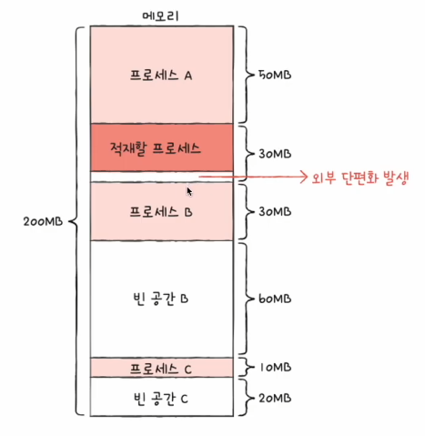

## 4. 외부 단편화 해결 방법

- 해결방법은 많다
- 그중 가장 유명한 방법 몇개 소개

### (1) 메모리 압축 (compaction)

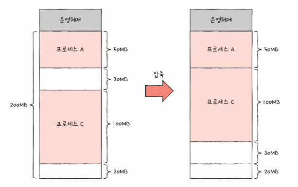

- 여기저기 흩어져있는 빈 공간들을 하나로 모으는 방식
- 프로세스를 적당히 재배치시켜서 흩어져 있는 작은 빈 공간들을 하나의 큰 빈 공간으로 만드는 방법

- 두번째 방법보다는 조금 부작용이 있는 편
    - 단점 1: 프로세스들을 재배치하는 과정에서 많은 오버헤드를 야기시킨다!
    - 단점 2 : 프로세스들은 자기가 해야 될 일을 제대로 못 할 수도 있다!

### (2) 가상 메모리 기법, 페이지

- 현대 운영체제에서 외부 단편화를 최소화하기 위해서 선택하는 대중적인 방법

> 그 다음 [28강](https://github.com/yunji1201/ReadingBooks/blob/main/computer/37_연속메모리할당.md) 에서 자세히 다뤄진다!