# 38강. 페이징을 통한 가상 메모리 관리

> 페이징을 통해 연속 메모리 할당의 문제점 해결해보자

## 0. 연속 메모리 할당의 두 가지 문제점 (지난 강의 참고)

- (1) 외부 단편화
- (2) 물리 메모리보다 큰 프로세스 실행 불가

## 1. 가상 메모리

- 실행하고자 하는 프로그램을 일부만 메모리에 적재하여 실제 물리 메모리 크기보다 더 큰 프로세스를 실행 할 수 있게 하는 기술
- 페이징, 세그멘테이션 등

## 2. 페이징

> Q. '외부 단편화'가 발생했던 근본적인 문제는?  
> A. 각기 다른 크기의 프로세스가 메모리에 연속적으로 할당되었기 때문 !  
> => 그렇다면 프로세스를 일정 크기로 자르고, 이를 메모리에 불연속적으로 할당하면 해결되지 않을까??  
> 그게 바로 '페이징'

### (1) 페이징(paging)이란?

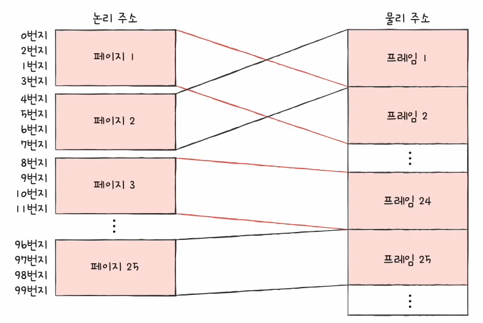

- 프로세스의 논리 주소 공간을 페이지(page)라는 일정 단위로 자르고,
- 메모리의 물리 주소 공간을 프레임(frame)이라는 페이지와 동일한 일정한 단위로 자른 뒤, 페이지를 프레임에 할당하는
- 가상 메모리 관리 기법!

### (2) 페이징에서의 스와핑

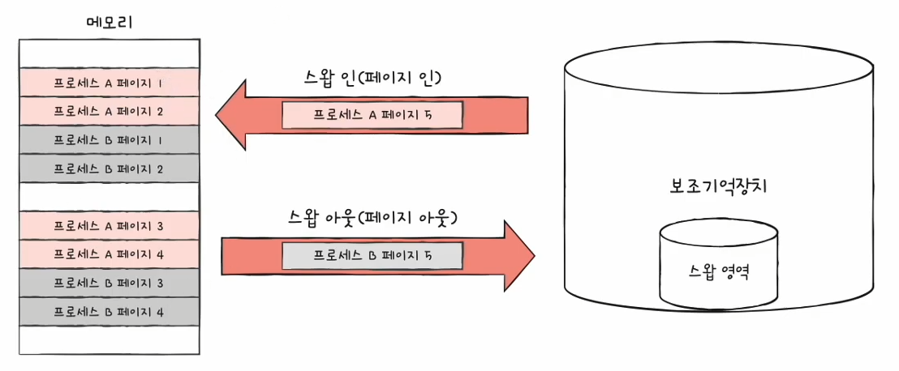

- 프로세스 단위의 스왑 인, 스왑 아웃이 아닌 페이지 단위의 스왑 인(페이지 인), 스왑 아웃(페이지 아웃)
- 메모리에 적재될 필요가 없는 페이지들은 보조기억장치로 스왑 아웃
- 실행에 필요한 페이지들은 메모리로 스왑 인

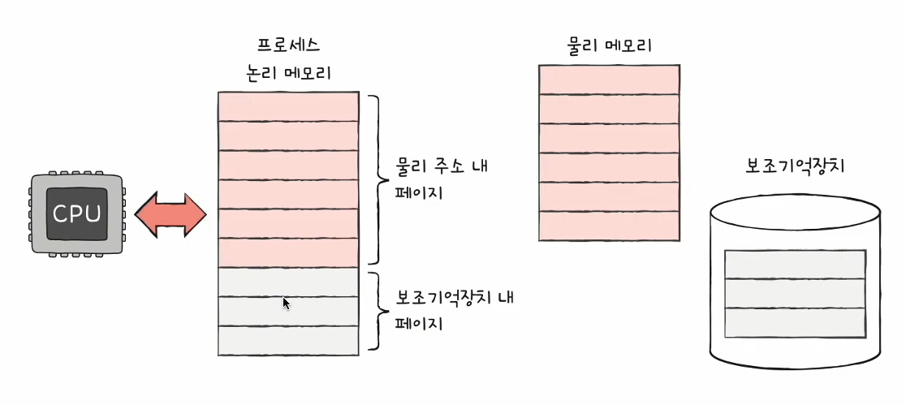

- => 프로세스를 실행하기 위해 메모리에 모든 페이지가 전부 다 저장될 필요는 없다는 것을 뜻함
    - 달리 말해 물리 메모리보다 큰 프로세스도 실행될 수 있다

### (3) 문제점

- 프로세스를 이루는 페이지가 어느 프레임에 적재되어 있는 CPU가 일일이 알기 어렵다
- 프로세스가 메모리에 불연속적으로 배치된다면 CPU입장에서는 이를 순차적으로 실행할 수 없음!
- CPU 입장에선 '다음 실행할 명령어 위치' 찾기 어려워!

- 해결 방법으로 나온 것이 바로 '페이지 테이블'

## 3. 페이지 테이블

### (1) 페이지 테이블이란?

- 실제 메모리 내의 주소인 물리 주소에 불연속적으로 배치되더라도
- CPU가 바라보는 주소인 논리 주소에는 연속적으로 배치하는 방법
- **페이지 번호와 프레임 번호를 짝지어주는 일종의 이정표!**

### (2) 페이지 테이블 특징

- 프로세스마다 페이지 테이블이 있다!

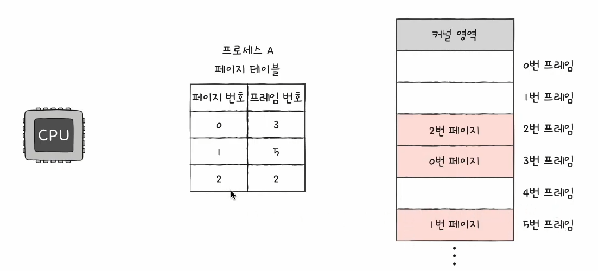
  (0번 페이지는 프레임 3에 저장되어있다. 그러므로 CPU는 페이지 번호를 연속적으로 보면서 순차적으로 실행하면 돼)

### (3) '내부 단편화'라는 부작용

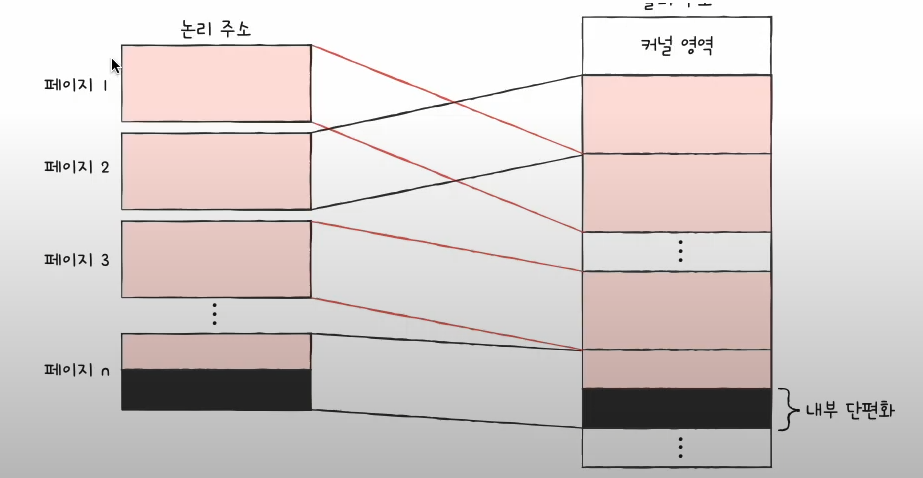
  아래 부분이 낭비 될 수 있음

- (예시) 페이지 크기가 10KB, 프로세스 크기 108KB ?
    - 맨마지막에 남겨진 2KB : 내부 단편화 발생
- 하나의 페이지 크기보다 작은 크기로 발생

## 4. 프로세스 테이블 베이스 레지스터(PTBR)

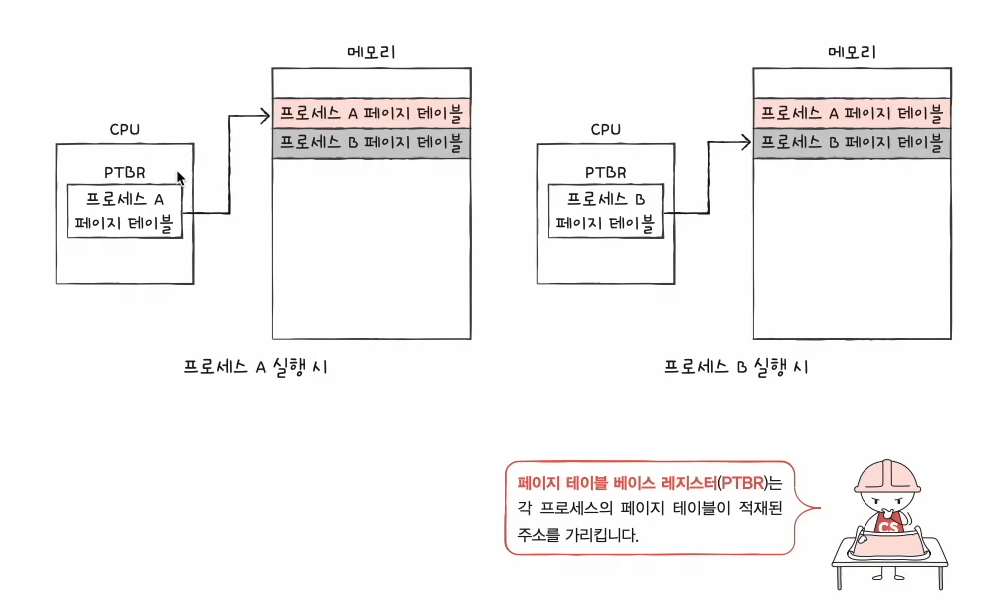

- 프로세스마다 페이지 테이블이 있고, 각 페이지 테이블은 CPU내의 프로세스 테이블 베이스 레지스터(PTBR)가 가르킨다.

### < PTBR의 문제점 >

- 페이지 테이블이 메모리에 있다면?
- 메모리 접근 시간이 두배로 걸린다!
    - 페이지 테이블 참조하기 위해 한 번
    - 페이지 참조하기 위해 한 번

- 그래서 이 문제를 해결하기 위해 나온 방식이 바로 'TLB'

## 5. TLB

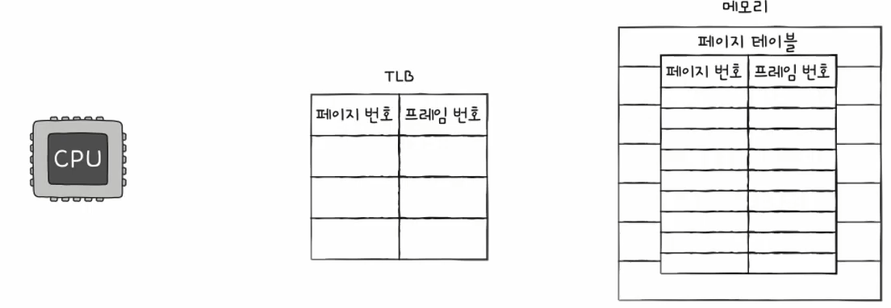

- TLB : CPU 곁에 페이지 테이블의 특별한 '캐시 메모리'
- 현재 자주 참고하고 있는 페이지 테이블의 일부를 가져와 저장
- 이렇게 되면 굳이 접근을 두번 안해도 된다!

### TLB 히트 / TLB 미스

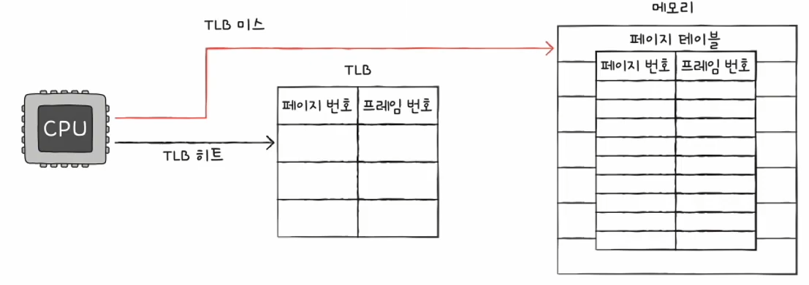

- CPU가 접근하려는 논리 주소가 TLB에 있다면?
    - **TLB 히트!**
        - 메모리 접근 한 번
- CPU가 접근하려는 논리 주소가 TLB에 없다면?
    - **TLB 미스!**
        - 메모리 접근 두 번

## 6. 페이징에서의 주소 변환

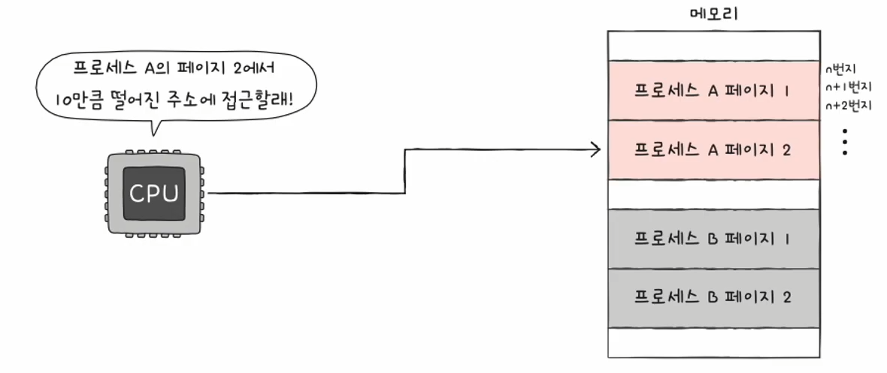

- 특정 주소에 접근하고자 한다면 어떤 정보가 필요할까?
    - (1) 어떤 페이지/프레임에 접근하고 싶은지
    - (2) 접근하려는 주소가 그 페이지 혹은 프레임으로부터 얼마나 떨어져 있는지

### 페이징 시스템에서의 논리 주소

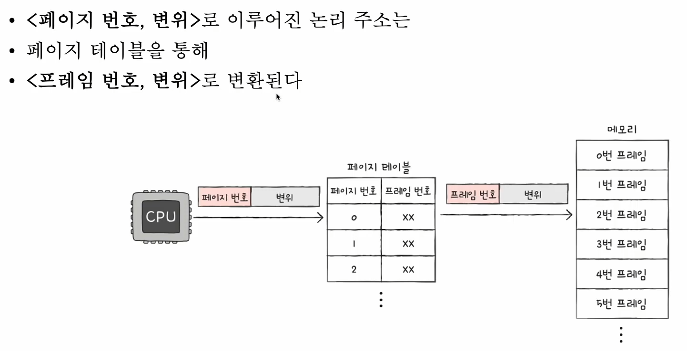

- 페이지 번호 (page number) / 변위 (offset)
    - 내가 접근하고자 하는 페이지 - 페이지 번호
    - 내가 접근하고자 하는 그 주소는 그 페이지에서 얼만큼 떨어져있는지 - 변위

- 페이지와 프레임 크기는 같으니까 변환이 되어도 변위는 같겠지!

### 예시

  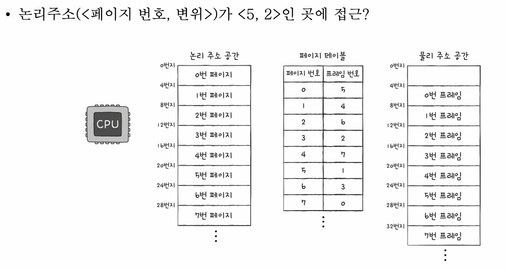

1. 논리주소가 <5,2>인 곳에 접근하려고 한다.
2. 페이지 번호가 5니까 1번 프레임번호에 있겠지.
3. 1번 프레임은 8번지부터 시작되고
4. 변위는 2이니까 8+2=10
5. 즉 10번지에 접근하게 된다!

## 7. 페이지 테이블 엔트리

### 페이지 테이블의 각각의 행 : 페이지 테이블 엔트리 (PTE)

- 현재까지 설명한 PTE : 페이지 번호, 프레임 번호
- 이외에 담기는 정보? 물론 운영체제마다 각기 다르지만
- 대체적으로 모든 운영체제가 가진 중요한 정보
    - 유효비트

### (1) 유효비트

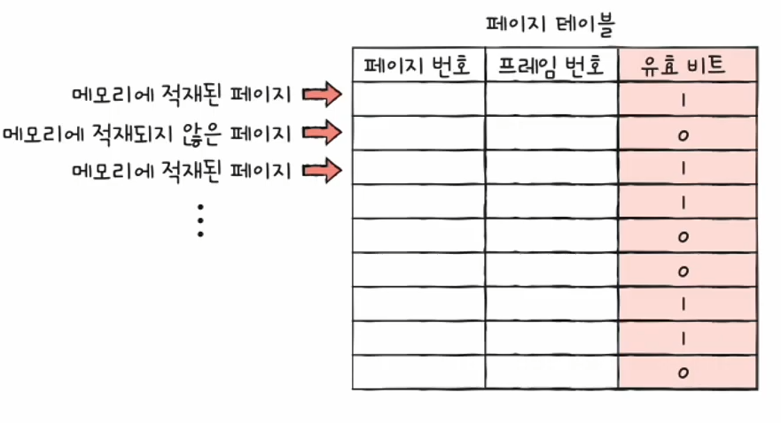

- 현재 해당 페이지에 접근 가능한지 여부
    - 1이면 메모리에 적재된 페이지라 접근 가능
    - 0이면 메모리에 적재되지 않은 페이지랑 접근 불가능

- 유효비트가 0인 페이지에 접근하려면?
    - '페이지 폴트(page fault)'라는 인터럽트 발생!
- (1) CPU는 기존의 작업 내용을 백업한다
- (2) 페이지 폴트 처리 루틴 실행
- (3) 페이지 처리 루틴은 원하는 페이지를 보조기억장치에서 메모리로 가져온 뒤 유효 비트를 1로 변경
- (4) 페이지 폴트를 처리했다면 이제 CPU는 해당 페이지에 접근 가능!!

### (2) 보호비트

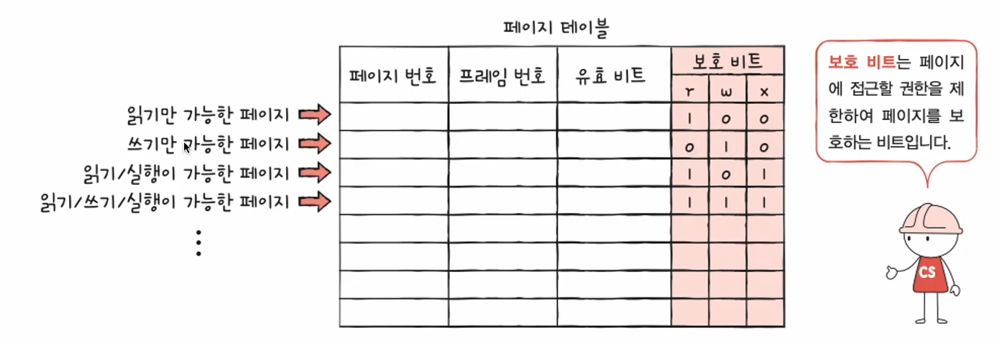

- 페이지 보호 기능을 위해 존재하는 비트
    - 어떤 페이지는 읽기 전용, 어떤 페이지는 쓰기도 가능

### (3) 참조비트

- CPU가 이 페이지에 접근한 적이 있는지 여부

### (4) 수정비트 (=dirty bit)

- CPU가 이 페이지에 데이터를 쓴 적이 있는지 여부
- 즉, 이 페이지가 한번이라도 변경이 된 적이 있는지 없는지
- 존재 이유
    - 이 페이지가 메모리에서 스왑 아웃될 때 보조기억 장치에도 동일하게 쓰기 작업을 거쳐야하니까!

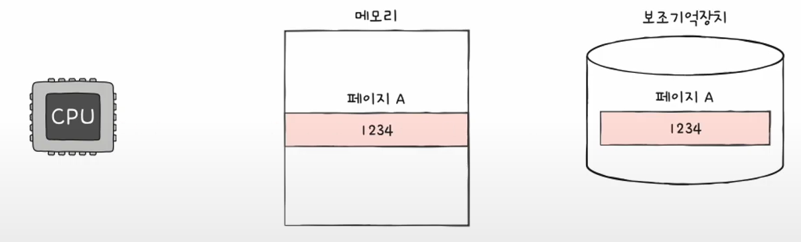
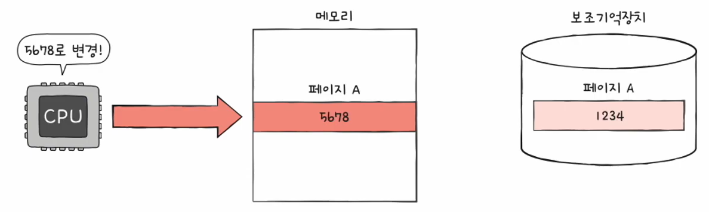