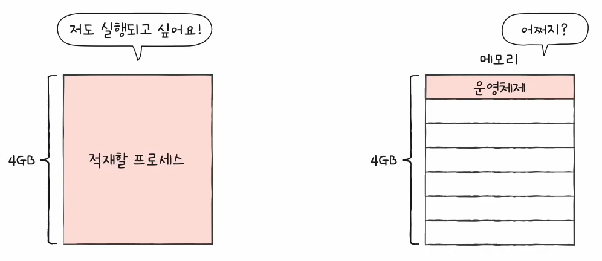
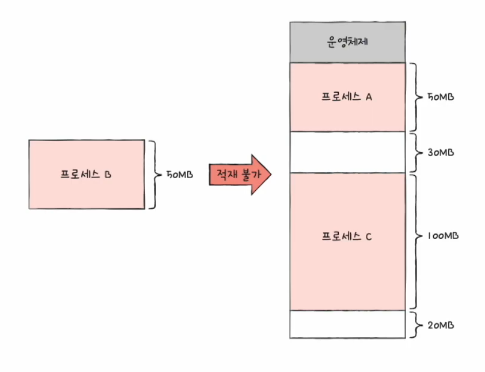
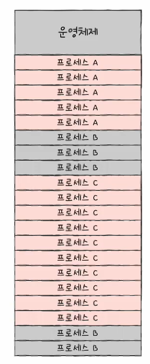

# 38강. 페이징을 통한 가상 메모리 관리

> 페이징을 통해 연속 메모리 할당의 문제점 해결해보자

## 연속 메모리 할당의 두 가지 문제점 (지난 강의 참고)

- (1) 외부 단편화
- (2) 물리 메모리보다 큰 프로세스 실행 불가

## 가상 메모리

- 실행하고자 하는 프로그램을 일부만 메모리에 적재하여 실제 물리 메모리 크기보다 더 큰 프로세스를 실행 할 수 있게 하는 기술
- 페이징, 세그멘테이션 등

## 페이징

> Q. '외부 단편화'가 발생했던 근본적인 문제는?  
> A. 각기 다른 크기의 프로세스가 메모리에 연속적으로 할당되었기 때문 !  
> => 그렇다면 프로세스를 일정 크기로 자르고, 이를 메모리에 불연속적으로 할당하면 해결되지 않을까??  
> 그게 바로 '페이징'

### 페이징 (paging)

- 프로세스의 논리 주소 공간을 페이지(page)라는 일정 단위로 자르고,
- 메모리의 물리 주소 공간을 프레임(frame)이라는 페이지와 동일한 일정한 단위로 자른 뒤, 페이지를 프레임에 할당하는
- 가상 메모리 관리 기법! 
