# 39강. 페이지 교체와 프레임 할당

> 물리 메모리보다 큰 프로세스를 실행할 수 있지만, 그럼에도 물리 메모리의 크기는 한정되어있다
>
> 기존에 적재된 불필요한 페이지를 선별해 보조기억장치로 내보내고 => (페이지 교체 알고리즘) 
> 프로세스들에게 적절한 수의 프레임을 할당해야한다 => (프레임 할당)

## 1. 요구 페이징 (demand paging)

- 처음부터 모든 페이지를 적재하지 않고 필요한 페이지만을 메모리에 적재하는 기법
- 요구되는 페이지만 적재하는 기법

### 실행 순서

1. CPU가 특정 페이지에 접근하는 명령어를 실행
2. 해당 페이지가 현재 메모리에 있으면 (유효비트=1) CPU는 페이지가 적재된 프레임에 접근
3. 해당 페이지가 현재 메모리에 없으면 (유효비트=0) 페이지 폴트가 발생
4. 페이지 폴트 처리 루틴은 해당 페이지를 메모리로 적재하고 유효비트를 1로 설정
5. 다시 1번 수행하기

### Q. 요구페이징 시스템이 안정적으로 작동하려면?

- A. 페이지 교체
- A. 프레임 할당

## 2. 페이지 교체 알고리즘

- 요구 페이징 기법으로 페이지들을 적재하다보면 언젠가 메모리가 가득 차게 된다
- 당장 실행에 필요한 페이지를 적재하려면 적재된 페이지를 보조기억장치로 내보내야 함
- 근데 그럼 어떤 페이지 내보내야 해????
- 이를 결정하는 방법(알고리즘)이 **<U>페이지 교체 알고리즘!</U>**

> Q. 그럼 무엇이 좋은 페이지 교체 알고리즘일까?
>
> A. 페이지 폴트가 적은 알고리즘!  
> => 페이지 폴트가 발생하면 보조기억장치에 접근해야 해서 성능 저하 / 속도 느려짐

- 이렇다는 건 '페이지 폴트 횟수'를 알아야 한다. 어떻게 알 수 있지?

### 페이지 참조열(page reference string)

- CPU가 참조하는 페이지들 중 연속된 페이지를 생략한 페이지열

### (1) FIFO 페이지 교체 알고리즘

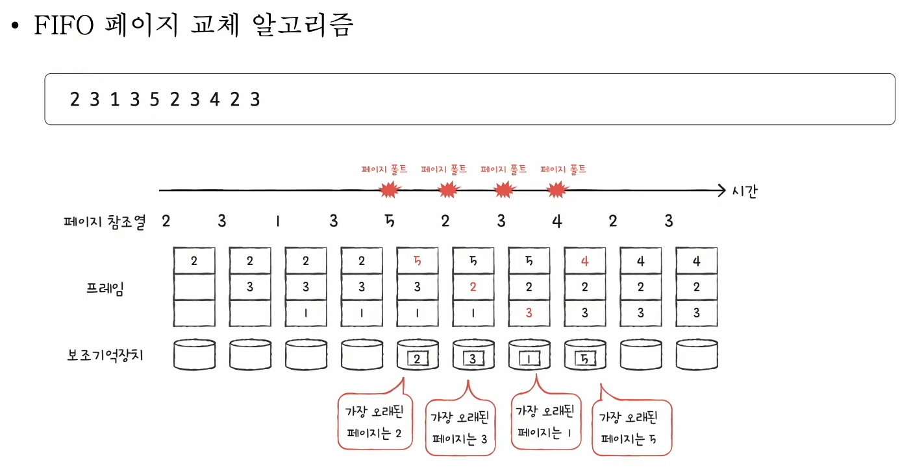

#### <특징>

- 가장 단순한 방식
- 메모리에 가장 먼저 올라온 페이지부터 내쫓는 방식
- '오래 머물렀다면 나가라'

#### <의의>

- 프로그램 실행 내내 사용될 페이지가 있을 수 있는데, 먼저 적재되었다고 내쫓길 수 있음!
- 그래서 성능적으로는 안좋아서 보완책으로 나온 것이 바로 '2차 기회 페이지 교체 알고리즘'!

### (2) 2차 기회 (second-chance) 페이지 교체 알고리즘

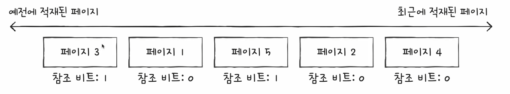
 
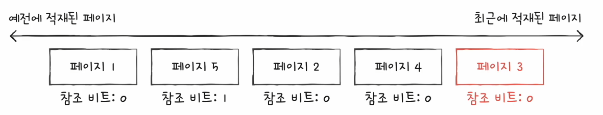

#### <특징>

- 참조 비트 1 : CPU가 한 번 참조한 적이 있는 페이지
- 참조 비트 0 : CPU가 참조한 적이 없는 페이지

- 만약에 참조비트가 1이면 CPU가 한 번 참조한 적이 있다는거니까 적재시간을 현재시간으로 재설정하고 참조비트를 0으로 초기화
    - 즉, 가장 최근에 적재한 페이지로 간주한다
- 오랫동안 머무른 페이지가 참조비트가 0이라면 CPU가 안 사용하는 페이지니까 이 페이지를 내보내게 된다!

### (3) 최적 페이지 교체 알고리즘

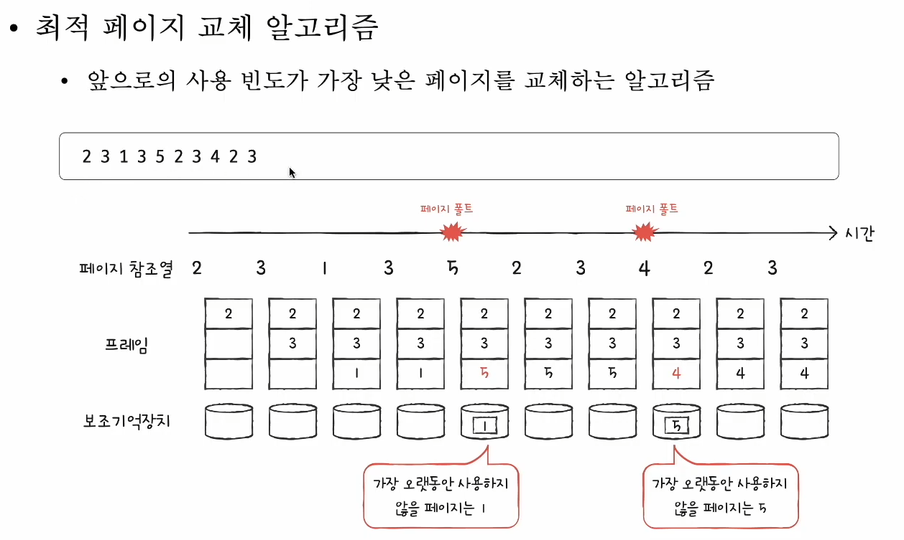

#### <특징>

- CPU에 의해 참조되는 <u>횟수</u>를 고려
- 메모리에 오래 남아야 할 페이지는 **자주 사용될 페이지**
- 메모리에 없어도 될 페이지는 오랫동안 **사용되지 않을 페이지**

#### <의의>

- 가장 낮은 페이지 폴트율을 보장하는 페이지 교체 알고리즘
- 그렇지만! 실제 구현이 어렵다...
    - '앞으로 오랫동안 사용되지 않을 페이지를 어떻게 예측하는가...'
    - => 다른 페이지 교체 알고리즘 성능을 평가하기 위한 하한선(기준)으로 간주!

### (4) LRU(Least-Recently-Used) 페이지 교체 알고리즘

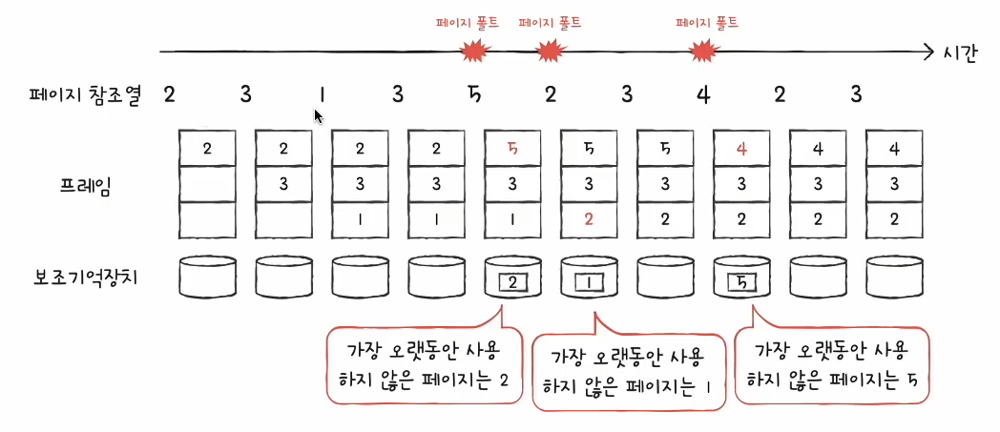

#### <특징>

- 최적 페이지 교체 알고리즘 : 가장 오래 사용되지 **않을** 페이지 교체
- LRU 페이지 교체 알고리즘 : 가장 오래 사용되지 **않은** 페이지 교체
    - 최근에 사용되지 않은 페이지는 앞으로도 사용되지 않지 않을까?

### (5) 기타 페이지 교체 알고리즘

- 이외에도 많은 페이지 교체 알고리즘들이 있다
    - LRU 페이지 교체 알고리즘의 파생 알고리즘 등..

> ### 🤔 < 생각해볼것 >
> 1. 페이지 교체 알고리즘이란 무엇인지 
> 2. 페이지 교체는 왜 해야 하는지 
> 3. 무엇이 좋은 페이지 교체 알고리즘인지 

## 3. 스래싱

> Q. 페이지 폴트가 자주 발생하는 이유
>
> A. 나쁜 페이지 교체 알고리즘을 사용해서 
> A. 프로세스가 사용할 수 있는 프레임 자체가 적어서

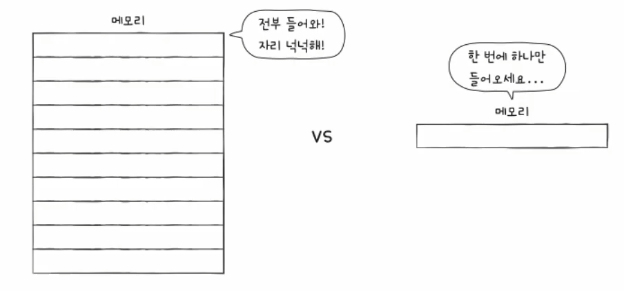

### (1) 스래싱이란?

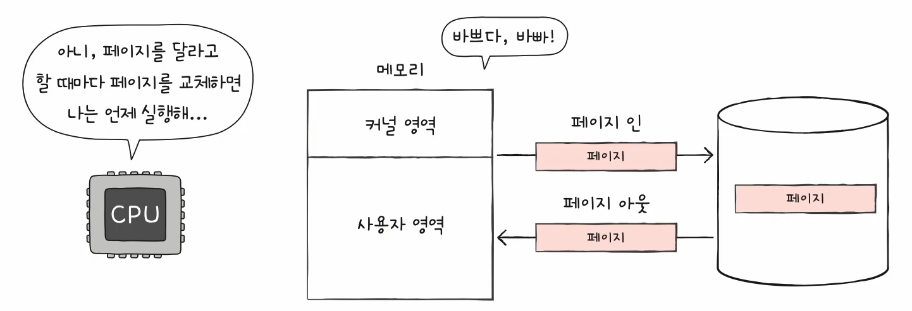

- 프로세스가 실행되는 시간보다 페이징에 더 많은 시간을 소요하여 성능(CPU 이용률)이 저해되는 문제

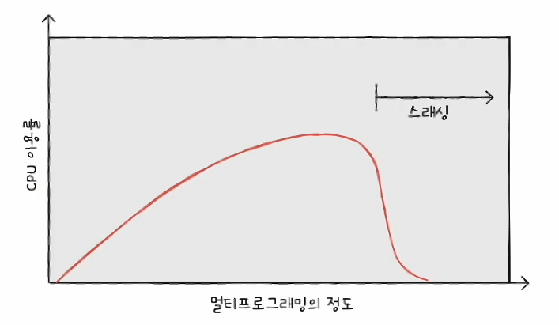 
(멀티프로그래밍의 정도 : 메모리에 동시에 실행되는 프로세스 수)

- 동시 실행되는 프로세스 수를 늘린다고 CPU 이용률이 높아지는 것이 아니다.

### (2) 스래싱 발생 이유

- 각 프로세스가 필요로 하는 최소한의 프레임 수가 보장되지 않았기 때문
- 각 프로세스가 필요로 하는 최소한의 프레임 수를 파악하고 프로세스들에게 적절한 프레임을 할당해주어야 한다

## 4. 프레임 할당 방식

- 정적 할당 방식 : 프로세스 실행 과정 고려없이 프로세스 크기 자체만 보고 결정
- 동적 할당 방식 : 프로세스 실행 과정을 통해서 프레임 할당을 결정

### (1) 균등할당 (equal allocation) - 정적 할당 방식

- 가장 단순한 할당 방식
- 모든 프로세스들에게 균등하게 프레임을 할당하는 방식
- 그렇지만 비합리적임
    - 어떤 프로세스는 크고 어떤건 작으면?

### (2) 비례할당 (proportional allocation) - 정적 할당 방식

- 프로세스 크기를 고려하자
- 프로세스 크기에 비례하여 프레임 할당
- 그렇지만 이것도 비합리적
    - 크기가 큰 프로세스인데 막상 실행해보니 많은 프레임 안 필요하면?
    - 크기 작은 프로세스인데 막상 실행해보니 많은 프레임 필요하면?
    - 결국 프로세스가 필요한 프레임 수는 실행해봐야 안다..!

### (3) 작업 집합 모델 기반의 프레임 할당 방식 (working set model) - 동적 할당 방식

- 프로세스가 실행하는 과정에서 배분할 프레임 결정
- 스레싱이 발생하는 이유는 빈번한 페이지 교체 때문
    - 그렇다면 CPU가 특정 시간 동안 주로 참조한 페이지 개수만큼만 프레임 할당하면 된다
        - 참조직업성의 원리와 비슷
- '프로세스가 일정기간동안 참조한 페이지 집합'을 기억하여 빈번한 페이지 교체를 방지
    - **작업집합**이란 '실행 중인 프로세스가 일정 시간 동안 참조한 페이지의 집합'

#### < 작업 집합 모델 >

- 작업 집합을 구하려면
    1. 프로세스가 참조한 페이지
    2. 시간 간격이 필요

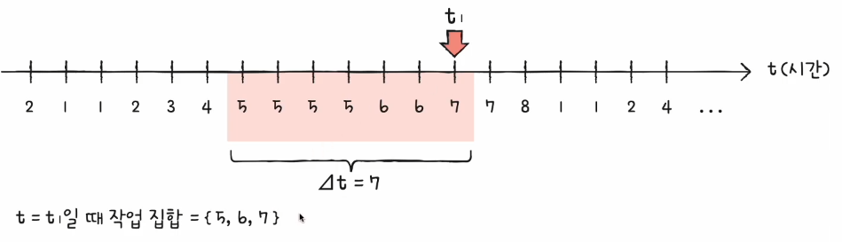
  - T1 시간동안에는 5,6,7 프레임이 필요  

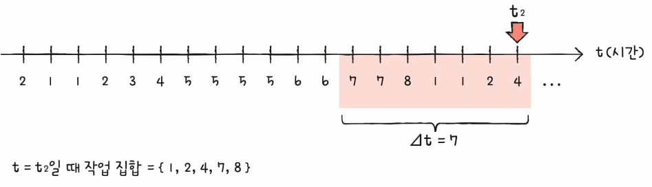
 
- T2 시간동안에는 1,2,4,7,8 프레임이 필요

### (4) 페이지 폴트 빈도 기반의 프레임 할당 방식 - 동적 할당 방식

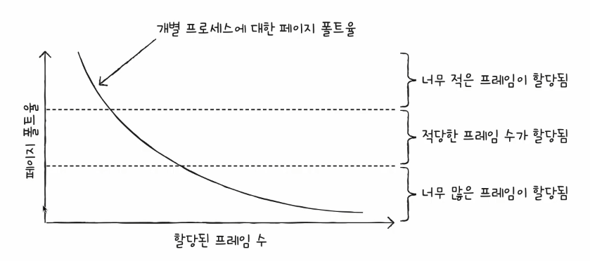

- 페이지 폴트 빈도
    - 프로세스가 실행하는 과정에서 배분할 프레임 결정
    - 두 개의 가정에서 생겨난 아이디어
        - (1) 페이지 폴트율이 너무 높으면 그 프로세스는 너무 적은 프레임을 갖고 있다
        - (2) 페이지 폴트율이 너무 낮으면 그 프로세스가 너무 많은 프레임을 갖고 있다.

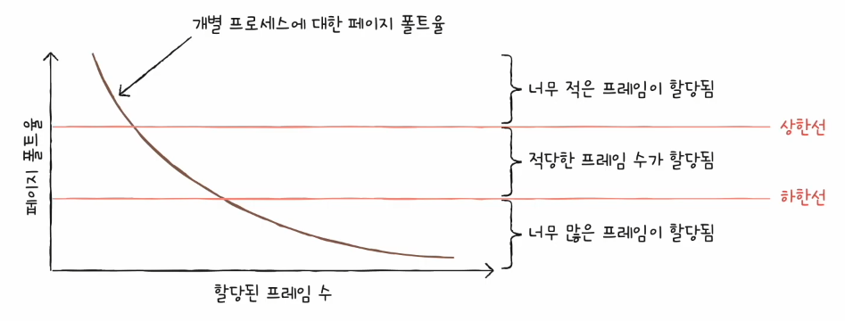

- 페이지 폴트율에 상한선과 하한선을 정하기
- 그 내부 범위 안에서만 프레임을 할당하는 방식!
