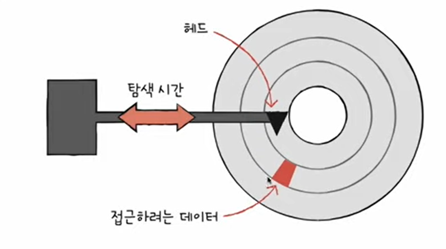
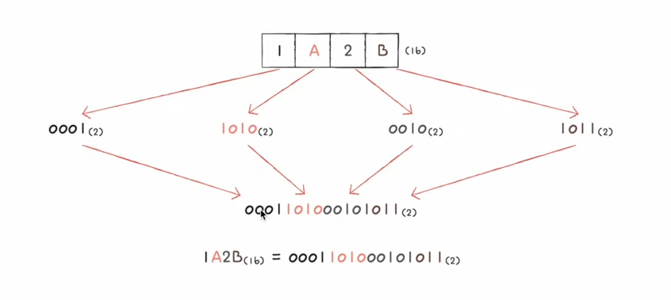
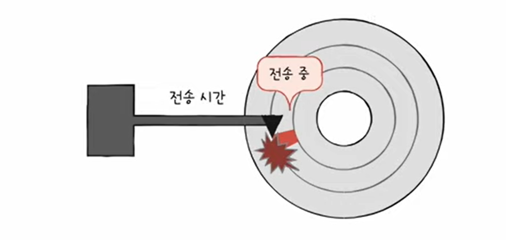

## 4강. 0과 1로 숫자를 표현하는 방법

- Q. 0과 1만 아는 컴퓨터가 어떻게 1보다 큰 수를 이해할 수 있지?

### 비트 (bit)

- 0과 1을 표현하는 정보 단위
- 컴퓨터가 이해 할 수 있는 가장 작은 정보 단위
- n비트로 2의 n승가지의 정보 표현 가능
- 프로그램은 수많은 비트로 이루어져 있음
- 종류 : 바이트, 킬로바이트, 메가바이트, 기가바이트 ... 등

   

### 워드 (word)

- CPU가 한번에 처리할 수 있는 정보 크기 단위
- 종류 : 하프 워드, 풀 워드, 더블 워드 ... 등

### 이진법 (binary)

- 0과 1로 수 표현
- 숫자가 1 넘어가면 자리올림
- 1~9 진법은 십진법(decimal)
- 예시 : 이진수로 8 표기
    - 1000(2) - 수학적 표기방식
    - 0B1000 - 코드상 표기방식

#### 음수 표현

- 0과 1로 음수 표현 : 2의 보수
- 어떤 수를 그보다 큰 2의 n승에서 뺀 값
    - 예) 11(2)의 보수를 구하려면 110(2)-11(2) = 01(2)
    - 더쉽게 : 모든 0과 1을 뒤집고 1 더한 값
    - 예) 1011(2) -> 0100 + 1 = 0101(2)
- 그런데 음수로 표현한 값과 원래 양수인 이진법을 어떻게 구분하지?
    - 예) -1011(2) = 0101(2) 와 십진수 5인 0101(2) 구분하기
    - cpu 내부에서는 플래그 레지스터가 있어서 그 안에서 양수인지 음수인지 표기를 한다. 그러므로 cpu가 알아서 판단 할 수 있음.

### 십육진법

- 이진법으로는 숫자 길이가 너무 길어짐
- 그래서 컴퓨터 데이터 표현할 때 십육진법도 많이 사용
- 수가 15 넘어가면 자리올림
- 0~9 그 다음에 ABCDEF 그 다음에 16자리부터 10~... 이렇게 계산
- 예시 : 십육진법 15 표기
    - 15(16) - 수학적 표기방식
    - 0x15 - 코드상 표기방식

- 사용 이유 : 2진수와 16진수 변환이 가장 간편해서 16진법 많이 사용한다

### 변환해보자 (2진수 -> 16진수)

- 2의 4승은 16비트
   

### 변환해보자 (16진수 -> 2진수)

   

