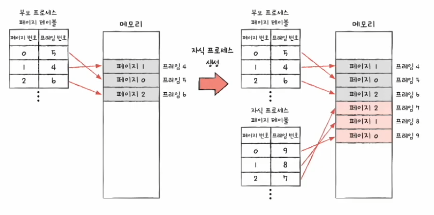
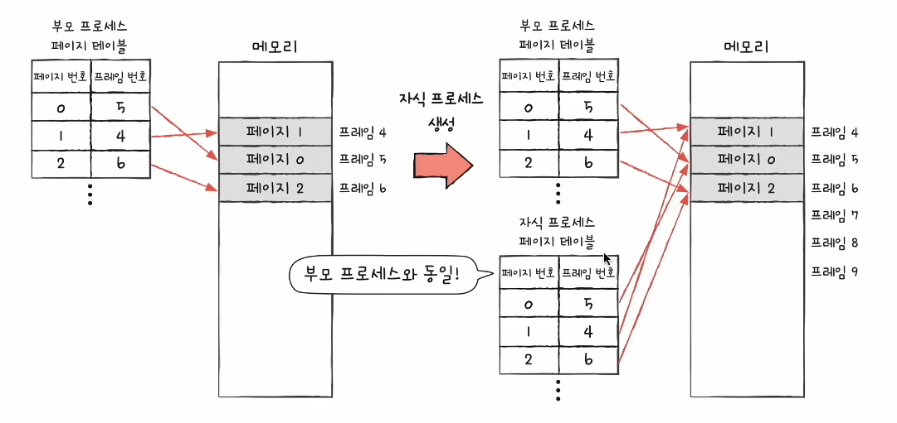
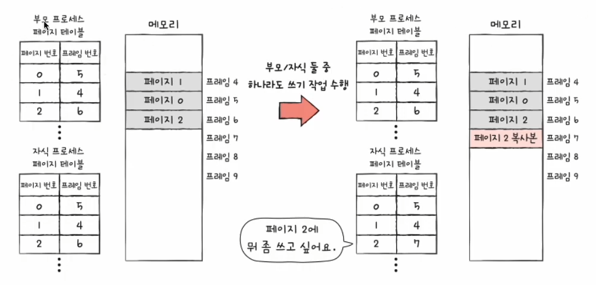
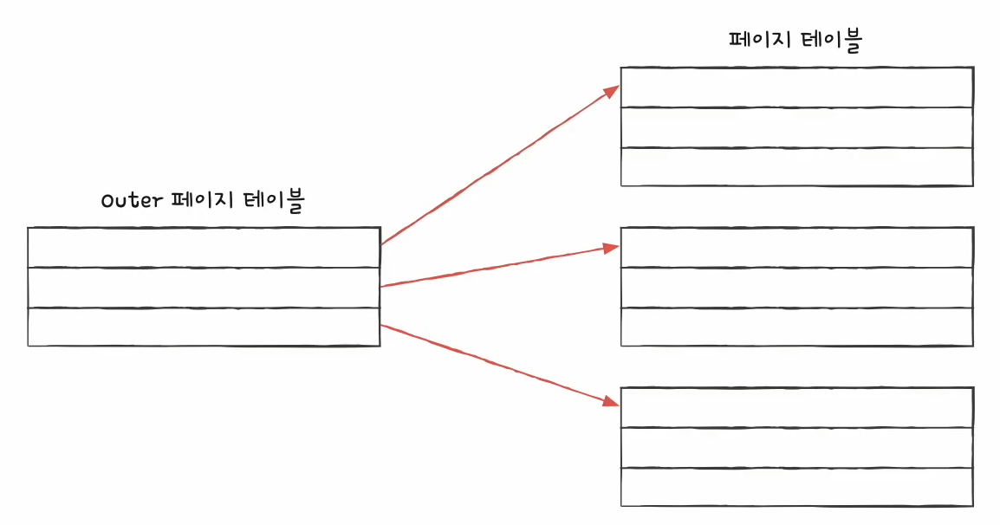
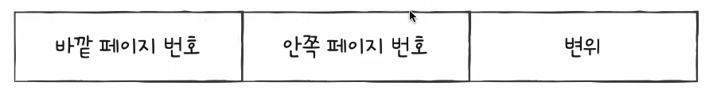
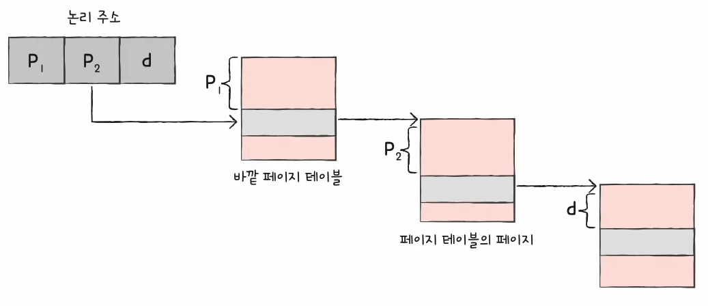

# 40강. 페이징의 이점과 계층적 페이징

## 1. 쓰기 시 복사

- '쓰기 시 복사'는 페이징 이점 중 하나!
    - 이전 강의 내용에서는 페이징을 통해 외부 단편화 문제를 해결할 수 있다고 했는데, 페이징은 그 외에도 아주 많은 이점이 많다.

### (1) 이론적인 fork()

- 프로세스는 기본적으로 자원을 공유하지 않는다
- 부모 프로세스가 적재된 별도의 공간에 자식 프로세스가 통째로 복제되어 적재
    - 단점
        - 복제되는 시간이 오래걸릴 수도 있음 (프로세스 생성시간 지연)
        - 동일한 내용이 메모리에 중복해서 적재되므로 메모리 낭비
    - 이러한 단점을 극복하는 것이 바로 '쓰기 시 복사'

### (2) 쓰기 시 복사

- Copy-on-write (COW)
- 부모 프로세스와 동일한 자식 프로세스가 복제되어 생성되면
    - (1) 쓰기 작업 없다면
        - 자식 프로세스는 부모 프로세스와 동일한 프레임을 가리킴
            - 쓰기 작업 없다면 계속 이 상태를 유지하게 된다
    - (2) 그런데 부모 프로세스 / 자식 프로세스 둘 중 하나가 페이지에 쓰기 작업 수행 시
        - 해당 페이지는 별도의 공간으로 복제
        - 프로세스 생성 시간 절약
        - 메모리 절약 - 중복해서 저장하지 않으니까!

  
- (1) 쓰기 작업 없다면   
  
- (2) 부모 프로세스 / 자식 프로세스 둘 중 하나가 페이지에 쓰기 작업 수행 시 

## 2. 계층적 페이징

- 프로세스 테이블의 크기는 생각보다 작지 않다
    - 점점 늘어나니까!
- 프로세스를 이루는 모든 페이지 테이블 엔트리를 메모리에 두는 것은 큰 낭비
- 프로세스를 이루는 모든 페이지 테이블 엔트리를 항상 메모리에 유지하지 않을 방법

### (1) 계층적 페이징이란? = 다단계 페이징 방식

- 페이지 테이블을 페이징하여 여러 단계의 페이지를 두는 방식
- 페이지 테이블을 여러 페이지로 쪼개고 이 페이지를 가리키는 페이지 테이블 (Outer 페이지 테이블)을 두는 방식
    - Outer 페이지 테이블(CPU와 가장 가까이 위치한 테이블)은 항상 메모리에 두어야하고,
    - 세 개 중에는 지금 당장 사용하고 있는 페이지 테이블만 가지고 있으면 된다
- 모든 페이지 테이블을 항상 메모리에 둘 필요가 없어짐

### (2) 계층적 페이징 환경에서의 논리 주소

1. 바깥 페이지 번호를 통해 페이지 테이블의 페이지를 찾기
2. 페이지 테이블의 페이지를 통해 프레임 번호를 찾고 변위를 더함으로서 물리 주소 얻기

### (3) 계층적 페이징 의의

- 계층적 페이징은 사실 1단계, 2단계, 3단계, ... 그 후로도 쭉 계속 생성될 수 있다.
- 그렇지만, 계층이 많아지게 되면 페이지 폴트가 발생했을 시 메모리를 참조하는 횟수가 그만큼 많아지게 된다
- 그러므로 계층이 많다고 해서 좋은 것은 아니다!