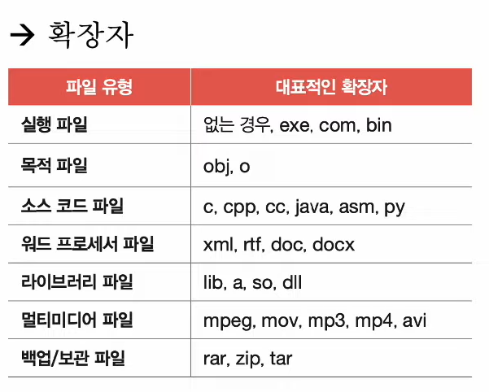
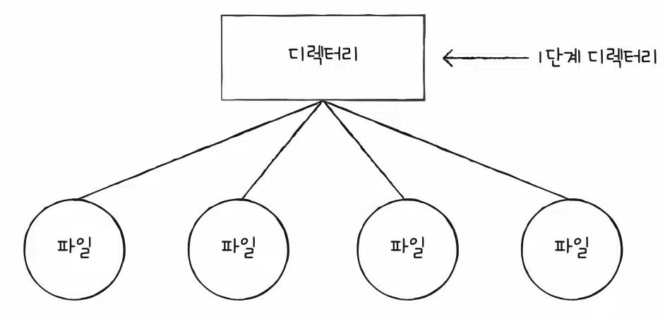
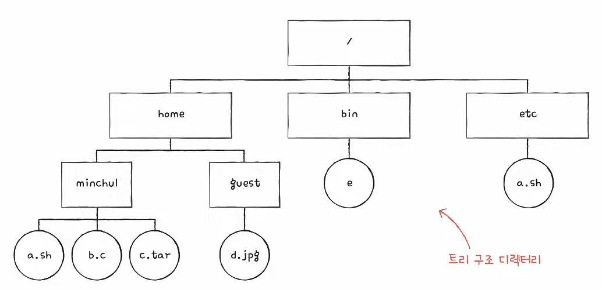
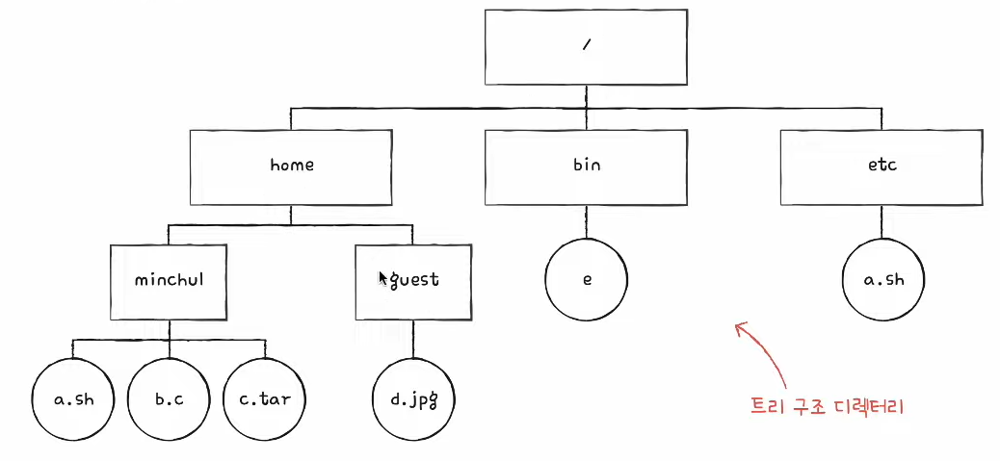
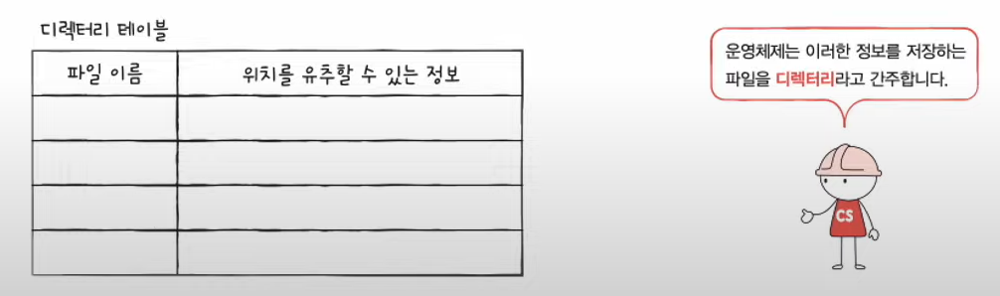
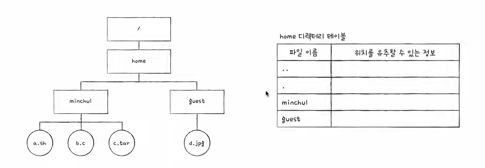
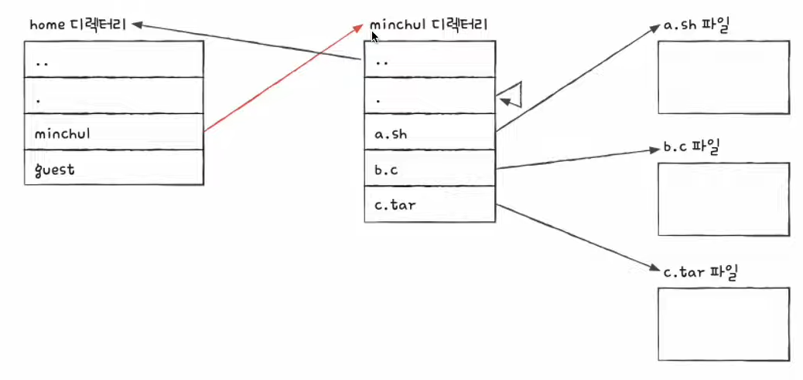

# 41강. 파일과 디렉터리

### 파일 시스템 (file system)

- 파일과 디렉터리를 관리하는 운영체제 내의 프로그램
- 파일과 디렉터리를 다루어 주는 프로그램

### 파일과 디렉터리

- 보조기억장치의 데이터 덩어리, 파일과 디렉터리

## 1. 파일

- 보조기억장치에 저장된 관련 정보의 집합
- 의미있고 관련 있는 정보를 모은 논리적 단위

### (1) 파일에 있는 정보

1. 파일을 이루는 정보
2. 파일을 실행하기 위한 정보 + 부가 정보 (=속성, 메타 데이터)

### (2) 파일의 속성

1. 유형
    - 운영체제가 인지하는 파일의 종류를 나타낸다
    - 
2. 크기
    - 파일의 현재 크기와 허용 가능한 최대 크기를 나타낸다
3. 보호
    - 어떤 사용자가 해당 파일을 읽고, 쓰고, 실행할 수 있는지를 나타낸다
4. 생성 날짜
5. 마지막 접근 날짜
6. 마지막 수정 날짜
7. 생성자
8. 소유자
9. 위치
    - 파일의 보조기억장치상의 현재 위치를 나타낸다

### (3) 파일 연산을 위한 시스템 호출

1. 파일 생성
2. 파일 삭제
3. 파일 열기
4. 파일 닫기
5. 파일 읽기
6. 파일 쓰기
7. 등등

## 2. 디렉터리

- 윈도우에서는 폴더 (folder)
- 1단계 디렉터리

- 트리구조디렉터리
    - 여러 계층으로 파일 및 폴더를 관리하는 디렉터리
    - 최상위 디렉터리 (루트 디렉터리, / 또는 C:₩으로 표현), 서브 디렉터리

### (1) 경로

- 디렉터리를 이용해 파일/디렉터리의 위치, 이름까지 특정 지을 수 있는 정보
- 절대 경로, 상대 경로
- 같은 디렉터리에는 동일한 이름 파일 존재 못함, 서로 다른 디렉터리(다른 경로)에서는 동일한 이름 파일 존재 가능

#### < 절대 경로 >

- 루트 디렉터리에서 자기 자신까지 이르는 고유한 경로
    - ex) /home/yun/sweethome.jpg

#### < 상대 경로 >

- 현재 디렉터리에서 자기 자신까지 이르는 경로
    - ex) 현재 디렉터리가 /home 인 경우 : yun/sweethome.jpg

### (2) 디렉터리 연산을 위한 시스템 호출

1. 디렉터리 생성
2. 디렉터리 삭제
3. 디렉터리 열기
4. 디렉터리 닫기
5. 디렉터리 읽기
6. 등등

> 여기까지 봤을 때, 파일과 디렉터리를 완전히 구분지어 생각하겠지만  
> 사실, 많은 운영체제에서는 디렉터리를 그저 <u>특별한 형태의 파일</u>로 간주한다!  
> 즉, 디렉터리는 그저 '포함된 정보가 조금 특별한 파일'

### 디렉터리 엔트리

- 파일의 내부에는 파일과 관련된 정보들이 있다면
- 디렉터리 내부에는 해당 디렉터리에 담겨 있는 대상과 관련된 정보들이 담겨 있다
    - 이 정보는 보통 테이블(표) 형태로 구성

- 각 엔트리 (행)에 대한 담기는 정보
- 디렉터리에 포함된 _**대상의 이름**_
- 그 대상이 보조기억장치 내에 _**저장된 위치(를 유츄할 수 있는 정보)**_

