# 42강. 파일 시스템

> < 학습 내용 > 
> 파일 시스템이 파일과 디렉터리를 보조기억장치에 할당하고 접근하는 방법  
> 대표적인 파일 시스템의 종류 (FAT 파일 시스템, 유닉스 파일 시스템) 학습

## 1. 파티셔닝과 포매팅

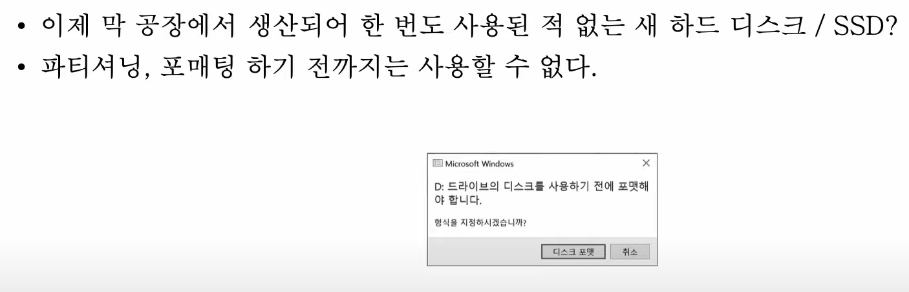

### (1) 파티셔닝이란?

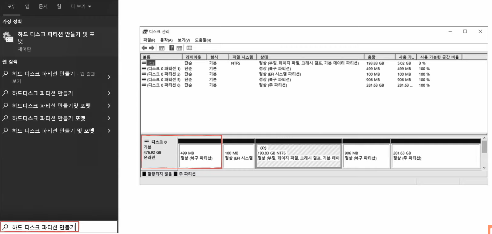

- 저장 장치의 하나 이상의 논리적인 영역을 구획하는 작업
- 칸막이처럼 보조기억장치의 영역을 나누는 작업
- 나눠진 구역을 '파티션'이라고 함

### (2) 포매팅이란?

- 파일 시스템을 설정
- 어떤 방식으로 파일을 관리할 지 결정, 새로운 데이터를 쓸 준비하는 작업
- 논리적 포매팅을 의미

#### < 예시 >

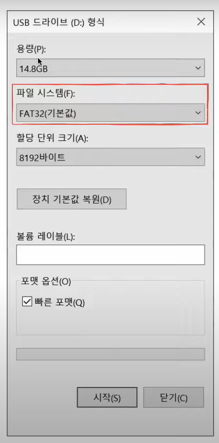

- USB 포매팅 예시
- 파일 시스템은 포매팅 할 떄 결정된다
    - 파일 시스템에는 여러 종류가 있고,
    - 파티션마다 다른 파일 시스템을 설정할 수도 있다

- 포매팅까지 완료하여 파일 시스템을 설정해야지 파일과 디렉터리 생성이 가능해진다!

## 2. 파일 할당 방법

- 포매팅까지 끝난 하드 디스크에 파일을 저장하기
- 운영체제는 파일/디렉터리를 블록 단위로 읽고 쓴다
    - 즉, 하나의 파일이 보조기억장치에 저장될 떄에는 여러 블록에 걸쳐 저장된다
        - 하드 디스크에 가장 작은 저장단위는 사실 '섹터'이지만, 너무 작은 단위라서 보통 블록 단위로 읽고 씀

- 파일을 보조기억장치에 할당하는 두 가지 방법 : 연속 할당, 불연속 할당
    - 오늘날 사용되는 방법은 '불연속 할당'

### (1) 연속 할당 방법

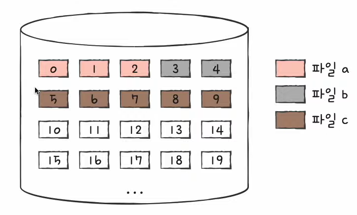

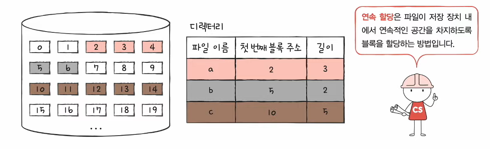

- 이름 그대로 보조기억장치 내 연속적인 블록에 파일 할당
- 연속된 파일에 접근하기 위해 파일의 첫번째 블록 주소와 블록 단위의 길이만 알면 된다

#### < 디렉터리 엔트리 >

- '파일이름 & 첫번쨰 블록주소 & 블록단위길이 명시'

#### < 연속 할당 방법의 '부작용' >

- 구현이 단순하지만 외부 단편화를 야기할 수 있음

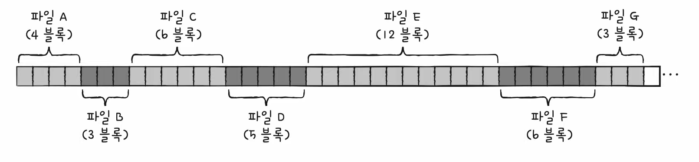

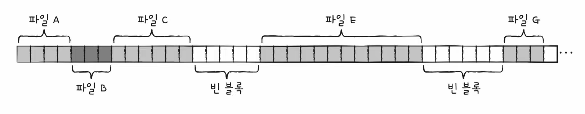

- 파일 D와 F를 삭제 했을 때,
- 잔여 블록 11개이지만
- 블록을 7개 이상 사용하는 파일은 할당하지 못한다!

> 이 부작용을 해결하는 방법이 바로 '불연속 할당 방법'

### (2) 불연속 할당 방법 - 연결 할당

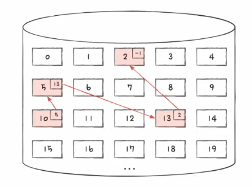

- 각 블록의 일부에 다음 블록의 주소를 저장하여 각 블록이 다음 블록을 가리키는 형태로 할당
- 파일을 이루는 데이터 블록을 연결 리스트로 관리
- 불연속 할당의 일종 : 파일이 여러 블록에 흩어져 저장되어도 무방

#### < 디렉터리 엔트리 >

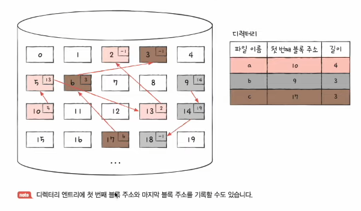

- '파일이름 & 첫번쨰 블록주소 & 블록단위길이 명시'
    - (-1은 끝(마지막 블록 주소)을 말함)

#### < 연결 할당의 '단점' >

- 반드시 첫 번째 블록부터 하나씩 읽어들여야 한다 (= 임의접근속도가 느림)
- 오류 발생시(하드웨어 고장 등) 해당 블록 이후 블록은 접근이 어렵다

### (3) 불연속 할당 방법 - 색인 할당

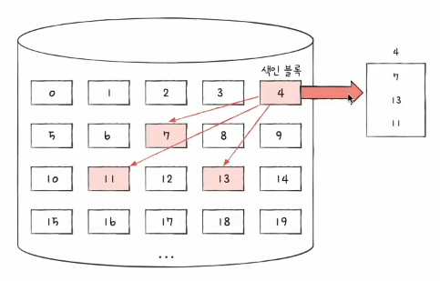

- 파일의 모든 블록 주소를 '색인 블록'이라는 하나의 블록에 모아 관리하는 방식
- 파일 내 임의의 위치에 접근하기 용이하다

#### < 디렉터리 엔트리 >

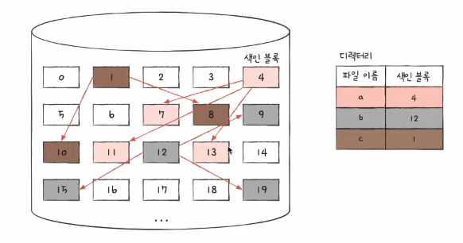

- '파일이름 & 색인 블록 주소'

## 3. 실제 파일 시스템 살펴보기

### (1) FAT 파일 시스템

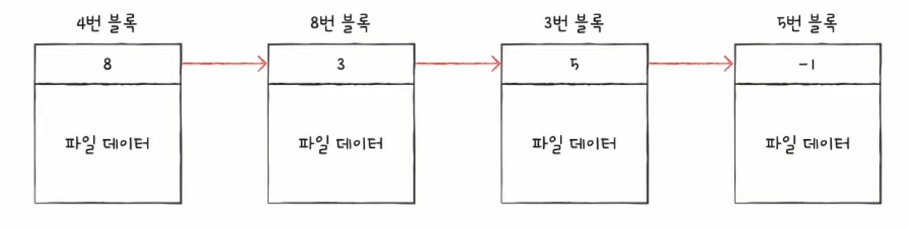

- 연결 할당 기반 파일 시스템
- usb, ssd 등의 저용량 메모리에 현재까지도 많이 사용됨
- 연결 할당의 단점 보완

#### < 연결 할당의 단점 어떻게 보완? >

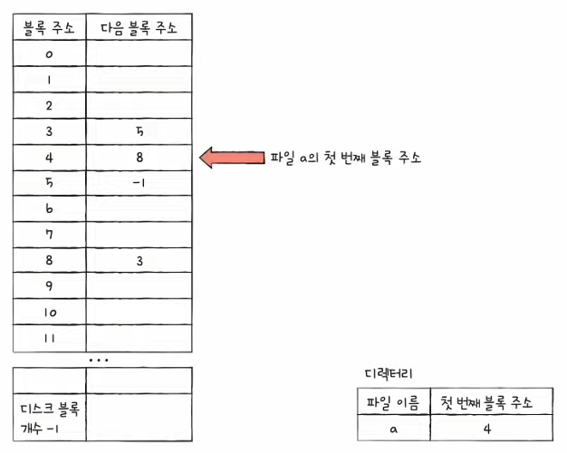

- FAT 시스템으로 이루어진 파일 포맷팅한 형태 (도식화한 모습)

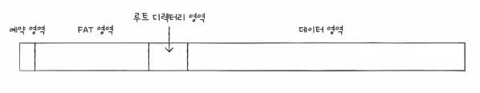

> 문제 (1) : 데이터 안에 다음 블록 주소를 넣어둬서 문제 일어남
>
> 해결 방법 : 각 블록에 포함된 다음 블록 주소를 한데 모아 테이블로 관리  

- 여기서 말하는 테이블이 바로 FAT (file allocation table) !!
    - FAT가 메모리에 캐시될 경우 느린 임의 접근 속도 개선 가능

> 문제 (2) : 반드시 첫 번째 블록부터 하나씩 읽는거만 가능
>
> 해결 방법 : FAT 자체가 메모리에 캐시되므로 임의 접근 가능!  

#### < FAT 파일 시스템의 '디렉터리 엔트리' >

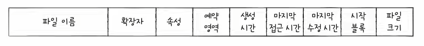

- 모든 파일의 속성들이 명시가 된다

#### < FAT 파일 시스템 파일 읽는 과정 >

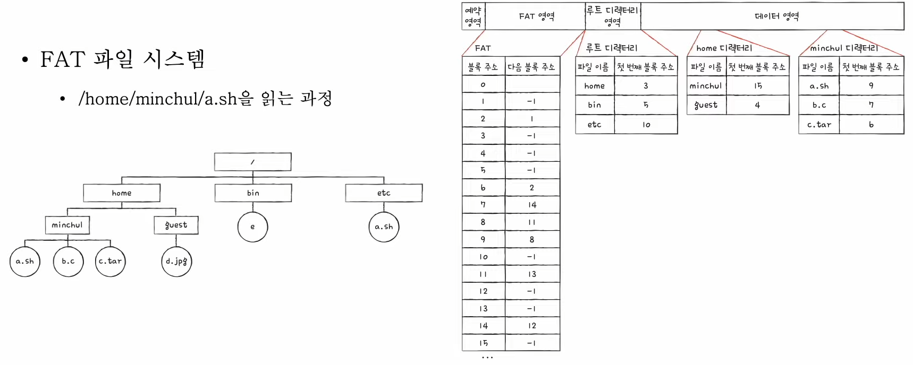

1. 가장 먼저 읽어야하는 것은 '루트 디렉터리'이다.
2. '루트 디렉터리'가니까 home파일은 블록주소 3이다.
3. 'home 디렉터리'로 가니까 minchul은 블록주소 15이다.
4. 'minchul'의 디렉토리에서 a.sh의 블록주소는 9이다.
5. FAT 영역으로 가서 '9' 블록주소로 가니까 8
6. 8로 가니까 11
7. 11로 가니까 13
8. 13으로 가니까 -1
9. 끝!

- 결론 : a.sh파일을 읽으려면 9, 8, 11, 13 블록에 접근해야한다

### (2) 유닉스 파일 시스템

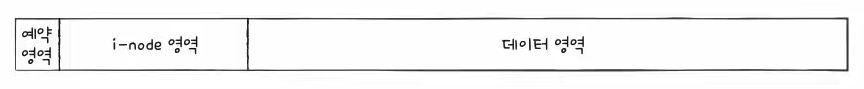

- 색인 할당 기반 파일 시스템
- 색인 블록 == i-node
    - 파일의 속성 정보와 15개의 블록 주소 저장 가능

#### < 유닉스 파일 시스템의 블록 주소 저장 방법 >

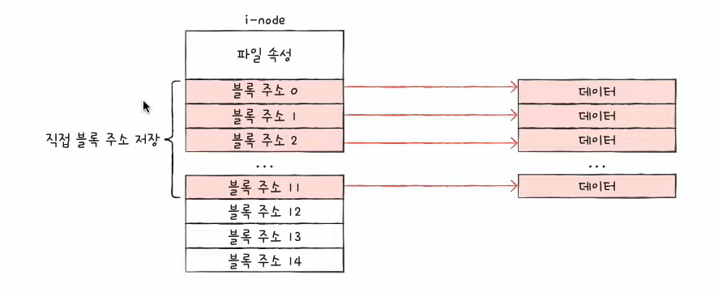

- (1) 직접 블록 : 파일 데이터가 저장된 블록
- (2) 단일 간접 블록 : 파일 데이터를 저장한 블록 주소가 저장된 블록
    - 직접블록으로 충분하지 않다면 13번째 주소에 단일 간접 블록 주소 저장
- (3) 이중간접 블록 : 단일 간접 블록들의 주소를 저장하는 블록
    - 단일 간접 블록으로도 충분하지 않다면 14번째 주소에 이중 간접 블록 주소 저장
- (4) 삼중간접 블록 : 이중 간접 블록들의 주소를 저장하는 블록
    - 이중 간접 블록으로도 충분하지 않다면 14번째 주소에 이중 간접 블록 주소 저장

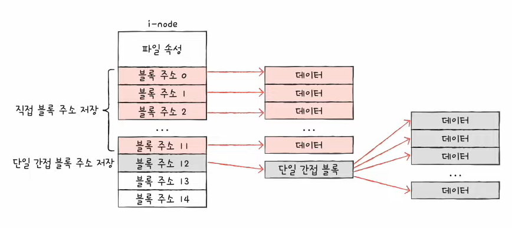

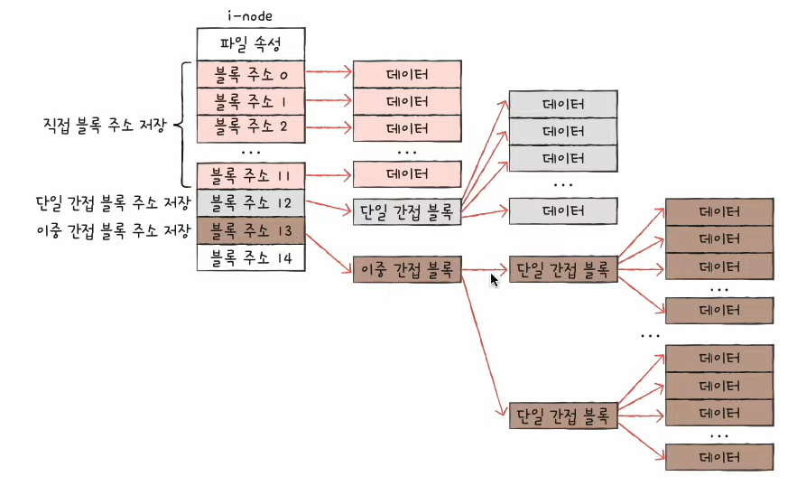

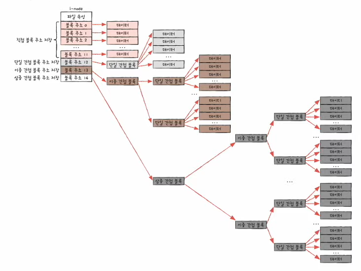

#### < 유닉스 파일 시스템의 '디렉터리 엔트리' >

- i-node가 유닉스 파일 시스템의 핵심이다!

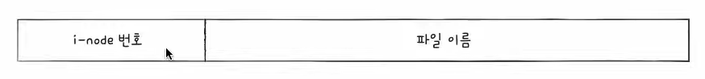

#### < 유닉스 파일 시스템의 파일 읽는 과정 >

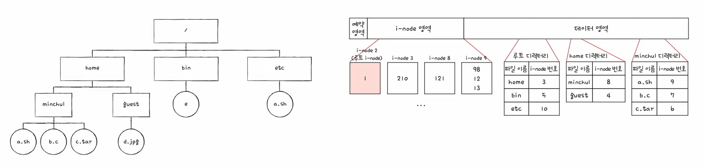

1. 유닉스 파일 시스템은 어떤 i-node가 루트 디렉토리 주소를 가지고 있는지 항상 알고 있다.
2. 2번 노드를 보면 1번 블록에 루트 디렉토리가 있다는 것을 알 수 있음.
3. 1번 디렉토리 내용보면 home의 node 번호는 3번
4. 3번 i-node는 210번 i-node로 가고
5. 210번 i-node보면 home 디렉터리 내용을 볼 수 있고 그 안에 minchul을 보면 8번 i-node
6. 8번 i-node보면 121
7. 121을 보면 minchul 디렉터리로 가서 a.sh파일
8. a.sh파일은 9번 i-node이다.
9. 9번 i-node 보면 98,12,13 블록정보가 적혀있음.
10. 끝!

- 결론 : a.sh파일을 읽으려면 98,12,13 블록에 접근해야한다

### 드디어 1회독 끝! 수고했다 :)