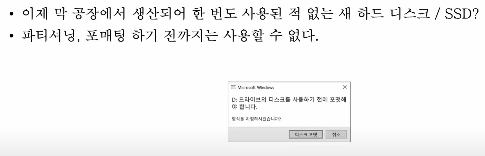
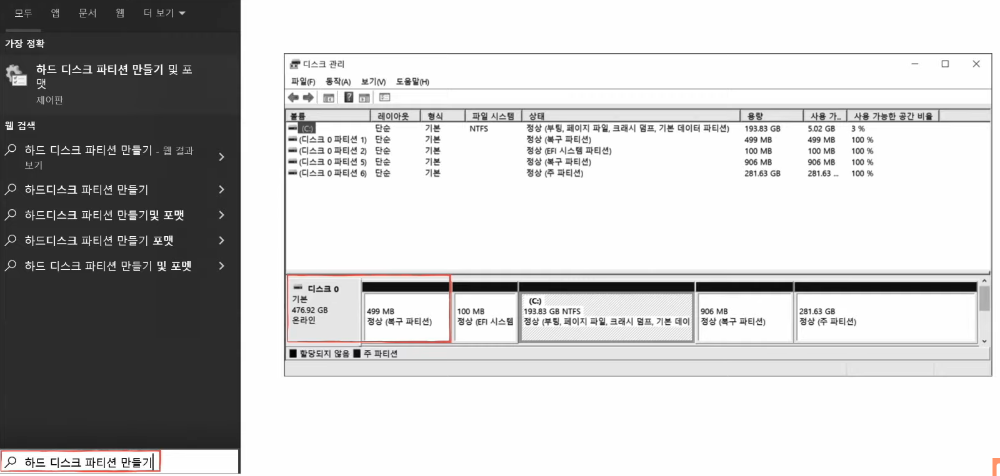
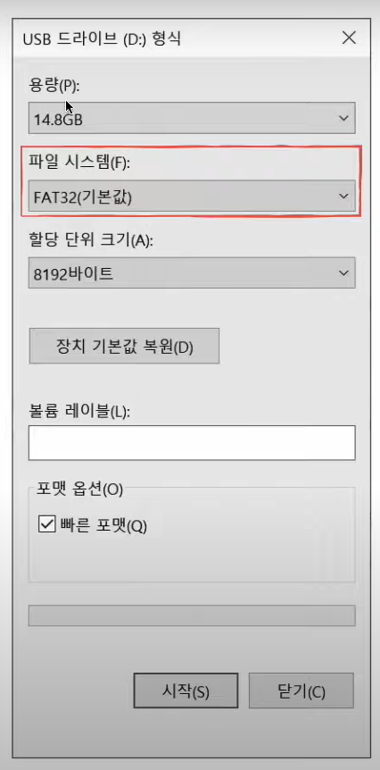
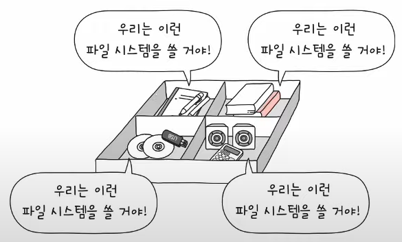
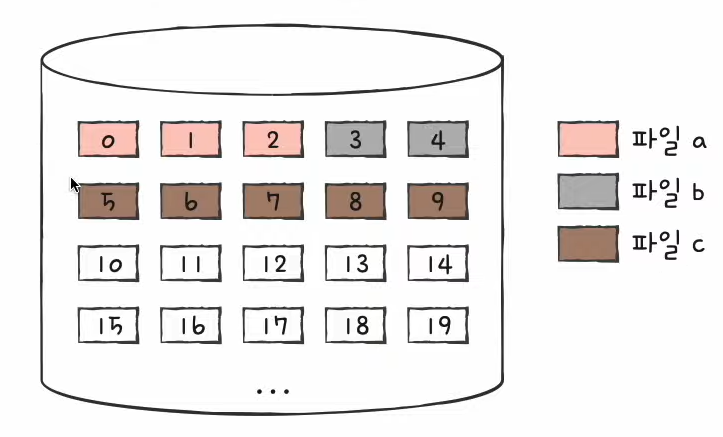
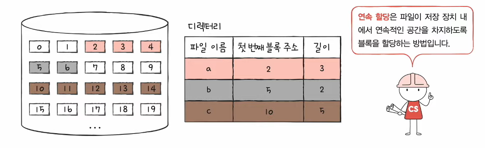
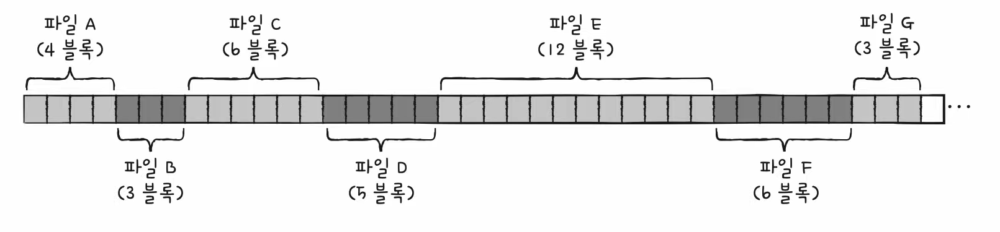
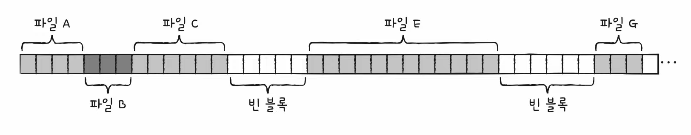

# 42강. 파일 시스템

> < 학습 내용 > 
> 파일 시스템이 파일과 디렉터리를 보조기억장치에 할당하고 접근하는 방법  
> 대표적인 파일 시스템의 종류 (FAT 파일 시스템, 유닉스 파일 시스템) 학습

## 1. 파티셔닝과 포매팅

### (1) 파티셔닝이란?

- 저장 장치의 하나 이상의 논리적인 영역을 구획하는 작업
- 칸막이처럼 보조기억장치의 영역을 나누는 작업
- 나눠진 구역을 '파티션'이라고 함

### (2) 포매팅이란?

- 파일 시스템을 설정
- 어떤 방식으로 파일을 관리할 지 결정, 새로운 데이터를 쓸 준비하는 작업
- 논리적 포매팅을 의미

#### < 예시 >

- USB 포매팅 예시
- 파일 시스템은 포매팅 할 떄 결정된다
    - 파일 시스템에는 여러 종류가 있고,
    - 파티션마다 다른 파일 시스템을 설정할 수도 있다

- 포매팅까지 완료하여 파일 시스템을 설정해야지 파일과 디렉터리 생성이 가능해진다!

## 2. 파일 할당 방법

- 포매팅까지 끝난 하드 디스크에 파일을 저장하기
- 운영체제는 파일/디렉터리를 블록 단위로 읽고 쓴다
    - 즉, 하나의 파일이 보조기억장치에 저장될 떄에는 여러 블록에 걸쳐 저장된다
        - 하드 디스크에 가장 작은 저장단위는 사실 '섹터'이지만, 너무 작은 단위라서 보통 블록 단위로 읽고 씀

- 파일을 보조기억장치에 할당하는 두 가지 방법 : 연속 할당, 불연속 할당
    - 오늘날 사용되는 방법은 '불연속 할당'

### (1) 연속 할당 방법

- 이름 그대로 보조기억장치 내 연속적인 블록에 파일 할당
- 연속된 파일에 접근하기 위해 파일의 첫번째 블록 주소와 블록 단위의 길이만 알면 된다

#### < 디렉터리 엔트리 >

- '파일이름 & 첫번쨰 블록주소 & 블록단위길이 명시'

#### < 연속 할당 방법의 '부작용' >

- 구현이 단순하지만 외부 단편화를 야기할 수 있음

- 파일 D와 F를 삭제 했을 때,
- 잔여 블록 11개이지만
- 블록을 7개 이상 사용하는 파일은 할당하지 못한다!

> 이 부작용을 해결하는 방법이 바로 '불연속 할당 방법'

11:34

### (2) 불연속 할당 방법

### (3) 연결 할당 방법

### (4) 색인 할당 방법