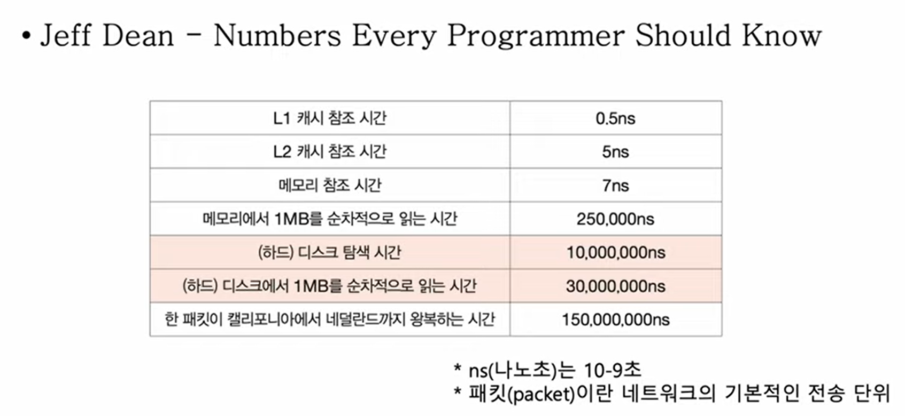

# 5강. 0과 1로 문자를 표현하는 방법

- Q. 0과 1만 아는 컴퓨터가 어떻게 문자를 이해할 수 있지?

## 문자집합과 인코딩

- 문자 집합 (character set)
    - 컴퓨터가 이해할 수 있는 문자의 모음(집합)
- 인코딩 (encoding)
    - 코드화하는 과정
    - 문자를 0과 1로 이루어진 문자코드로 변환하는 과정
- 디코딩 (decoding)
    - 코드를 해석하는 과정
    - 0과 1로 표현된 문자 코드로 문자로 변환하는 과정

## 가장 대중적인 문자집합 소개

- 아스키 코드
    - 초창기 문자 집합 중 하나
    - 알파벳, 아라비아 숫자, 일부 특수 문자 및 제어 문자(엔터, 백스페이스 등)
    - 7비트로 하나의 문자 표현
        - 8비트 중 1비트는 오류 검출을 위해 사용되는 특수한 패리티 비트 (parity bit)
        - 즉 2^7 = 128개 정도를 표현 할 수 있음
    - 코드포인트(code point) : 문자에 부여된 값
    - 장점 : 간단한 인코딩
    - 단점 : 한글을 포함한 다른 언어 문자, 다양한 특수 문자 표현 불가
        - 아스키 코드는 단 128개뿐이니까
        - 이후에 8비트 확장 아스키(extended ASCII)가 나왔지만 그것도 부족함

## 한글 인코딩

- 한글을 위한 인코딩이 필요
    - 한글의 특징
    - 알파벳을 이어쓰면 단어가 되는 영어
    - 초성, 중성, 종성의 조합으로 이루어진 한글
    - 완성형, 조합형 두 가지의 인코딩 방식이 존재
       

## EUC-KR

- KS X 1001 KS X 1003 문자집합 기반의 한글 인코딩 방식
- 완성형 인코딩
- 글자 하나하나에 2바이트 크기의 코드 부여
    - 2바이트(1바이트8비트) == 16비트 == 4자리 16진수
- 2300여개의 한글 표현 가능
- 여전히 모든 한글 표현하기에 부족 (쀏, 뙠, 휔 같은거 표현 불가능)
- 단점 : 이러한 언어별 인코딩을 국가마다 하게되면 다국어를 지원하는 프로그램을 개발할 때엔 언어별 인코딩 방식으로 모두 이해해야함

@. 모든 언어, 특수문자까지 통일된 문자 집합을 사용하면 어떨까? 통일된 문자집합 & 인코딩 방식이 있다면? ⇒ 유니코드, utf

## 유니코드 문자집합 & utf-8

- 유니코드
    - 통일된 문자집합
    - 한글, 영어, 화살표와 같은 특수문자, 이모티콘 등
    - 현대 문자 표현에 있어 매우 중요
- 유니코드 인코딩 방식
    - utf-8, utf-16, utf-32..

'한'과 '글'에는 유니코드 코드포인트에 각각 'D55C', 'AE00'이 부여되어있다. 이 값들을 '한'과 '글'의 인코딩 값 그대로 쓰지 않고, 이걸 어떻게 사용하느냐에 따라 인코딩 방식이 달라진다. 인코딩 방식
종류에 따라 다 달라지는데 유니코드 인코딩 방식 중 가장 보편적인게 바로 uft-8

- utf-8 인코딩
    - UTF(Unicode Transformation Format) == 유니코드 인코딩 방법
    - 가변 길이 인코딩 : 인코딩 결과가 1바이트 ~ 4바이트
    - 인코딩 결과가 몇 바이트가 될지는 유니코드에 부여된 값에 따라 다름

유니코드 문자에 부여된 값에 따라 인코딩 크기는 1바이트 ~ 4바이트로 달라지게 되는데, 문자의 고유값이 속한 범위에 따라 인코딩 크기가 달라지게 된다. 예를 들어, '한'이라는 글자는 16비트로 D55C(16)로
표현된다. D55C 값의 범위는 세번째니까 3바이트로 표시되고, D55C라는 16진수를 2진수로 바꾸면 1101 0101 0101 1100이 되니까 저 3바이트 자릿수에 차례대로 채워넣으면 된다. 즉, '한'이라는
글자는 '11101101 10010101 10011100(2)' 이다.