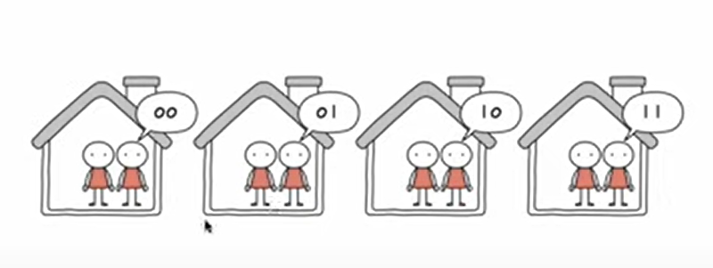

## 6강. 소스코드와 명령어

- Q. 개발자가 작성한 소스코드를 컴퓨터가 어떻게 인식할까?

### 1. 고급언어와 저급언어

- 고급언어 : 개발자들이 읽고 쓰기 편하게 만들어진 언어
    - ex) 자바, 파이썬, C 등등

- 저급언어 : 컴퓨터가 알아듣는 언어 = '명령어'

⇒ 즉, 개발자가 작성한 소스코드가 컴퓨터 내부에서 실행될 때는 저급언어로 변환이 되어서 실행된다.

### 2. 저급언어

- 기계어 : 0과 1로 표현된(이진수) 기계어, (16진수로도 표현 될 때 있음)
- 어셈블리어 : 위 기계어를 좀 더 사람들이 읽기 편한 형태로 번역한 저급 언어

### 3. 고급언어를 저급언어로 변환하는 방법

#### (1) 컴파일

- 컴파일 해서 변환하는 언어 : 컴파일 언어
- 컴파일 : 컴파일 언어로 작성된 소스코드가 컴파일러에 의해 저급언어로 변환되는 과정
- 컴파일 결과로 생성되는 것 -> 저급언어인 '목적코드'

#### (2) 인터프리트

- 인터프리트 해서 변환하는 언어 : 인터프리트 언어
- 인터프리터라고 하는 특수한 프로그램에 의해 한 줄씩 실행 (컴파일러는 보통 전체적으로 통째로 한 번에 봄)
- 그러므로 소스코드 전체가 저급언어로 변환되기까지 기다릴 필요 없음

### 4. 컴파일방식과 인터프리트방식의 차이

- x86-64 : CPU 종류
- gcc 12.2 : 컴파일러 종류

> **주의** : 컴파일 언어와 인터프리트 언어는 정확하게 구분되지 않는 경우가 많다.
>
> 고급언어가 저급언어로 변환되는 방식이라고 알아두는 게 중점!