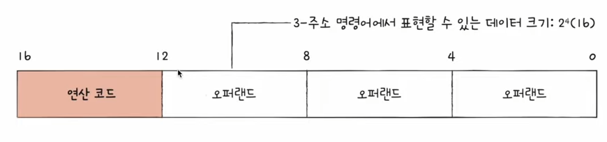
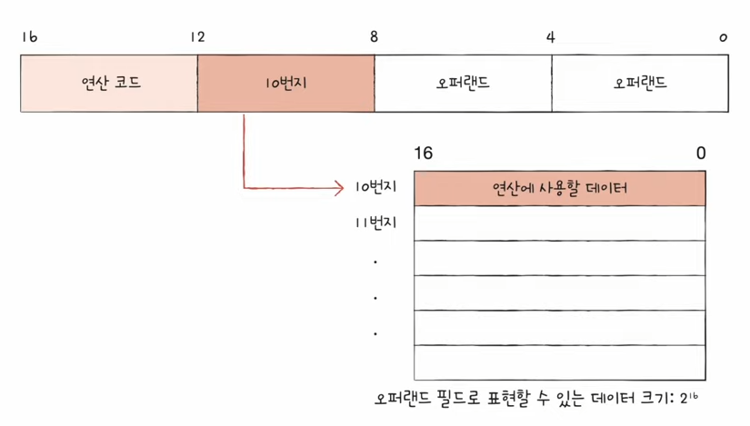
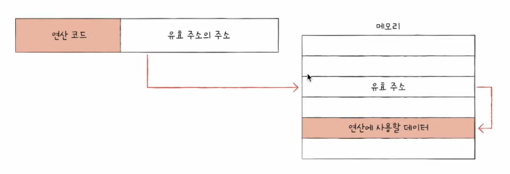
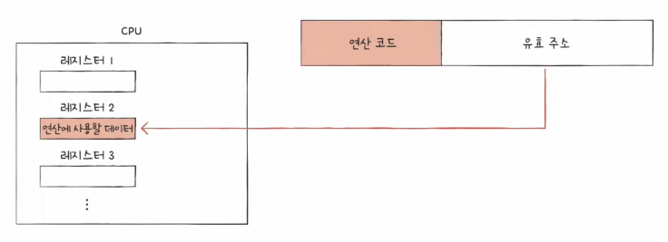
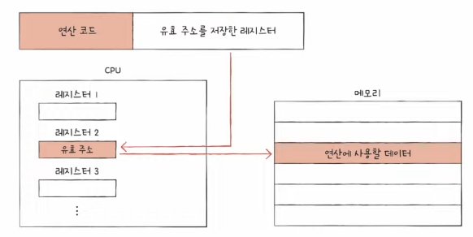

# 7강. 명령어의 구조와 주소 지정 방식

- Q. 명령어 하나하나는 어떻게 생겼고 어떻게 동작할까?

## 명령어의 형태

- 명령어의 구조
    - 무엇을 대상으로, 무엇을 수행하라
    - 명령어 : 연산코드 + 오퍼랜드
        - 예) 더해라 + 10을

## 연산코드?

: 수행할 연산

- 연산코드의 종류와 생김새는 CPU마다 다르다
- 보통 자주 사용되는 종류
    - 데이터 전송 (move, store, load, push, pop..)
    - 산술/논리 연산 (사칙연산(add,substract,multiply,divide), increment,decrement, 논리(and,or,not), 비교(compare))
    - 제어 흐름 변경 (jump, conditional jump, halt, call, return)
    - 입출력 제어 (read, write, start io, test io)

## 오퍼랜드?

: 연산에 사용될 데이터 / 연산에 사용될 데이터가 저장된 위치

- 그렇지만 보통은 연산에 사용될 데이터가 저장된 '위치'가 더 많이 저장됨
- 그래서 오퍼랜드가 담기는 공간 자체를 '주소필드'라고 부른다
- 오퍼랜드가 없는 경우, 한 개, 여러 개인 경우도 있음

  
- Q. 근데 왜 오퍼랜드에 데이터를 안 넣고 데이터의 위치를 저장하지?

- A. 왜냐하면 한정된 명령어에서 오퍼랜드에서 표현할 수 있는 데이터는 제한적이기 때문!

 

- 그림처럼 오퍼랜드가 늘어날 수록 표현할 수 있는 데이터의 크기는 줄어든다

 

- 위치정보 저장을 하게되면 더 많은 데이터를 사용할 수 있다

## 명령어 주소 지정 방식

- 유효주소 (effective address)
    - 연산에 사용될 데이터가 저장된 위치

- 명령어 주소 지정 방식 (addressing modes)
    - 연산에 사용할 데이터가 저장된 위치를 찾는 방법
    - 유효 주소를 찾는 방법
    - 다양한 명령어 주소 지정 방식들

> 메모리에 직간접적으로 유효주소 명시 방식

### (1) 즉시 주소 지정 방식 (immediate addressing mode)

- 연산에 사용할 데이터를 오퍼랜드 필드에 직접 명시
- 가장 간단한 형태의 주소 지정 방식
- 연산에 사욯할 데이터의 크기가 작아질 수 있지만, 빠름
    - 왜냐면 주소에 가서 안뒤젹거리면서 찾을 필요 없으니까 빠르다!

### (2) 직접 주소 지정 방식 (direct addressing mode)

- 오퍼랜드 필드에 유효 주소 직접적으로 명시
- 유효 주소를 표현할 수 있는 크기가 연산 코드만큼 줄어듦
    - 유효주소를 찾아갔더니! 연산에 사용할 데이터가 있더라!

### (3) 간접 주소 지정 방식 (indirect addressing mode)

- 오퍼랜드 필드에 유효 주소의 주소를 명시
- 앞선 주소 지정 방식들에 비해 속도가 느림..
    - (CPU가 메모리 뒤적이는 시간은 매우 느리다, 그러므로 이 속도 최소화하는게 중요)
- 

> 레지스터를 사용한 주소지정 방식

### (4) 레지스터 주소 지정 방식 (register addressing mode)

- 연산에 사용할 데이터가 저장된 레지스터 명시
- 메모리에 접근하는 속도보다 레지스터에 접근하는 것이 빠름
    - 메모리는 CPU 밖에 있지만 레지스터는 CPU 안에 있기 때문에 속도 차이가 크다
    - '직접 주소 지정 방식'과 비슷하지만 더 빠를 수 있다!
- 

### (5) 레지스터 간전 주소 지정 방식 (register indirect addressing mode)

- 연산에 사용할 데이터를 메모리에 저장
- 그 주소를 저장한 레지스터를 오퍼랜드 필드에 명시
- 