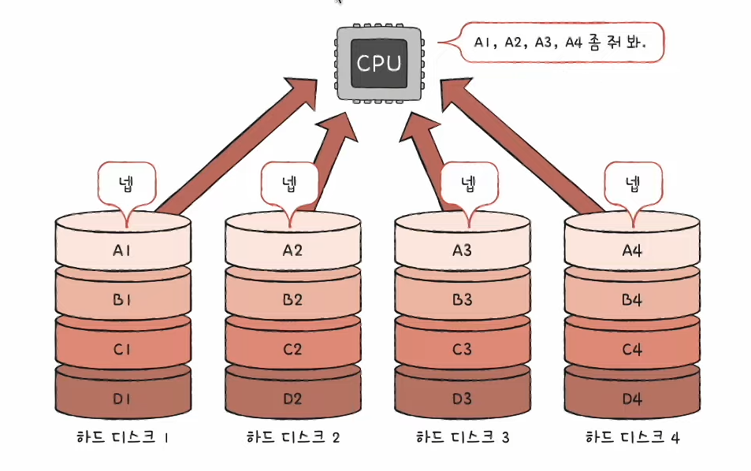
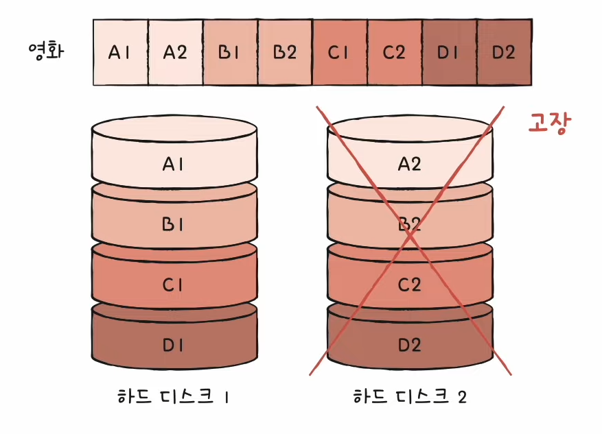

# 8강. C언어의 컴파일 과정

- Q. C언어의 컴파일 과정에 대해 알아보자!

## 전체적인 과정

- test.c -> test.exe
- c언어 소스코드를 실행파일로 만들어주는 과정 중에는 아래 네 가지의 과정을 거친다.
    - 전처리기 (preprocessor)
    - 컴파일러 (compiler)
    - 어셈블러 (asembler)
    - 링커 (linker)

## 전처리기

- 전처리 과정을 통해서 test.c -> test.i 결과물이 나온다
- 전처리 과정
    - 본격적으로 컴파일하기 전에 처리할 작업들 (준비과정)
    - 외부에 선언된 다양한 소스코드, 라이브러리 포함 (e.g #include)
        - 예를들어 println 함수는 java.io 패키지 안에 들어있으니까 그걸 내 소스코드 안에 가져오는 과정이 여기에 포함된다
        - 그러니까 import 라고 명시한 라이브러리들을 가져오는 과정이겠지
    - 프로그래밍의 편의를 위해 작성된 매크로 변환 (e.g #define)
    - 컴파일할 영역 명시 (e.g #if, #ifdef, ...)

## 컴파일러

- 컴파일 과정을 통해서 test.i -> test.s 결과물이 나온다
- 컴파일 과정
    - 전처리가 완료 되어도 여전히 소스코드
    - 전처리 완료된 소스코드를 저급 언어(어셈블리 언어)로 변환
        - 어셈블리 모습은 CPU마다, 컴파일러 종류에 따라 다르다

## 어셈블러

- 어셈블 과정을 통해서 test.s -> test.o 결과물이 나온다
- 어셈블 과정
    - 어셈블리어를 기계어로 변환
    - 목적 코드(object file)를 포함하는 목적 파일이 됨
    - 0과 1로 이루어진 걸 확인할 수 있음

- 여기에서 끝난 것 같지만 목적파일과 실행파일을 조금 다르다

### 목적파일 VS 실행파일

- 목적파일과 실행파일은 둘 다 기계어로 이루어진 파일
- 그렇지만 둘은 다르다
- 목적파일은 링킹(linking)을 거친 이후에야 실행 파일이 된다

## 링커

- 그림을 보면 main.c 파일과 helper.c 파일은 각각 목적파일로 변경 된 걸 볼 수 있지만, main.c와 helper.c의 코드가 그림처럼 서로 연결이 되어 있는 상태에서 helper.o 없이 그냥
  main.o를 실행한다고 하면 실행이 되지 않을 것이다. 그러므로 서로 필요한 파일들을 연결해주는 과정이 필요하고 그 연결과정이 바로 '링킹 과정'이다.

- 링킹 과정을 통해서 test.o -> test.exe 결과물이 나온다
- 링킹 과정
    - 각기 다른 목적코드를 하나의 실행파일로 묶는(연결하는) 과정