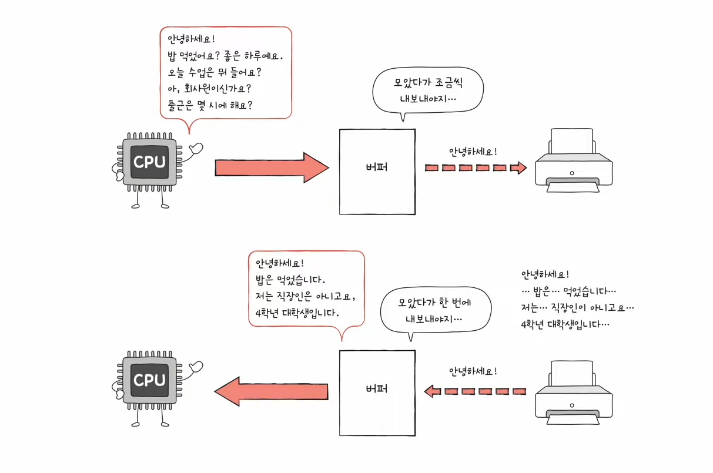

# 9강. CPU의 내부 구성 - ALU와 제어장치

- Q. ALU와 제어장치란 무엇일까?

## ALU

- 계산하는 장치
- 위 그림을 보면 '피연산자' 즉 계산할 때 필요한 정보들과 제어장치로부터 제어신호를 받아들인다.
- 결과적으로 레지스터들로부터 피연산자와 제어장치로부터 제어신호를 받아서 계산해가지고 다시 결과값을 레지스터로 반환한다.
- ALU가 내보내는 정보에는 '결과값'말고 또 '플래그'라는게 존재한다
    - 플래그 : 연산결과에 대한 부가정보! (예:이진법에서 양수,음수 구분해주는 정보)
    - 이걸 플래그 레지스터에게 보낸다
    - 그런데 가끔 연산결과가 결과를 담을 레지스터에 비해 너무 크다면?
        - 그것 또한 플래그에 담겨서 플래그 레지스터에게 보낸다 ⇒ '오버플로우'가 난다고 함

### 플래그 종류

- 이런식으로 저장된다
- 해당되면 0이 1로 바뀌도록!

## 제어장치

- 제어 신호를 발생시키고 명령어를 해석하는 장치

### 제어장치가 받아들이는 것

- 아래는 제어장치가 받아들이는 것들

#### (1) 클럭신호

- 컴퓨터의 모든 부품을 일사불란하게 움직일 수 있게 하는 시간 단위

#### (2) 해석할 명령어

- '명령어 레지스터'로 부터 해석할 명령어를 받아들인다

#### (3) 플래그

- '플래그 레지스터'로 부터 플래그를 받아들인다

#### (4) 제어신호

- 제어장치가 보통 제어신호를 발생시키긴 하지만, CPU만 제어신호를 발생시키는게 아니고, 입출력 장치를 비롯한 주변 장치들도 제어신호를 발생시킬 수 있음 그래서 외부로부터 CPU로 제어신호가 온다면 그걸 제어장치가
  받아들인다

### 제어장치가 내보내는 것

#### 제어신호

- 제어장치는 기본적으로 제어신호를 내보내고, CPU 내부에 내보내는 신호와 외부에 내보내는 신호로 나뉘어진다.
- CPU 내부로 : To. 레지스터(레지스터에게 명령하는 제어신호), ALU(수행할 연산을 제시하는 제어신호)
- CPU 외부로 : To. 메모리(메모리 읽어라써라 지시), 입출력장치(입출력장치 써라 테스트해라 지시)
